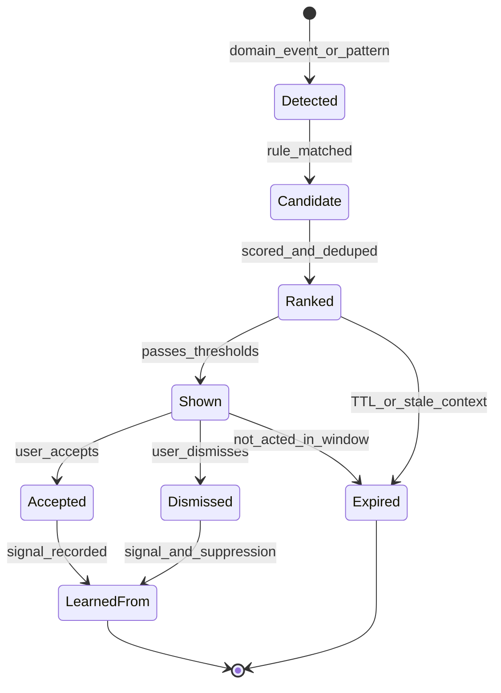
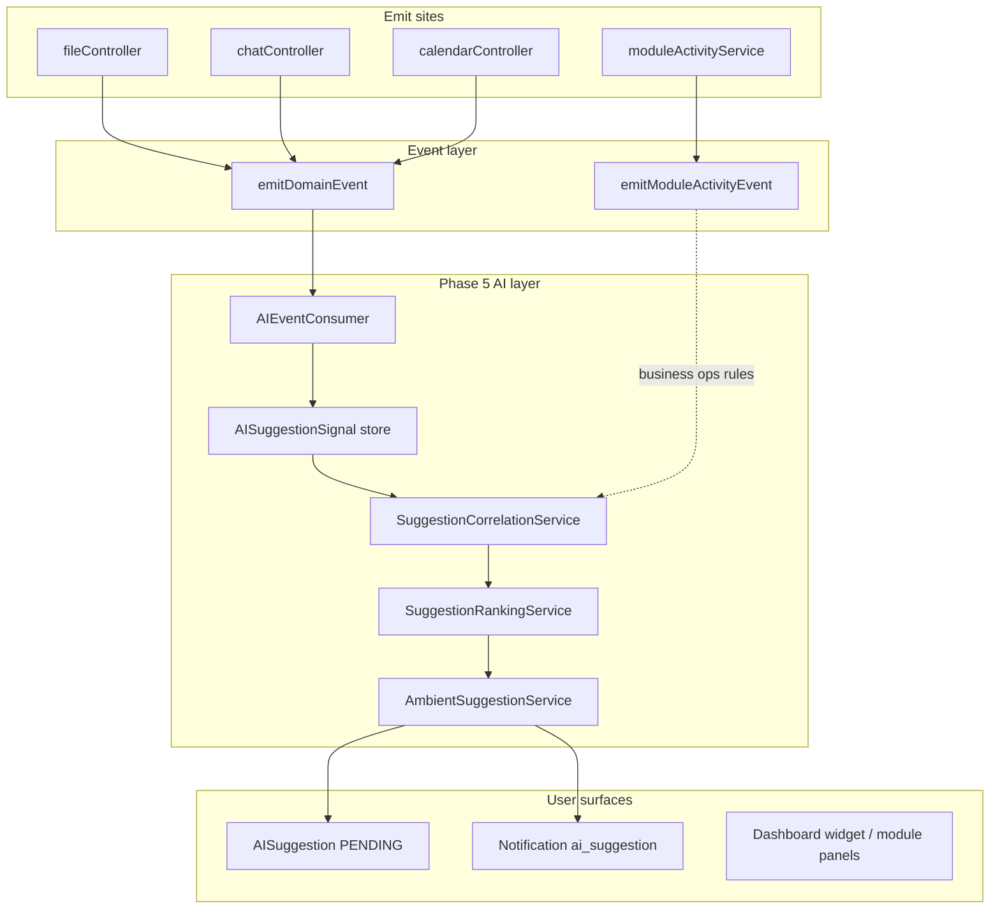

# AI Ambient Contextual Assistance Plan (Phase 5)

**Date:** May 2026  
**Status:** Proposed — awaiting approval before implementation  
**Scope:** Ambient contextual assistance — pattern-aware, explainable suggestions (not autonomy)  
**Builds on:** AI Platform Maturity Plan Phases 1–4 (Memory, Learning, Cross-Module Intelligence, Extensibility, Autonomy de-emphasis)

**Product constraint:** **This is NOT autonomy.** Do not build autonomous execution. Do not market as agents. The goal is ambient contextual assistance: the AI notices patterns, correlations, and useful opportunities, then suggests help to the user without acting on its own.

**Guiding principle:** Helpful, explainable suggestions — not autonomous actions.

**Related (canonical, do not duplicate):**

| Topic | Source |
|-------|--------|
| Maturity Phases 1–4 (complete) | [`AI_PLATFORM_MATURITY_PLAN.md`](./AI_PLATFORM_MATURITY_PLAN.md) |
| **How to build (required reading)** | [`AI_PLATFORM_EXECUTION_PRINCIPLES.md`](./AI_PLATFORM_EXECUTION_PRINCIPLES.md) — especially §2 rung 7 (Recommendations), §6 (UX intelligence) |
| Domain events | [`docs/architecture/DOMAIN_EVENTS.md`](../architecture/DOMAIN_EVENTS.md) |
| Admin pipeline diagnostics | [`docs/architecture/AI_PIPELINE_ADMIN_TOOLS.md`](../architecture/AI_PIPELINE_ADMIN_TOOLS.md) |
| Context & recall architecture | `memory-bank/AI_CONTEXT_MEMORY_ARCHITECTURE.md` |
| Module AI context contract | `memory-bank/aiContextSystem.md` |

---

## How to use this plan

0. Read **[`AI_PLATFORM_EXECUTION_PRINCIPLES.md`](./AI_PLATFORM_EXECUTION_PRINCIPLES.md)** — governs *how* each subphase is implemented (Visible Intelligence > Hidden Intelligence).
1. Work **one subphase at a time** (5A → 5B → …). Do not start Phase 5B until Phase 5A acceptance criteria pass.
2. Each subphase lists **likely files**, **migrations**, and **acceptance criteria** sized for Cursor execution.
3. Preserve existing architecture: twin path, provider routing, vision, module registry, cookie/session auth, Next.js API proxy, business tenancy.
4. **No proactive autonomous execution** in any phase. Suggestions and user-initiated actions only.

---

## 1. Current-state audit

### 1.1 What can support ambient suggestions today (LIVE)

| Area | What works | Key paths |
|------|------------|-----------|
| **Suggestion store + API** | `AISuggestion` CRUD; accept/dismiss routes; learning signals on response | `prisma/modules/ai/ai-models.prisma`, `server/src/routes/ai.ts` |
| **Document-upload suggestion** | Single production proactive path (suggest-only + notification) | `server/src/services/proactiveSuggestionsService.ts` |
| **Learning signals** | Accept/dismiss → `AILearningEvent` behavioral signals | `server/src/services/userLearningSignalService.ts` |
| **Domain event bus** | Post-mutation events: file, chat, calendar, module, business | `server/src/events/domainEventRegistry.ts`, `emitDomainEvent.ts` |
| **AI event consumer** | Idempotent learning stubs from domain events | `server/src/ai/consumers/AIEventConsumer.ts` |
| **Cross-module synthesis** | Deterministic entity links (chat↔calendar people, chat↔drive files) | `server/src/ai/context/ContextSynthesisService.ts`, `entityLinking.ts` |
| **Context density + `contextUsed`** | Available vs used module context in trace + explain drawer | `AIContextAssembler.ts`, `pipelineDiagnostics.ts`, `buildResponseInfluence.ts` |
| **Memory + learning maturity** | Provenance, promote loop, Memory/Learning tabs, explain drawer | Phase 1–2 maturity deliverables |
| **Frontend suggestion surfaces** | Header badge, AIChatDropdown, ai-chat sidebar | `web/src/api/aiSuggestions.ts`, `GlobalHeaderTabs.tsx`, `AIChatDropdown.tsx` |
| **Notifications** | `ai_suggestion` type with click-through | `web/src/app/notifications/page.tsx` |
| **Webhook MVP** | Outbound event fan-out for partners | Phase 4C — future module signal ingestion |

### 1.2 Event streams available today

**Domain events (adopted):**

| Type | Emit site |
|------|-----------|
| `file.uploaded`, `file.deleted`, `file.shared` | `fileController` |
| `chat.message.sent` | `chatController` |
| `calendar.event.created` | `calendarController` |
| `module.installed`, `module.enabled`, `module.disabled` | `moduleProvisionController` |
| `business.member.added`, `business.member.removed`, `business.updated` | `businessController`, `memberController` |
| `user.preference.updated` | `userController` |

**Module activity events:** Normalized feed envelope per module — useful for business operational patterns (`server/src/services/moduleActivityService.ts`).

**Learning/behavioral signals:** `AILearningEvent` rows including `domain_event`, `suggestion_accepted`, `suggestion_dismissed`, module usage, corrections (`server/src/ai/learning/learningEventContract.ts`).

**Critical gaps:**

- Domain events → learning stubs only. **No correlation engine → suggestion factory.**
- File upload has **dual paths** — `onFileUploaded()` in controller creates suggestions; `FILE_UPLOADED` domain event creates learning stub only. Phase 5 unifies through a single suggestion pipeline fed by domain events.

### 1.3 Reusable intelligence (do not rebuild)

| System | Reuse for suggestions | Notes |
|--------|----------------------|-------|
| `MemoryRetrievalService` + scoring | Prioritize suggestions user cares about | Tenant-scoped facts |
| `userLearningSignalService` | Accept/dismiss → confidence adjust | Extend with suggestion-type decay |
| `ContextSynthesisService` + `entityLinking` | Cross-module correlation rules | Query-time today; adapt for event-time with bounded fetches |
| `SmartPatternEngine` | Recurring routine detection | Today: in-prompt + `/api/ai/patterns`; surface as ranked candidates |
| `contextDensityReport` | Explainability (“Drive + Calendar context used”) | Mirror pattern for suggestion trace |
| `PreferenceResolver` work/sleep windows | Quiet hours for outbound nudges | Prompt-only today; wire to suggestion scheduler in 5E |
| `AIAutonomySettings` | “Suggestion boundaries” per domain | Prompt boundaries only — not execution |

### 1.4 Existing proactive/suggestion code — rename or constrain

| Location | Action |
|----------|--------|
| `proactiveSuggestionsService.ts` | **Evolve** → `ambientSuggestionService.ts`; keep suggest-only semantics |
| `SmartPatternEngine` scheduling copy | **Soften** — “Would you like to save this as a preference?” not auto-setup |
| `PredictiveIntelligenceDashboard.tsx` | **Informational only** — no push notifications from admin analytics |
| `IntelligentRecommendationsEngine`, `AIPoweredInsightsEngine` | **Admin/analytics only** until data-backed |
| `todoAIPrioritizationService` | **Module-specific** suggestion source; register as suggestion provider |
| `AutonomousActionExecutor`, `/api/ai/autonomous/*` | **Remain hidden/deprecated** — never trigger from suggestions |
| `AIWidget.proactiveMode` | **Remove dead flag** when touching widget |
| “Phase 7: Proactive AI” comments | **Rename** to “Ambient contextual assistance” |

### 1.5 Keep hidden (implies autonomy)

- `AutonomousActions.tsx`, `ApprovalManager.tsx` (orphaned approval UX)
- `/api/ai/autonomous/*` execute paths
- `AutonomyManager` auto-execute wiring
- `PatternAnalysisScheduler` outbound nudges (env-gated; learning-only until Phase 5E)
- Collective/global patterns as **silent** user nudges (admin/opt-in only)
- Any “AI will do this for you” onboarding copy

**Safe vocabulary:** suggestions, contextual assistance, assisted workflows, action boundaries, recommendations — **not** agents, autonomy, proactive execution.

---

## 2. Product definition

**Ambient contextual assistance** = the platform notices **patterns, correlations, and opportunities** across authorized workspace context, then **surfaces a small number of explainable suggestions**. The user always chooses what happens next.

| Property | Requirement |
|----------|-------------|
| **Pattern-aware** | Uses behavioral history, recurring routines, and event sequences — not single-shot heuristics |
| **Context-aware** | Scoped to `userId` + `dashboardId` + optional `businessId`; uses module context providers where needed |
| **Explainable** | Every suggestion answers: why, what context, what you can do, how to dismiss/tune |
| **User-initiated or user-approved** | Accept opens twin with prefilled prompt or navigates to module; dismiss stops similar nudges |
| **Non-autonomous** | Zero server-side mutations from suggestion pipeline except creating the suggestion row + optional notification |
| **Low-noise** | Caps, dedupe, expiration, quiet hours |
| **Dismissible** | Always; optional “don’t suggest this again” |
| **Learnable from feedback** | Accept/dismiss adjusts ranking; repeated accepts may propose memory/preference (reviewable in Learning tab) |

**Goal:** Move Vssyl from “AI that answers with context” to “AI that gently helps users navigate life and work by surfacing relevant, explainable suggestions.”

**Anchor (from execution principles):** Visible Intelligence > Hidden Intelligence — a suggestion is not real unless the user can see it, understand why, and diagnostics can prove the correlation.

---

## 3. Suggestion types

| `suggestionType` | Example | Data requirements |
|----------------|---------|-------------------|
| `meeting_prep` | Calendar event tomorrow + related files changed today → suggest summarizing | `calendar.event.created`, `file.uploaded`, entity links, optional memory fact |
| `file_review` | Chat thread mentions work + Drive has updated documents → suggest reviewing | `file.uploaded`, `chat.message.sent`, `entityLinking`, same-day window |
| `thread_summary` | User often asks for summaries after long threads → suggest after activity spike | K× `chat.message.sent` same threadId, 2h rolling window |
| `deadline_risk` | Deadline mentioned in chat; related todo still open | Chat metadata + todo module provider fetch |
| `business_ops` | Business workspace shows unusual unresolved items → suggest operational review | Module activity aggregates, 7d baseline |
| `recurring_routine` | User repeatedly opens certain files before meetings → suggest briefing | `SmartPatternEngine` pattern + calendar lookahead |
| `document_upload` | Document uploaded → extract or add reminder (existing) | `file.uploaded`, document mime |
| `module_specific` | Todo priority/scheduling, etc. | Module APIs + domain events via `SuggestionRule` registry |

Each type maps to a **`correlationRuleId`**, **`actionData`** schema, and **`suppressionKey`** pattern.

### 3.1 `actionData` schema (by type)

```typescript
// Shared base — Prisma JSON column
interface SuggestionActionDataBase {
  suggestedPrompt?: string;
  deepLink?: string;
  entityRefs?: Array<{ moduleId: string; entityType: string; entityId: string }>;
}

// document_upload (existing, migrate)
interface DocumentUploadActionData extends SuggestionActionDataBase {
  fileId: string;
  fileName: string;
  suggestedActions: ('extract_document' | 'add_reminder')[];
}

// meeting_prep
interface MeetingPrepActionData extends SuggestionActionDataBase {
  eventId: string;
  calendarId: string;
  relatedFileIds: string[];
  suggestedPrompt: string; // e.g. "Summarize these files for my meeting tomorrow"
}

// thread_summary
interface ThreadSummaryActionData extends SuggestionActionDataBase {
  conversationId: string;
  threadId?: string;
  messageCount: number;
}
```

Accept **never** executes tools server-side — it returns navigation URLs and prefilled prompts only.

---

## 4. Suggestion lifecycle



| State | Meaning | Persistence |
|-------|---------|-------------|
| **detected** | Raw signal ingested (domain event, pattern tick) | `AISuggestionSignal` |
| **candidate** | Rule produced a possible suggestion | Transient / signal row with `ruleId` |
| **ranked** | Scored, deduped, capped | Pre-insert validation in `SuggestionRankingService` |
| **shown** | User-visible suggestion | `AISuggestion.status = PENDING` + optional notification |
| **accepted** | User tapped Accept | `ACCEPTED` + `AISuggestionFeedback` + learning signal |
| **dismissed** | User dismissed (+ optional reason) | `DISMISSED` + suppression key |
| **expired** | TTL elapsed or context stale | `EXPIRED` |
| **learned from** | Feedback applied to ranking / Learning proposal | `AISuggestionFeedback`, `AILearningEvent` |

---

## 5. Data model plan

Extend modular Prisma under `prisma/modules/ai/` — **do not hand-edit** `schema.prisma`.

### 5.1 Extend `AISuggestion`

| Field | Type | Notes |
|-------|------|-------|
| `dashboardId` | String | Required for tenant isolation |
| `businessId` | String? | Business workspace scope |
| `householdId` | String? | Reject until supported (match memory pattern) |
| `suggestionType` | String | Canonical type (see §3) |
| `priority` | Enum | `low` \| `normal` \| `high` |
| `confidence` | Float | 0–1 |
| `explainability` | Json | See §5.4 |
| `expiresAt` | DateTime | Auto-expire stale suggestions |
| `shownAt` | DateTime? | When first surfaced to user |
| `suppressionKey` | String? | Dedupe / do-not-show-again |
| `correlationRuleId` | String | Rule that created this suggestion |
| `status` | Enum | Add `EXPIRED` to existing PENDING/ACCEPTED/DISMISSED |

Keep existing: `type` (legacy alias during migration), `title`, `body`, `actionData`, `respondedAt`.

### 5.2 New `AISuggestionSignal`

| Field | Type | Notes |
|-------|------|-------|
| `id` | String | UUID |
| `userId` | String | Actor |
| `dashboardId` | String | Tenant |
| `businessId` | String? | |
| `domainEventId` | String? | Link to domain event record |
| `domainEventType` | String? | e.g. `file.uploaded` |
| `entityType` | String? | |
| `entityId` | String? | |
| `sourceModule` | String | drive, chat, calendar, … |
| `occurredAt` | DateTime | Event timestamp |
| `metadata` | Json | Sanitized — no message bodies |
| `processedAt` | DateTime? | When correlator consumed |
| `ruleIds` | String[] | Rules that evaluated this signal |

Retention: 7–30 days; purge job optional in Phase 5F.

### 5.3 New `AISuggestionFeedback`

| Field | Type | Notes |
|-------|------|-------|
| `suggestionId` | String | FK to AISuggestion |
| `userId` | String | |
| `action` | Enum | `accepted` \| `dismissed` \| `ignored` |
| `reason` | String? | Optional dismiss reason |
| `doNotShowAgain` | Boolean | Triggers 90d suppression |
| `suppressionKey` | String? | |
| `createdAt` | DateTime | |

### 5.4 `explainability` JSON schema

```typescript
interface SuggestionExplainability {
  summary: string; // "Meeting tomorrow and 3 files changed today"
  contextUsed: Array<{
    moduleId: string;
    reason: string; // "2 recent files", "upcoming event"
  }>;
  correlationReason: string; // "meeting_prep_v1: calendar.event.created + 3× file.uploaded within 24h"
  sourceEventIds: string[]; // domain event ids only
}
```

### 5.5 Indexes and tenancy

- `@@index([userId, dashboardId, status, createdAt])`
- `@@index([userId, suppressionKey])`
- `@@index([expiresAt])`
- All queries **must** filter by authorized `userId` + tenant scope (mirror `userMemoryFactService.ts`).

---

## 6. Event correlation plan

### 6.1 Architecture



### 6.2 Correlation rules (deterministic v1 — no LLM required)

| Rule ID | Trigger events | Window | Output `suggestionType` | Min confidence |
|---------|----------------|--------|-------------------------|----------------|
| `meeting_prep_v1` | `calendar.event.created` + N× `file.uploaded` | Same day; event start within 48h | `meeting_prep` | 0.70 |
| `file_after_chat_v1` | `chat.message.sent` + `file.uploaded` | 4h; entity link or same dashboard | `file_review` | 0.65 |
| `thread_activity_spike_v1` | K× `chat.message.sent` same threadId | 2h rolling (K≥10) | `thread_summary` | 0.65 |
| `document_upload_v1` | `file.uploaded` (document mime) | Immediate | `document_upload` | 0.75 |
| `pre_meeting_routine_v1` | Pattern: file opens + calendar event | 24h before meeting | `meeting_prep` | 0.70 |
| `business_unresolved_spike_v1` | Module activity aggregate | 7d baseline | `business_ops` | 0.70 |

**Implementation:** `SuggestionCorrelationService` in `server/src/ai/suggestions/` loads recent `AISuggestionSignal` rows + bounded module provider snapshots (`ModuleAIContextService` with strict timeouts). Use `entityLinking` for cross-module joins.

### 6.3 Correlation windows

| Window | Use case |
|--------|----------|
| **Immediate (0–15m)** | Document upload, file shared |
| **Same day** | Meeting prep, file review after chat |
| **Before meetings (24–48h)** | Briefing suggestions |
| **After high activity (2–4h rolling)** | Thread summaries |
| **Repeated behavior (7–30d)** | Routine suggestions via `SmartPatternEngine` |

### 6.4 Deferred event adoption

Implement when emit sites exist:

- `calendar.event.updated`, `file.updated`
- `task.created`, `task.completed` (todo module domain events or module activity)
- `chat.message.sent` metadata enrichment (thread activity counts) without storing bodies

---

## 7. Ranking and noise control

**`SuggestionRankingService`** (Phase 5B) scores candidates before insert:

| Control | Default policy |
|---------|----------------|
| **Confidence threshold** | ≥ 0.65 to create `PENDING`; 0.5–0.65 admin/diagnostics only |
| **User frequency cap** | Max 3 shown suggestions / user / dashboard / 24h |
| **Dedupe** | Same `suppressionKey` within 7d → skip |
| **Do-not-show-again** | Dismiss with flag → block `suppressionKey` 90d |
| **Dismissal learning** | Decrease rule weight for `(userId, suggestionType)`; never below admin floor |
| **Priority** | `high` only when confidence ≥ 0.85 and time-sensitive (meeting < 24h) |
| **Tenant sensitivity** | Business suggestions require `businessId` match + membership check |
| **Quiet hours** | Respect `AIAutonomySettings` / preference work-sleep windows — queue until window opens |
| **Notification prefs** | Honor user notification settings; in-app surfaces still available if notifications off |

---

## 8. Explainability UX

Every suggestion UI component (reuse `AIResponseExplainDrawer.tsx` patterns) must expose:

1. **Why am I seeing this?** — One sentence from `explainability.summary`
2. **What context was used?** — Module chips from `explainability.contextUsed` (ids/counts, not raw content)
3. **What can I do?** — Accept (twin prefilled prompt or module deep link); secondary: view related items
4. **Dismiss or tune?** — Dismiss, optional reason, “Don’t suggest this again”, link to AI Identity → Behavior (boundaries)

**Copy rules:** “I noticed…” / “Would you like…” — never “I did…” or “I scheduled…”

---

## 9. UI surfaces

| Surface | Phase | Pattern |
|---------|-------|---------|
| **Header badge + AIChatDropdown** | 5D | Enhance existing; add explain expander on cards |
| **AI Identity → Suggestions tab** | 5D | Pending + recent dismissed; full explain |
| **Dashboard widget (`ai`)** | 5D | Fix `DashboardClient` missing `case 'ai'`; top 1–2 suggestions |
| **Calendar event panel** | 5D+ | Contextual strip when event has linked file activity |
| **Drive file details** | 5D+ | “Related chat activity” suggestion chip |
| **Chat thread panel** | 5D+ | Summary suggestion after activity spike |
| **Business workspace dashboard** | 5D | Scoped via `businessId` |
| **Notification center** | 5D | Add `ai` to default categories in `NotificationsWidget` |

**Shared component:** `AmbientSuggestionCard.tsx` — title, body, explain drawer, Accept/Dismiss, tenant badge.

---

## 10. Integration with Memory and Learning

| Feedback | Effect |
|----------|--------|
| **Accepted suggestion** | `userLearningSignalService.recordSuggestionAccepted` (existing); bump rule confidence |
| **Dismissed suggestion** | `recordSuggestionDismissed` + suppression; decay rule weight |
| **Repeated accepts (≥3 same type)** | Create **reviewable** Learning tab proposal — **not** auto-promote |
| **Memory proposals** | Only via existing promote flow → `UserMemoryFact` / `UserAIContext` |
| **Reviewability** | All inferred preferences visible in Learning/Memory tabs |

Align with `learningApplicationService.ts` — suggestions feed **signals**, not silent mutation.

---

## 11. Observability

| Signal | Content | Must NOT include |
|--------|---------|------------------|
| **Suggestion trace** | `suggestionId`, `correlationRuleId`, `confidence`, lifecycle timestamps | Message bodies, file contents |
| **Source event ids** | `domainEventId[]`, entity refs | Raw metadata blobs |
| **Correlation reason** | Rule matched + window + module ids | User PII beyond ids |
| **Metrics** | shown / accepted / dismissed / expired by `suggestionType` | — |
| **Admin panel** | Test Lab: “Simulate correlation from fixture events” | Production user data in exports |

Log via `logger` (`server/src/lib/logger.ts`):

- `operation: ambient_suggestion_signal_recorded`
- `operation: ambient_suggestion_created`
- `operation: ambient_suggestion_shown`
- `operation: ambient_suggestion_accepted`
- `operation: ambient_suggestion_dismissed`
- `operation: ambient_suggestion_expired`

Optional: `AISuggestionDiagnostic` persistence — defer unless volume requires it.

---

## 12. Safety and trust boundaries

- **No autonomous action** — accept returns URLs/prompts only; twin tools require user send
- **No hidden execution** — no background tool calls from correlation service
- **Sensitive suggestions** — business/HR require membership + module permission; no cross-user suggestions
- **No cross-tenant leakage** — enforce `dashboardId`/`businessId` on all reads/writes
- **No creepy personalization** — explain every nudge; always dismissible
- **Domain event hygiene** — continue `sanitizeDomainEventMetadata` rules; no chat bodies in correlation store

---

## 13. Implementation phases (Cursor-sized)

### Phase 5A — Suggestion model + lifecycle

**Work:**

- Prisma: extend `AISuggestion`, add `AISuggestionSignal`, `AISuggestionFeedback`, `EXPIRED` status
- `ambientSuggestionService.ts` — create/show/expire/accept/dismiss (migrate from `proactiveSuggestionsService.ts`)
- Unify file upload: domain event → signal → same factory (deprecate direct controller call)
- API: extend list/filter by tenant; GET explain payload; POST dismiss with `reason` / `doNotShowAgain`

**Likely files:**

| Action | Path |
|--------|------|
| Modify | `prisma/modules/ai/ai-models.prisma` |
| Create | `server/src/services/ambientSuggestionService.ts` |
| Modify | `server/src/routes/ai.ts` |
| Modify | `server/src/services/proactiveSuggestionsService.ts` (thin wrapper or deprecate) |
| Create | `server/src/services/__tests__/ambientSuggestionService.test.ts` |
| Migration | `20260522xxxxxx_ai_suggestion_ambient_fields` |

**Acceptance criteria:**

- [ ] `AISuggestion` has tenant fields + explainability JSON
- [ ] Legacy document-upload suggestions still work via unified pipeline
- [ ] Expired suggestions excluded from PENDING list
- [ ] Integration test: tenancy on list/accept/dismiss

### Phase 5B — Event correlation service

**Work:**

- `SuggestionCorrelationService`, `SuggestionRankingService`, `suggestionRules.ts` registry
- Extend `AIEventConsumer` to persist `AISuggestionSignal` then invoke correlator (async, non-blocking)
- Expiration job (cron or on-read) for stale PENDING

**Likely files:**

| Action | Path |
|--------|------|
| Create | `server/src/ai/suggestions/SuggestionCorrelationService.ts` |
| Create | `server/src/ai/suggestions/SuggestionRankingService.ts` |
| Create | `server/src/ai/suggestions/suggestionRules.ts` |
| Modify | `server/src/ai/consumers/AIEventConsumer.ts` |
| Modify | `docs/architecture/DOMAIN_EVENTS.md` |

**Acceptance criteria:**

- [ ] Domain event creates signal row + triggers correlator without blocking emit site
- [ ] Ranking rejects below-threshold and over-cap candidates
- [ ] Dedupe by `suppressionKey` works

### Phase 5C — Meeting/file preparation + thread summary rules

**Work:**

- Implement `meeting_prep_v1`, `file_after_chat_v1`, `thread_activity_spike_v1`, migrate `document_upload_v1`
- Bounded module fetches for calendar/drive/chat context
- Reuse `entityLinking` for cross-module joins

**Likely files:**

| Action | Path |
|--------|------|
| Create | `server/src/ai/suggestions/rules/*.ts` |
| Create | `server/src/ai/suggestions/__tests__/correlation.integration.test.ts` |

**Acceptance criteria:**

- [x] Fixture: calendar + file upload → `meeting_prep` suggestion with explainability
- [x] Fixture: chat spike → `thread_summary` suggestion
- [x] No LLM required for v1 rules

### Phase 5D — Suggestion UI surfaces

**Work:**

- `AmbientSuggestionCard.tsx`, Suggestions tab in AI Control Center
- Fix dashboard `ai` widget case in `DashboardClient`
- Enhance `GlobalHeaderTabs` / `AIChatDropdown` with explain expander
- NotificationsWidget: include `ai` category

**Likely files:**

| Action | Path |
|--------|------|
| Create | `web/src/components/ai/AmbientSuggestionCard.tsx` |
| Modify | `web/src/app/ai/page.tsx`, `web/src/lib/aiControlCenterTabs.ts` |
| Modify | `web/src/app/dashboard/DashboardClient.tsx` |
| Modify | `web/src/components/header/AIChatDropdown.tsx` |
| Modify | `web/src/components/widgets/NotificationsWidget.tsx` |

**Acceptance criteria:**

- [x] User sees explainability on every suggestion card
- [x] Suggestions tab lists pending + recent history
- [x] Dashboard `ai` widget renders without “Unknown widget type”

### Phase 5E — Feedback + learning loop

**Work:**

- Suppression keys + dismissal decay in ranking
- Repeated-accept → Learning tab proposal (reviewable)
- Wire quiet hours from autonomy settings / preferences
- Extend `userLearningSignalService` metadata for suggestion rule ids

**Likely files:**

| Action | Path |
|--------|------|
| Modify | `server/src/services/userLearningSignalService.ts` |
| Modify | `server/src/services/learningApplicationService.ts` |
| Modify | `web/src/components/ai/AILearningHub.tsx` |

**Acceptance criteria:**

- [x] Dismiss with do-not-show-again suppresses for 90d
- [x] 3× accept same type creates reviewable Learning proposal (not auto-promote)
- [x] Quiet hours defer notification (in-app still available)

### Phase 5F — Admin diagnostics and tests

**Work:**

- Admin Test Lab: correlation dry-run from fixture events
- Metrics endpoint or trace extension for suggestion funnel
- Full acceptance test suite (§14)

**Likely files:**

| Action | Path |
|--------|------|
| Modify | `server/src/routes/admin-portal/adminPortalRoutes.aiPipeline.ts` |
| Modify | `web/src/components/admin-portal/ai-pipeline/` |
| Create | `server/src/ai/suggestions/__tests__/ambientSuggestionAcceptance.test.ts` |

**Acceptance criteria:**

- [x] Admin dry-run shows rule id, source events, confidence for fixture
- [x] All §14 acceptance criteria pass in CI

**Preserved throughout:** Next.js API proxy, JWT auth, module registry, vision/twin path, autonomy de-emphasis, existing Memory/Learning UX.

---

## 14. Acceptance criteria (Phase 5 exit)

- [x] Suggestion generated from **real correlated domain events** (integration test: calendar + file upload → `meeting_prep`)
- [x] Suggestion **explains source context** (`explainability` populated; UI shows why + modules)
- [x] User can **accept** (navigates to twin/module) and **dismiss** (with optional reason)
- [x] Dismiss with “don’t suggest again” **suppresses similar** suggestions (same `suppressionKey`) for 90d
- [x] **No suggestion across tenant boundaries** (business A user never sees business B suggestion)
- [x] **Diagnostics prove** why suggestion appeared (rule id, source event ids, confidence) in admin dry-run
- [x] Accept/dismiss records learning signals; repeated accept creates **reviewable** Learning proposal only
- [x] No new autonomous execution paths; `/api/ai/autonomous/*` unchanged and unused
- [x] Frequency caps enforced (4th suggestion in 24h blocked)
- [x] Expired suggestions never shown in PENDING list
- [x] Logs use `logger` with `operation`; no raw sensitive content

---

## Success metrics (implementation-level, not marketing)

| Metric | Target |
|--------|--------|
| Suggestion acceptance rate | Track; not a launch gate |
| Dismiss + do-not-show-again rate | < 30% for well-tuned rules |
| Explainability completeness | 100% of shown suggestions have non-empty `explainability.summary` |
| Noise | ≤ 3 suggestions/user/dashboard/day |
| Trust | Zero cross-tenant leaks in CI |
| Honesty | 0 suggestions from mock/admin-only engines |

---

## Approval

This plan is **documentation only** until approved. Implementers must follow [`AI_PLATFORM_EXECUTION_PRINCIPLES.md`](./AI_PLATFORM_EXECUTION_PRINCIPLES.md) for every subphase. Reply **`ACT`** with phase scope (e.g. “ACT Phase 5A”) to begin implementation.

After each subphase: update `memory-bank/progress.md` and `memory-bank/activeContext.md` with status — do not duplicate full architecture here.
