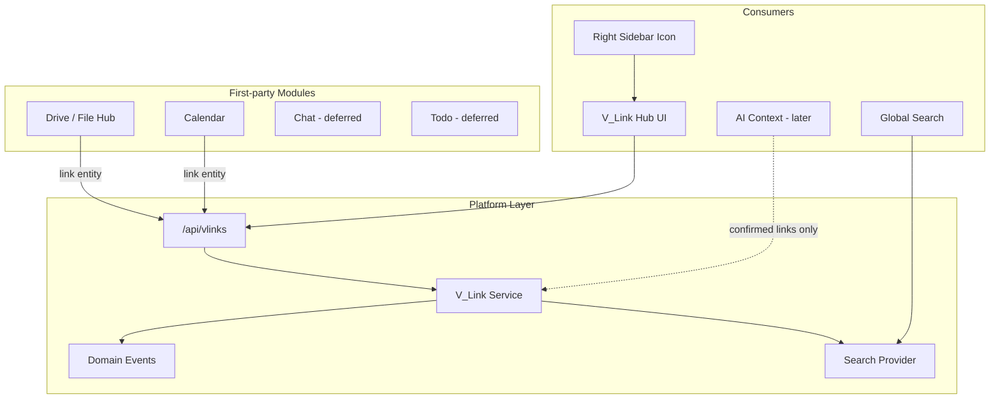

# V_Link Platform Layer Plan

> **Implementation status (2026-06-14):** V_Link is **shipped** for core modules. For current resolver/manifest/UI truth use [PLATFORM_ENTITY_MODEL.md](../architecture/PLATFORM_ENTITY_MODEL.md) and [V_LINK.md](../architecture/V_LINK.md). For relationship semantics use [RELATIONSHIP_FRAMEWORK_INDEX.md](../architecture/RELATIONSHIP_FRAMEWORK_INDEX.md). This plan retains **historical phase decisions and non-negotiables** — do not use VL phase checklists as integration status.

**Date:** May 2026  
**Status:** **Revised — approved as source of truth** (VL-0). Implementation begins at **VL-1 only after this document is committed.**  
**Scope:** Platform-wide contextual relationship layer — connects files, calendar events, and future entities across personal, business, and household scopes  
**Canonical doc:** This file — [`docs/plans/V_LINK_PLATFORM_LAYER_PLAN.md`](./V_LINK_PLATFORM_LAYER_PLAN.md)

**Product constraint:** V_Link is **not** a tag system, folder replacement, project manager, or AI-only feature. It is a native operating-layer primitive for organization, search, collaboration, and permission-aware discovery.

**Revision note (May 2026):** Incorporated product decisions on entity linking schema, v1 access model (membership-only), favorites deferral, business admin ownership transfer (VL-7), archive vs Global Trash, and Drive upload UX.

**Related (do not duplicate):**

| Topic | Source |
|-------|--------|
| Module interoperability contract | [`memory-bank/moduleSpecs.md`](../../memory-bank/moduleSpecs.md), [`.cursor/rules/module-interoperability.mdc`](../../.cursor/rules/module-interoperability.mdc) |
| Domain events | [`docs/architecture/DOMAIN_EVENTS.md`](../architecture/DOMAIN_EVENTS.md) |
| Workspace runtime | [`docs/architecture/WORKSPACE_RUNTIME_AND_MODULE_CONTRACTS.md`](../architecture/WORKSPACE_RUNTIME_AND_MODULE_CONTRACTS.md) |
| Drive / Calendar product context | [`memory-bank/driveProductContext.md`](../../memory-bank/driveProductContext.md), [`memory-bank/calendarProductContext.md`](../../memory-bank/calendarProductContext.md) |
| Global search | [`memory-bank/globalSearchProductContext.md`](../../memory-bank/globalSearchProductContext.md) |
| AI context providers | [`memory-bank/aiContextSystem.md`](../../memory-bank/aiContextSystem.md) |
| Prisma discipline | [`docs/guides/PRISMA_MIGRATION_DISCIPLINE.md`](../guides/PRISMA_MIGRATION_DISCIPLINE.md) |

---

## How to use this plan

0. Work **one phase at a time** (VL-0 → VL-1 → …). **Do not start VL-1 until this document is committed.**
1. After each implementation phase, run validation (see §16), summarize changes/risks, and ask: **"Phase VL-N is complete. Ready to start Phase VL-N+1?"**
2. Preserve existing architecture: JWT auth, Next.js API proxy, tenant scoping (`dashboardId` + `businessId`/`householdId`), Policy Engine patterns, domain event registry.
3. See **Non-negotiable principles** below — especially membership vs entity access.

---

## Non-negotiable principles

These are fixed for v1 and must not be weakened in implementation:

1. **V_Link membership never grants access to linked entity content in v1.** V_Link organizes relationships; it does not override Drive, Calendar, Chat, Business, Household, or module permissions.
2. **V_Link is a platform primitive, not an installable marketplace module.**
3. **AI may suggest links but may not silently create or attach confirmed links** — user approval required; suggestions stored separately from confirmed links.
4. **Tenant isolation:** no cross-business, cross-household, or personal→business leakage without authorized scope alignment.
5. **v1 access is membership-only.** No UNLISTED/code-only anonymous access. Public code resolves identity; the user must still be a vlink member (or receive an invite flow) to view the container.

---

## 1. Repo audit summary (May 2026)

### 1.1 What exists today

| Area | Finding | Key paths |
|------|---------|-----------|
| **V_Link code** | **None** — greenfield | No `vlink` references in repo |
| **Cross-entity links** | Module-specific junction tables only | `TaskFileLink`, `TaskEventLink` in [`prisma/modules/todo/todo.prisma`](../../prisma/modules/todo/todo.prisma); [`server/src/controllers/todoController.ts`](../../server/src/controllers/todoController.ts) |
| **AI entity linking** | Query-time inference, not persisted | [`server/src/ai/context/entityLinking.ts`](../../server/src/ai/context/entityLinking.ts), [`ContextSynthesisService.ts`](../../server/src/ai/context/ContextSynthesisService.ts) |
| **Polymorphic audit pattern** | `resourceType` + `resourceId` | [`prisma/modules/admin/admin-portal.prisma`](../../prisma/modules/admin/admin-portal.prisma) (`AuditLog`, `DataClassification`) |
| **Sharing roles** | `NoteShare` viewer/editor | [`prisma/modules/notes/notes.prisma`](../../prisma/modules/notes/notes.prisma) |
| **Scope patterns** | `dashboardId` + optional org FKs | Notes, Task, AISuggestion, File, Calendar (`CalendarContextType` + `contextId`) |
| **Soft delete** | `trashedAt` (Global Trash) vs `deletedAt` | Drive `File`/`Folder`, Calendar `Event`; Notes use `deletedAt` |
| **Public codes** | Block ID on User; tokens on invites | [`prisma/modules/auth/user.prisma`](../../prisma/modules/auth/user.prisma); `RsvpToken`, `BusinessInvitation` |
| **Domain events** | Registry + typed emitters | [`server/src/events/domainEventRegistry.ts`](../../server/src/events/domainEventRegistry.ts), [`domainEventEmitters.ts`](../../server/src/events/domainEventEmitters.ts) |
| **Global search** | Provider registry in controller | [`server/src/controllers/searchController.ts`](../../server/src/controllers/searchController.ts); types in [`shared/src/types/search.ts`](../../shared/src/types/search.ts) |
| **Right sidebar / AI** | 40px fixed rail; Brain → `/ai-chat` | [`web/src/app/dashboard/DashboardLayoutInner.tsx`](../../web/src/app/dashboard/DashboardLayoutInner.tsx) ~1269–1297; [`web/src/components/business/DashboardLayoutWrapper.tsx`](../../web/src/components/business/DashboardLayoutWrapper.tsx) |
| **Drag payload contract** | JSON `application/json` with `moduleId` | [`web/src/components/modules/DriveModule.tsx`](../../web/src/components/modules/DriveModule.tsx); drop target template: [`web/src/components/GlobalTrashBin.tsx`](../../web/src/components/GlobalTrashBin.tsx) |
| **Module page template** | Notes pattern | [`web/src/app/notes/`](../../web/src/app/notes/), [`web/src/components/notes/NotesModule.tsx`](../../web/src/components/notes/NotesModule.tsx) |
| **Detail panel template** | Drive slide-over | [`web/src/components/drive/DriveDetailsPanel.tsx`](../../web/src/components/drive/DriveDetailsPanel.tsx) |
| **Calendar recurrence** | `parentEventId`, `recurrenceRule` on `Event` | [`prisma/modules/calendar/calendars.prisma`](../../prisma/modules/calendar/calendars.prisma) |
| **Prisma modules** | Edit `prisma/modules/**`; build via script | [`scripts/build-prisma-schema.js`](../../scripts/build-prisma-schema.js) — add new folder to `moduleOrder` |
| **Ambient AI suggestions** | Separate concern — do not conflate | [`prisma/modules/ai/ai-models.prisma`](../../prisma/modules/ai/ai-models.prisma) (`AISuggestion`, `AISuggestionSignal`) |

### 1.2 Architectural positioning



**V_Link is NOT:**
- An installable marketplace module
- A replacement for Drive folders, calendar ownership, or chat threads
- A permission escalation mechanism

**V_Link IS:**
- A platform primitive registered as a **core capability** (like Global Trash), with UI surfaces in the persistent shell
- A polymorphic link store + membership container + activity history

### 1.3 Registration vs marketplace module

| Aspect | Decision |
|--------|----------|
| Marketplace install | **No** — always available to every user |
| `coreModuleRegistry` | **Yes** — register `id: 'vlink'` with `source: 'core'`, `capabilities: ['read','write','ai']` for routing/workspace metadata only |
| `registerBuiltInModules.ts` | **Partial** — add AI context provider entry in Phase VL-9 only; skip marketplace manifest in v1 |
| Business workspace hub | **Yes** — `VLinkWorkspaceLanding.tsx` + `BusinessWorkspaceContent` case per [`module-development.mdc`](../../.cursor/rules/module-development.mdc) |
| Module activity feed | **Optional secondary** — primary history via `VLinkActivity`; domain events for platform fan-out |

---

## 2. Product definition (locked)

| Property | Requirement |
|----------|-------------|
| User-facing name | **V_Link** |
| Individual item | **vlink** |
| Internal model | **VLink** |
| Public code | **VL-############** (12 digits); immutable; prefix shown in UI |
| Scopes at launch | PERSONAL, BUSINESS, HOUSEHOLD |
| Nesting | One parent, unlimited children; no cycles |
| Archive/delete | Supported; **separate archive** (not Global Trash v1) — see §18 |
| Global search | Required |
| Sidebar icon | Persistent right rail, **directly under AI (Brain) icon** |
| First integrations | Drive, Calendar; Chat deferred |
| AI | Suggest only; user approval required; no silent attach |
| v1 access | **Membership-only** — no UNLISTED/code-only anonymous access |

---

## 3. Data model plan

### 3.1 Prisma location

**New module folder:** [`prisma/modules/platform/vlink.prisma`](../../prisma/modules/platform/vlink.prisma)

**Build script change:** Add `'platform'` to `moduleOrder` in [`scripts/build-prisma-schema.js`](../../scripts/build-prisma-schema.js) **after `'business'`** and **before `'ai'`**.

**Migration naming:** `20260601120000_vlink_platform_foundation/migration.sql` (timestamp at implementation time).

### 3.2 Enums (module-local unless shared widely)

```prisma
enum VLinkScope { PERSONAL BUSINESS HOUSEHOLD }
enum VLinkStatus { ACTIVE ARCHIVED DELETED }
enum VLinkMemberRole { OWNER EDITOR VIEWER }
enum VLinkEntityType {
  FILE FOLDER CALENDAR_EVENT CHAT_CONVERSATION CHAT_THREAD
  TASK TODO NOTE DASHBOARD WIDGET USER BUSINESS HOUSEHOLD MODULE_ENTITY
}
enum VLinkEntityRelationType { PRIMARY REFERENCE }  // v1 uses PRIMARY only; REFERENCE reserved for v2+
enum VLinkEntitySource { MANUAL AI_SUGGESTED SYSTEM }
enum VLinkSuggestionStatus { PENDING ACCEPTED REJECTED EXPIRED }
enum VLinkSuggestionSource { AI SYSTEM }
```

**Deferred for v1:** `VLinkVisibility` (UNLISTED/PUBLIC). Access is membership-only. Add visibility enum in a future migration when product requires code-only or public discovery.

### 3.3 Models

#### VLink

| Field | Type | Notes |
|-------|------|-------|
| `id` | UUID PK | Internal |
| `publicCode` | String @unique | Format `VL-` + 12 digits; generated server-side |
| `title` | String | Editable |
| `description` | String? | Editable |
| `scope` | VLinkScope | PERSONAL / BUSINESS / HOUSEHOLD |
| `dashboardId` | String | Workspace anchor (required) |
| `businessId` | String? | Required when scope=BUSINESS |
| `householdId` | String? | Required when scope=HOUSEHOLD |
| `ownerUserId` | String | Initial owner; business creator for business scope |
| `parentVLinkId` | String? | Self-relation; null = root |
| `color` | String? | Hex or token |
| `icon` | String? | Lucide icon name |
| `status` | VLinkStatus | ACTIVE / ARCHIVED / DELETED |
| `metadata` | Json? | AI/workflow extensibility; **`pinned` deferred** — may use `metadata.pinned` later for favorites |
| `createdById` | String | |
| `updatedById` | String? | |
| `archivedAt` | DateTime? | Separate archive UX — **not** Global Trash v1 |
| `deletedAt` | DateTime? | Soft delete |
| `createdAt` / `updatedAt` | DateTime | |

**Indexes:** `[dashboardId, businessId, householdId]`, `[ownerUserId]`, `[parentVLinkId]`, `[status]`, `[publicCode]`

**Relations:** `parent`/`children`, `members`, `entities`, `suggestions`, `activities`

#### VLinkMember

| Field | Notes |
|-------|-------|
| `vlinkId`, `userId` | `@@unique([vlinkId, userId])` |
| `role` | OWNER / EDITOR / VIEWER |
| `invitedById` | |
| `acceptedAt` | Null until accept (external guest flow) |
| `createdAt`, `updatedAt` | |

**v1 rule:** Creator gets OWNER row on create. Business ADMIN may **force-transfer ownership** in Phase VL-7.

#### VLinkEntity (confirmed links)

| Field | Notes |
|-------|-------|
| `vlinkId` | |
| `entityType` | VLinkEntityType |
| `entityId` | String — polymorphic target ID |
| `moduleId` | String? | e.g. `drive`, `calendar` |
| `relationType` | VLinkEntityRelationType @default(PRIMARY) | v1: PRIMARY only; REFERENCE reserved for secondary links in v2+ |
| `isPrimary` | Boolean @default(true) | Denormalized flag aligned with `relationType=PRIMARY` |
| `linkedById` | User who confirmed link |
| `source` | MANUAL / AI_SUGGESTED / SYSTEM |
| `metadata` | Json? | |
| `unlinkedAt` | DateTime? | Soft unlink (preserve audit) |
| `createdAt`, `updatedAt` | |

**v1 rule — one primary vlink per entity:**

Each entity may have **at most one active primary link** (`relationType=PRIMARY`, `isPrimary=true`, `unlinkedAt IS NULL`) across all vlinks.

**Forward-compatible schema (avoid painful v2 migration):**

- **Do NOT** use `@@unique([entityType, entityId])` on the whole table — that would block secondary/reference links later.
- **Do** use:
  - `@@unique([vlinkId, entityType, entityId])` — prevent duplicate link of same entity to the same vlink
  - `@@index([entityType, entityId])` — reverse lookup
  - **Partial unique index (migration SQL):** one active primary per entity:

```sql
CREATE UNIQUE INDEX vlink_entities_one_primary_per_entity
ON vlink_entities (entity_type, entity_id)
WHERE relation_type = 'PRIMARY' AND is_primary = true AND unlinked_at IS NULL;
```

- **Service-layer guard** in `vlinkService.linkEntity()`: before creating a PRIMARY link, verify no conflicting active primary exists; return 409 with option to move primary to this vlink (unlink old + link new).

**v2+ (planned, not v1):** Allow additional rows with `relationType=REFERENCE`, `isPrimary=false` — same entity linked to multiple vlinks as non-primary references.

#### VLinkSuggestion (AI/system proposals — NOT confirmed)

Separate from `VLinkEntity`. Full schema in Phase VL-8; optional stub in VL-1.

| Field | Notes |
|-------|-------|
| `vlinkId` | Nullable — may suggest new vlink |
| `suggestedTitle` | For create-new suggestions |
| `entityType`, `entityId` | |
| `suggestedBy` | AI / SYSTEM |
| `confidence` | Float |
| `reasonCodes` | Json |
| `explanation` | Internal/admin only |
| `status` | PENDING / ACCEPTED / REJECTED / EXPIRED |
| `reviewedById`, `reviewedAt` | |

**Accept flow:** Creates `VLinkEntity` with `source: AI_SUGGESTED`; marks suggestion ACCEPTED. Never auto-create.

#### VLinkActivity

**Recommendation: dedicated table** (least duplicative for vlink detail Activity tab).

| Field | Notes |
|-------|-------|
| `vlinkId` | |
| `actorUserId` | Nullable for system |
| `action` | e.g. `created`, `title_updated`, `entity_linked`, `member_added` |
| `entityType`, `entityId` | Optional — for link/unlink rows |
| `metadata` | Json — safe, no secrets |
| `createdAt` | Immutable |

**Also emit domain events** (§6) for cross-cutting consumers — activity row = user-facing history; domain event = platform bus.

**Do NOT reuse:** Drive `Activity` model, `AuditLog` alone, or `AISuggestion`.

### 3.4 Public code generation

**Service:** `vlinkPublicCodeService.ts`

- Format: `VL-` + 12 random digits (crypto-safe)
- Validate uniqueness with retry (max 5 attempts)
- Store full string `VL-483920174625` for simpler lookup
- **Separate from Block ID** — no reuse of [`blockIdValidation.ts`](../../server/src/utils/blockIdValidation.ts)

**Code entry UX:** User types digits with visible `VL-` prefix. Server resolves code → returns vlink **only if caller is a member**; otherwise 403 or "request access" placeholder (no content leak).

---

## 4. Permissions model (v1)

### 4.1 Core principle

> **V_Link organizes relationships. V_Link does not grant access to linked resources.**

This is **non-negotiable** for v1.

### 4.2 Role matrix

| Action | Owner | Editor | Viewer | Business Admin (governance) |
|--------|-------|--------|--------|----------------------------|
| View vlink container (title, code, metadata) | Yes | Yes | Yes | List/metadata for business-scoped vlinks only |
| View linked item **content** | Per entity permission | Per entity permission | Per entity permission | Per entity permission — **never elevated** |
| Rename title / edit description | Yes | Yes | No | No |
| Edit color/icon | Yes | Yes | No | No |
| Add/remove linked entities | Yes | Yes | No | No |
| Invite/remove members | Yes | Yes (cannot grant Owner) | No | Can force-archive business vlink (VL-7) |
| View Activity tab | Yes | Yes | Yes | Governance list if not a member |
| View AI tab | Yes | Yes | Yes | Filtered like members |
| Archive vlink | Yes | No | No | Business ADMIN may archive business vlinks (VL-7) |
| Delete vlink (soft) | Yes | No | No | Business ADMIN with audit (VL-7) |
| Restore archived | Yes | No | No | Business ADMIN |
| Change parent (nest) | Yes | Yes | No | No |
| Accept/reject AI suggestions | Yes | Yes | No | No |
| **Force-transfer ownership** | — | — | — | **Yes (VL-7)** — business ADMIN for business-scoped vlinks |

### 4.3 Linked entity filtering (UX)

**v1 UX: redacted placeholder**

When user has vlink access but lacks entity permission:

```
Restricted file — you don't have access to this item
```

- Include entity **type** only; no filename, event title, or chat subject
- Counts on vlink cards: **accessible count** + **"+N restricted"** badge

**Implementation:** `vlinkEntityResolverService.ts` — Drive via [`evaluateDrivePolicyDual`](../../server/src/auth/drivePolicyDual.ts); Calendar via calendar membership checks.

### 4.4 Tenant isolation

| Rule | Enforcement |
|------|-------------|
| No cross-business | Scope + entity ownership checks on every link |
| No cross-household | Same |
| No personal→business leakage | Scope alignment required |
| External guests | `VLinkMember` with Owner/Editor invite + `acceptedAt`; same redaction rules |

### 4.5 Policy Engine (Phase VL-1 foundation, harden VL-7)

Add actions to [`policyActions.ts`](../../server/src/auth/policyActions.ts):

- `vlink:create`, `vlink:read`, `vlink:update`, `vlink:archive`, `vlink:delete`
- `vlink:member:invite`, `vlink:entity:link`, `vlink:entity:unlink`, `vlink:ownership:transfer` (VL-7)

---

## 5. Nesting rules (v1)

| Rule | Behavior |
|------|----------|
| Depth | One parent per vlink; unlimited children |
| Cycles | **Blocked** — service validates ancestry chain |
| Entity attachment | Links attach to **one primary vlink** per entity (not auto-duplicated to parent) |
| Rolled-up counts | Parent shows accessible child entity counts + child vlink count |
| Parent visibility | Does **not** reveal inaccessible child content |
| **Delete parent** | **Blocked if active children** — user chooses: archive subtree, reparent children, or cancel |
| **Archive parent** | Archive subtree by default |
| **Restore parent** | Restore parent only by default; optional "restore with children" |

---

## 6. Domain events

Register in [`domainEventRegistry.ts`](../../server/src/events/domainEventRegistry.ts) before emit. Helpers in [`domainEventEmitters.ts`](../../server/src/events/domainEventEmitters.ts).

| Event type | Producer | Payload (safe metadata) | Consumers |
|------------|----------|-------------------------|-----------|
| `vlink.created` | create | `vlinkId`, `publicCode`, `scope`, tenant ids, `parentVLinkId?` | Activity, socket, search |
| `vlink.updated` | PATCH | `vlinkId`, changed fields | Same |
| `vlink.archived` | archive | `vlinkId`, `archivedAt` | Same |
| `vlink.deleted` | soft delete | `vlinkId` | Same |
| `vlink.restored` | restore | `vlinkId` | Same |
| `vlink.member.added` | invite accept | `vlinkId`, `userId`, `role` | Activity, optional notification |
| `vlink.member.updated` | role PATCH | `vlinkId`, `userId`, `role` | Activity |
| `vlink.member.removed` | DELETE member | `vlinkId`, `userId` | Activity |
| `vlink.ownership.transferred` | VL-7 admin transfer | `vlinkId`, `fromUserId`, `toUserId` | Activity, audit |
| `vlink.entity.linked` | entity POST | `vlinkId`, `entityType`, `entityId`, `moduleId`, `source`, `relationType` | Activity, search |
| `vlink.entity.unlinked` | entity DELETE | `vlinkId`, `entityType`, `entityId` | Activity, search |
| `vlink.suggestion.created` | VL-8 | `suggestionId`, `entityType`, `entityId` | AI diagnostics |
| `vlink.suggestion.accepted` / `.rejected` | VL-8 | `suggestionId`, `vlinkId?` | Learning signals |

**Order:** `authorize → execute → write VLinkActivity → emitDomainEvent` (never emit on failure).

---

## 7. Backend API plan

### 7.1 Mount

```typescript
// server/src/index.ts
import vlinksRouter from './routes/vlinks';
app.use('/api/vlinks', authenticateJWT, vlinksRouter);
```

**Files:**
- [`server/src/routes/vlinks.ts`](../../server/src/routes/vlinks.ts)
- [`server/src/controllers/vlinkController.ts`](../../server/src/controllers/vlinkController.ts)
- [`server/src/services/vlinkService.ts`](../../server/src/services/vlinkService.ts)
- [`server/src/services/vlinkPermissionService.ts`](../../server/src/services/vlinkPermissionService.ts)
- [`server/src/services/vlinkEntityResolverService.ts`](../../server/src/services/vlinkEntityResolverService.ts)
- [`server/src/services/vlinkPublicCodeService.ts`](../../server/src/services/vlinkPublicCodeService.ts)
- [`web/src/api/vlinks.ts`](../../web/src/api/vlinks.ts)

### 7.2 URL identifier strategy

| Use | Identifier |
|-----|------------|
| Internal relations | UUID |
| User-facing code entry | `publicCode` |
| API | UUID routes + `GET /api/vlinks/by-code/:publicCode` (membership required) |

### 7.3 Endpoints

| Method | Path | Purpose |
|--------|------|---------|
| GET | `/api/vlinks` | List (scope, status, businessId, householdId, sharedWithMe, archived, recent) |
| POST | `/api/vlinks` | Create |
| GET | `/api/vlinks/:idOrCode` | Detail + counts |
| PATCH | `/api/vlinks/:id` | Update |
| DELETE | `/api/vlinks/:id` | Soft delete (child handling body) |
| POST | `/api/vlinks/:id/archive` | Archive (+ optional subtree) |
| POST | `/api/vlinks/:id/restore` | Restore |
| GET/POST/PATCH/DELETE | `/api/vlinks/:id/members` | Member CRUD |
| POST | `/api/vlinks/:id/ownership/transfer` | **VL-7** — business admin force-transfer |
| GET/POST/DELETE | `/api/vlinks/:id/entities` | Entity link CRUD |
| GET | `/api/vlinks/entity/:entityType/:entityId` | Reverse lookup (primary + future references) |
| GET | `/api/vlinks/:id/activity` | Paginated activity |
| GET/POST | `/api/vlinks/suggestions` | VL-8 |

**Pagination:** `?limit=20&cursor=` on `updatedAt` + `id`.

---

## 8. Frontend UX plan

### 8.1 Route: `/vlink`

| Route | Purpose |
|-------|---------|
| `/vlink` | Hub |
| `/vlink/[id]` | Detail |
| `/vlink/code/[publicCode]` | Deep link (membership gate) |
| `/business/[id]/workspace/vlink` | Redirect to `?module=vlink` |

### 8.2 Right sidebar icon

**Placement:** Immediately after Brain in [`DashboardLayoutInner.tsx`](../../web/src/app/dashboard/DashboardLayoutInner.tsx) and [`DashboardLayoutWrapper.tsx`](../../web/src/components/business/DashboardLayoutWrapper.tsx).

| Interaction | Behavior |
|-------------|----------|
| Click | Navigate to `/vlink` |
| Drag | Start link-drop mode |
| Mobile | Long-press / context menu "Add to V_Link" |

### 8.3 Hub filters (v1)

**Included:** Recent, Personal, Business, Household, Shared with Me, Archived, (AI Suggested — VL-8)

**Deferred:** Favorites — may add later via `metadata.pinned`; no Favorites filter in v1.

### 8.4 Detail page tabs

| Tab | v1 |
|-----|-----|
| Overview, Files, Calendar, Activity, People/Access | Functional |
| Chats, Tasks, AI | Placeholder |

### 8.5 Modals

- `VLinkConnectModal`, `VLinkCreateEditModal`, `VLinkShareModal` (with membership ≠ entity access warning), `VLinkCodeEntry` (VL- prefix visible)

---

## 9. Drive integration (Phase VL-5)

| Surface | File | Change |
|---------|------|--------|
| Indicators | `DriveModule.tsx` | `VLinkIndicator` |
| Detail panel | `DriveDetailsPanel.tsx` | Linked vlinks section |
| Context menu | `DriveModule.tsx`, `FileContextMenu.tsx` | Add to / View V_Link |
| Bulk select | `DriveModule.tsx` | Add to V_Link if bulk bar exists |
| **Upload flow** | `DrivePageContent.tsx` | **Post-upload toast action** ("Add to V_Link") — **not** a mandatory upload modal step |

---

## 10. Calendar integration (Phase VL-6)

Link **single occurrence** (`Event.id`) only; defer series linking to v2.

Files: `EventDrawer.tsx`, `CalendarModule.tsx`, `calendar/month/page.tsx`.

---

## 11. Chat integration (deferred — Phase VL-10)

Thread/conversation linking, chat header chip, related entities panel, chat activity tab.

---

## 12. AI integration (phased)

| Phase | Scope |
|-------|-------|
| VL-1–VL-7 | Manual links only |
| VL-8 | `VLinkSuggestion` accept/reject |
| VL-9 | AI context provider; `entityLinking` prefers persisted vlinks |

---

## 13. Global search (Phase VL-2)

`vlinkSearchProvider` in [`searchController.ts`](../../server/src/controllers/searchController.ts) — title, description, publicCode; membership-scoped; no restricted entity titles in results.

---

## 14. Phased implementation

### Phase VL-0: Repo audit + source-of-truth plan ✅

**Goal:** This document + README index. No runtime changes.

**Deliverables:**
- [`docs/plans/V_LINK_PLATFORM_LAYER_PLAN.md`](./V_LINK_PLATFORM_LAYER_PLAN.md) (this file)
- [`docs/plans/README.md`](./README.md) index row

**Checkpoint:** Commit revised plan → then begin VL-1.

---

### Phase VL-1: Data model + backend foundation

Prisma models (forward-compatible `VLinkEntity`), partial unique index migration, CRUD, permission skeleton, primary-link service guard, tests.

**Validation:** `pnpm prisma:build && pnpm prisma:generate`, `pnpm type-check`, `pnpm test -- vlink`

---

### Phase VL-2: Domain events + activity + search

Events, `VLinkActivity`, `vlinkSearchProvider`.

---

### Phase VL-3: V_Link Hub UI

`/vlink` hub — list, filter, create, edit, archive, nested tree, counts. **No Favorites filter.**

---

### Phase VL-4: Right sidebar + drag-to-link

Icon under AI; drag session; connect modal; mobile fallbacks.

---

### Phase VL-5: Drive integration

Indicators, menus, detail panel; **post-upload toast** for vlink connect.

---

### Phase VL-6: Calendar integration

Occurrence-only linking; indicators.

---

### Phase VL-7: Sharing/members hardening

Owner/editor/viewer, guest invites, **business ADMIN force-transfer ownership**, redaction polish, governance archive/delete.

---

### Phase VL-8: AI suggestions groundwork

`VLinkSuggestion` API/UI; no silent attach.

---

### Phase VL-9: AI context provider

**Status:** ✅ Complete — includes first-class AI Pipeline Context Source (`vlink`).

- Module provider: `GET /api/vlinks/ai/context/recent`
- Pipeline registry: `vlink` / **V_Link Relationships** in `pipelineCatalogDefaults.ts` (+ idempotent DB reconcile)
- Grounding rules: optional `vlink` on planning/workflow/business/technical intents (+ idempotent DB reconcile via `reconcileSystemPipelineGroundingRules`)
- Runtime: `vlinkPipelineContextService.ts` → `DigitalLifeTwinCore` → `entityLinking` (`persistedVLinks`)
- Traces: `source: vlink` in admin pipeline diagnostics (not generic `module_context` only)
- Grounding: optional `vlink` on planning / workflow / business intents; strong fetch on VL-code references
- **Excluded from grounding truth:** pending `VLinkSuggestion` rows (accept/reject API only)

---

### Phase VL-10: Chat/task/future modules

CHAT_CONVERSATION, TASK entity types; functional tabs.

---

## 15. Full feature acceptance criteria

- [ ] Create scoped vlinks with stable `VL-` code
- [ ] One **primary** link per entity in v1; schema supports future secondary links
- [ ] Nest vlinks; block cycles
- [ ] Archive in **separate archive UX** (not Global Trash)
- [ ] Global search by title/code
- [ ] Right sidebar icon under AI
- [ ] Drag onto Drive file / Calendar event → modal → link
- [ ] Indicators on linked items
- [ ] Detail Files + Calendar tabs permission-filtered
- [ ] Restricted placeholders for inaccessible items
- [ ] Membership ≠ entity access (**non-negotiable**)
- [ ] Business ADMIN force-transfer ownership (VL-7)
- [ ] Domain events + activity
- [ ] AI suggestions require approval (VL-8+)
- [ ] No regressions to Drive, Calendar, Chat, Dashboard, AI, auth, search

---

## 16. Validation commands

| Command | Purpose |
|---------|---------|
| `pnpm lint` | ESLint web + server + shared |
| `pnpm type-check` | All packages |
| `pnpm test` | Server vitest |
| `pnpm --filter vssyl-web test` | Web runtime tests |
| `pnpm prisma:build` / `pnpm prisma:generate` | Schema |
| `pnpm verify:ci` | type-check + test |

---

## 17. Memory Bank

**Do not create [`memory-bank/vlinkProductContext.md`](../../memory-bank/vlinkProductContext.md) during VL-0.**

**Create after VL-1** when schema and API stabilize. This plan remains canonical until then. Update [`memory-bank/activeContext.md`](../../memory-bank/activeContext.md) at first implementation milestone.

---

## 18. Locked product decisions (May 2026 revision)

Previously open questions — **resolved:**

| Question | Decision |
|----------|----------|
| **Favorites** | **Defer v1.** May add later via `metadata.pinned` and a Favorites filter — not in initial hub. |
| **UNLISTED visibility** | **No for v1.** Membership-only access. Defer `VLinkVisibility` enum entirely. Public code resolves identity; viewing requires membership. |
| **Business ADMIN force-transfer ownership** | **Yes — implement in VL-7.** Route: `POST /api/vlinks/:id/ownership/transfer`; emit `vlink.ownership.transferred`. |
| **Global Trash** | **Separate archive for v1.** Archived/deleted vlinks use V_Link archive UX (`archivedAt` / hub Archived filter), **not** Global Trash. |
| **Upload → vlink** | **Post-upload toast action first** — e.g. "Add to V_Link" on successful upload. **Not** a mandatory step in the upload modal. Optional connect in upload flow deferred. |

---

## 19. Phase boundary notes

Chat → VL-10. Sharing hardening (including admin ownership transfer) → VL-7 before AI suggestions. Drag infrastructure → VL-4 before Drive/Calendar. Entity schema designed for v2 secondary links without migration pain.
