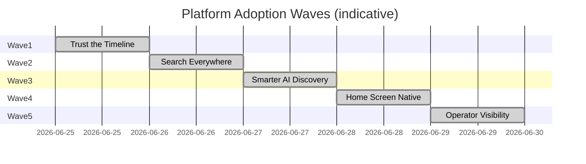

# Platform Adoption Wave Plan

**Program:** Platform Capability Adoption — Phase 0A  
**Date:** 2026-06-25  
**Status:** Waves 1–5 **complete**

**Wave 1 closeout:** [PLATFORM_ADOPTION_WAVE1_CLOSEOUT.md](./PLATFORM_ADOPTION_WAVE1_CLOSEOUT.md)  
**Wave 2 closeout:** [PLATFORM_ADOPTION_WAVE2_CLOSEOUT.md](./PLATFORM_ADOPTION_WAVE2_CLOSEOUT.md)  
**Wave 3 closeout:** [PLATFORM_ADOPTION_WAVE3_CLOSEOUT.md](./PLATFORM_ADOPTION_WAVE3_CLOSEOUT.md)  
**Wave 4 closeout:** [PLATFORM_ADOPTION_WAVE4_CLOSEOUT.md](./PLATFORM_ADOPTION_WAVE4_CLOSEOUT.md)  
**Wave 5 closeout:** [PLATFORM_ADOPTION_WAVE5_CLOSEOUT.md](./PLATFORM_ADOPTION_WAVE5_CLOSEOUT.md)

**Principle:** Each wave delivers **immediately visible user improvements**. No wave builds new platform capabilities — only closes adoption gaps against certified infrastructure.

**Opportunity cross-reference:** [PLATFORM_ADOPTION_OPPORTUNITY_REGISTER.md](./PLATFORM_ADOPTION_OPPORTUNITY_REGISTER.md)

---

## 1. Wave overview



| Wave | Name | Duration | Primary user outcome | Modules |
|------|------|----------|----------------------|---------|
| **1** | Trust the Timeline | ✅ **Complete** | Activity Feed + AI read kernel timeline | All |
| **2** | Search Everywhere | ✅ **Complete** | Omnibar finds workforce + notebook content | HR, Scheduling, WC, Notebook |
| **3** | Smarter AI Discovery | ✅ **Complete** | AI finds entities by asking | Drive, Todo, Calendar, HR, Scheduling, all search modules |
| **4** | Home Screen Native | ✅ **Complete** | Dashboard widgets participate in search + activity | Dashboard, Quick Notes, Bookmarks |
| **5** | Operator Visibility | ✅ **Complete** | Operators see adoption health in Platform Controller | Platform Adoption dashboard |

**Note:** Waves 4 and 5 can overlap with 2/3 after Wave 1 completes. Wave 1 is the critical path.

---

## 2. Wave 1 — Trust the Timeline

**Theme:** Platform Kernel read migration (ACT-R1)

**User-visible outcome:** "When I open my Activity Feed or ask my AI twin what happened today, I see the same events I see inside Chat, Drive, and HR."

### Scope

| ID | Work package | Owner surface |
|----|--------------|---------------|
| PA-P0-01 | `activityFeedController` → `platformActivityQueryService` | Activity Feed, Dashboard |
| PA-P0-02 | `CrossModuleContextEngine` + `DigitalLifeTwinService` kernel reads | AI workspace |
| PA-P1-06 | Activity Feed widget kernel-only path | Dashboard widget |
| PA-P1-11 | `analyticsCapabilityService` personal path off `prisma.activity` | Analytics capability |
| PA-P2-10 | V_Link activity normalization assessment | V_Link |

### Success metrics

| Metric | Target |
|--------|--------|
| Feed API legacy table queries | **0** in hot path |
| AI context engines legacy Activity reads | **0** |
| User-reported feed/AI inconsistency | Qualitative improvement in QA matrix |

### Out of scope

- New activity emitters (writes already strong)
- Domain event bus changes

### Dependencies

- None — uses existing `platformActivityQueryService`

### Risk

| Risk | Mitigation |
|------|------------|
| Missing historical events in Log | One-time backfill assessment; document cutoff date |
| Performance of Log scans | Existing indexes; pagination already in query service |

---

## 3. Wave 2 — Search Everywhere

**Theme:** Business operations + notebook search providers

**Status:** ✅ **Complete** — see [PLATFORM_ADOPTION_WAVE2_CLOSEOUT.md](./PLATFORM_ADOPTION_WAVE2_CLOSEOUT.md)

**User-visible outcome:** "I type 'Tuesday shift' or 'time off request' in search and get results without opening Scheduling or HR."

### Scope

| ID | Work package | Module |
|----|--------------|--------|
| PA-P0-03 | HR search provider | HR |
| PA-P0-04 | Scheduling search provider | Scheduling |
| PA-P1-02 | Workforce Comms search provider | Workforce Comms |
| PA-P1-03 | Notebook search provider + manifest | Notebook |
| PA-P2-13 | Place meeting search (optional in wave) | Place |

### Implementation pattern (copy from File Hub)

1. `searchAccessible*` in module visibility service
2. Register `RegisteredSearchProvider` in `searchProviderRegistry.ts`
3. Set `manifestSearchClaim: true` + `supportsSearch: true` on entities
4. PE `search:read` + module read dual on every hit
5. CI: `assertManifestSearchProviderParity()` green

### Success metrics

| Metric | Target |
|--------|--------|
| Built-in search providers | **13** (from 9) |
| BO module search QA scenarios | **PASS** in manual QA matrix |
| Manifest search parity test | Green |

### Dependencies

- Wave 1 not required but recommended for result deep-link activity consistency

---

## 4. Wave 3 — Smarter AI Discovery

**Theme:** Query-native AI discovery via Retrieval Adapter

**Status:** ✅ **Complete** — see [PLATFORM_ADOPTION_WAVE3_CLOSEOUT.md](./PLATFORM_ADOPTION_WAVE3_CLOSEOUT.md)

**User-visible outcome:** "I ask AI 'find the budget spreadsheet' or 'where is my Tuesday shift' and it searches the platform, not just recent files."

### Scope

| ID | Work package | Modules |
|----|--------------|---------|
| PA-P1-01 | Retrieval adapter → Unified Search delegate for Tier A/B intents | Drive, Todo, Calendar |
| PA-P1-08 | HR visibility-bounded AI reads | HR |
| PA-P1-09 | Scheduling visibility-bounded AI reads | Scheduling |
| PA-P2-11 | `notifications_activity` pipeline source | Notifications, AI |

### Architecture constraint

Per [AI_RETRIEVAL_CONSTITUTION.md](../ai/retrieval/AI_RETRIEVAL_CONSTITUTION.md): query-driven discovery **must delegate through Retrieval Adapter** — no parallel Prisma search in AI paths.

### Success metrics

| Metric | Target |
|--------|--------|
| AR-O-07, AR-O-08 operation matrix | **C** (compliant) |
| AI query-driven find scenarios | **PASS** in AI QA matrix |
| HR/Scheduling AI permission leak tests | **PASS** |

### Dependencies

- **Wave 2 required** for HR/Scheduling search delegate to be meaningful

---

## 5. Wave 4 — Home Screen Native

**Theme:** Platform-native dashboard & workspace widgets

**Status:** ✅ **Complete** — see [PLATFORM_ADOPTION_WAVE4_CLOSEOUT.md](./PLATFORM_ADOPTION_WAVE4_CLOSEOUT.md)

**User-visible outcome:** "Quick notes and bookmarks show up in global search; creating them appears in my activity timeline."

### Scope (delivered)

| ID | Work package | Surface |
|----|--------------|---------|
| PA-P2-07 | Quick Notes + Bookmarks via **dashboard search provider** | Widgets |
| PA-W4-01 | Kernel activity on quicknote/bookmark create | Widgets |
| PA-W4-02 | Widget audit + adoption matrix | All dashboard widgets |
| PA-W4-03 | Manifest entity parity for dashboard | Platform Controller |

### Product decision

**Option A adopted** — composition widgets participate through dashboard module (no widget-specific search/AI).

### Success metrics

| Metric | Target | Result |
|--------|--------|--------|
| Quick Notes / Bookmarks search | Unified Search | ✅ |
| Widget adoption (composition) | ≥ Level C | ✅ Level C |
| Dashboard module score | ≥ 55 | ✅ ~72 (Level B) |

### Dependencies

- Wave 2–3 for AI query-native discovery of dashboard hits

---

## 6. Wave 5 — Operator Visibility

**Theme:** Platform Controller adoption governance

**Status:** ✅ **Complete** — see [PLATFORM_ADOPTION_WAVE5_CLOSEOUT.md](./PLATFORM_ADOPTION_WAVE5_CLOSEOUT.md)

**User-visible outcome:** Operators see which modules participate in which capabilities and where gaps remain.

### Scope (delivered)

| ID | Work package | Surface |
|----|--------------|---------|
| PA-P1-12 | Per-module adoption health cards | `/admin-portal/platform-adoption` |
| PA-P2-12 | Platform participation CI validation | `pnpm validate:platform-adoption` |
| PA-P2-06 | Fleet-wide search readiness metrics | Adoption fleet summary |
| PA-P3-08 | Operator visibility docs | `PLATFORM_OPERATOR_VISIBILITY.md` |

### Success metrics

| Metric | Target | Result |
|--------|--------|--------|
| Operator answers "which modules lack search?" | < 30 seconds | ✅ Adoption dashboard |
| CI validation | Warn on regression | ✅ `platformAdoptionValidation` |
| Module cards | All evaluated surfaces | ✅ 22 registry entries |

### Dependencies

- Phase 0A documents + Waves 1–4 baselines

---

## 7. Cross-wave dependency graph

```
Wave 1 (Kernel reads)
  ├── enables ──► Wave 4 (Activity Feed widget)
  └── enables ──► Wave 3 (AI context quality)

Wave 2 (BO Search)
  └── enables ──► Wave 3 (AI search delegate for HR/Scheduling)

Wave 5 (Controller)
  └── can start after Wave 1 (uses scorecard baselines)
```

---

## 8. What not to do in adoption waves

| Anti-pattern | Why |
|--------------|-----|
| Build new platform capabilities | Capabilities are certified — adopt, don't expand |
| Re-run module certification | Adoption ≠ certification |
| Rewrite BO modules | Search providers + visibility reads are sufficient |
| Marketplace partner runtime changes | Out of scope for first-party adoption |
| Dashboard Package 4+ composition redesign | Wave 4 is adoption only |

---

## 9. Wave authorization checklist

Before each wave enters ACT mode:

- [ ] Council reviews wave scope against this plan
- [ ] Memory Bank `activeContext.md` updated with adoption program status
- [ ] Operation matrix rows added per module (adoption, not certification)
- [ ] QA scenarios added to `PLATFORM_MANUAL_QA_MATRIX.md`
- [ ] No conflict with archived certification programs

---

## 10. Expected portfolio trajectory

| Milestone | Weighted adoption score | Level B+ modules |
|-----------|-------------------------|------------------|
| **Today (0A)** | 68 | 8 / 22 |
| **After Wave 1** | 74 | 10 / 22 |
| **After Wave 2** | 80 | 13 / 22 |
| **After Wave 3** | 84 | 15 / 22 |
| **After Wave 4** | 87 | 17 / 22 |
| **After Wave 5** | 87 | 17 / 22 (+ operator governance) |

**Target:** **85+** weighted adoption with **≥ 75%** of active product modules at Level B or above.

---

**Last updated:** 2026-06-25
