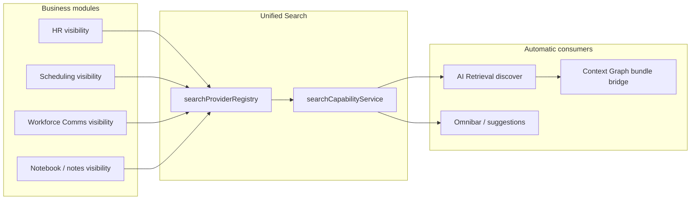

# Platform Discoverability

**Program:** Platform Capability Adoption — Wave 2  
**Date:** 2026-06-25  
**Status:** **Adopted** for HR, Scheduling, Workforce Communications, and Notebook

---

## 1. Definition

A **discoverable module** participates in the platform discovery layer through **Unified Search**. Once registered as a ready search provider, the module automatically feeds:

- **Global omnibar search** (`executeGlobalSearch`)
- **AI Retrieval** (`aiRetrievalCapabilityService.discover` → unified search pathway)
- **Context Graph grounding** (retrieval evidence → `retrievalBundleInferenceBridge` — no module-specific graph adapters)

**Principle:** Implement discoverability once. Consume everywhere.

---

## 2. Architecture

---

## 3. Adoption gate

| Requirement | Enforcement |
|-------------|-------------|
| `searchAccessible*` visibility service | PE dual on every hit; business membership |
| `RegisteredSearchProvider` in registry | `readiness: 'ready'`, `manifestSearchClaim: true` |
| Manifest `capabilities.search: true` | `assertManifestSearchProviderParity()` in CI |
| Entity `supportsSearch: true` | Manifest honesty for searchable types |

**Out of scope:** Module-specific AI retrieval pipelines, duplicate discovery APIs, Search redesign.

---

## 4. Wave 2 modules

| Module | Provider ID | Visibility service | Contexts |
|--------|-------------|-------------------|----------|
| HR | `hr` | `hrVisibilityService.searchAccessibleHrEntities` | Business |
| Scheduling | `scheduling` | `schedulingVisibilityService.searchAccessibleScheduling` | Business |
| Workforce Comms | `workforce_comms` | `workforceVisibilityService.searchAccessibleWorkforceComms` | Business |
| Notebook | `notebook` | `notesVisibilityService.searchAccessiblePages` (notebook branding) | Personal + business |

**Notes vs Notebook:** Legacy `notes` provider remains for backward compatibility. `notebook` provider returns the same visibility path with Notebook module identity and workspace URLs.

---

## 5. Permission model

Every hit is filtered **after** the database query using module Policy Engine dual wrappers:

- HR: `HR_EMPLOYEE_READ`, `HR_TIME_OFF_READ`, `HR_ONBOARDING_MANAGE`
- Scheduling: `SCHEDULING_SCHEDULE_READ`, `SCHEDULING_SHIFT_READ`
- Workforce: `WORKFORCE_COMMUNICATION_READ`, `WORKFORCE_CAMPAIGN_MANAGE` (campaigns)
- Notebook: `NOTES_PAGE_READ`

Global search also requires `search:read` via `evaluateSearchPolicyDual` before any provider runs.

---

## 6. Platform Controller alignment

Adoption is reflected through **existing governance** — no new dashboards:

- `MANIFEST_SEARCH_MODULE_IDS` parity test
- `builtInModuleManifests.ts` capability flags
- Search suggestions API (`getSearchSuggestionsForUser`)

---

## 7. Related documents

- [SEARCH_PROVIDER_ADOPTION.md](./SEARCH_PROVIDER_ADOPTION.md) — implementation checklist
- [DISCOVERABILITY_PARITY_MATRIX.md](./DISCOVERABILITY_PARITY_MATRIX.md) — capability participation matrix
- [PLATFORM_ADOPTION_WAVE2_CLOSEOUT.md](./PLATFORM_ADOPTION_WAVE2_CLOSEOUT.md) — wave closeout
- [../search/SEARCH_MODULE_COMPLIANCE_REQUIREMENTS.md](../search/SEARCH_MODULE_COMPLIANCE_REQUIREMENTS.md)

**Last updated:** 2026-06-25
