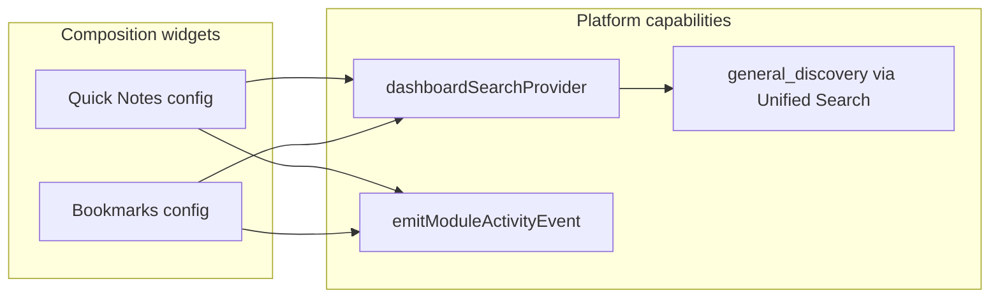

# Platform-Native Dashboard

**Program:** Platform Capability Adoption — Wave 4  
**Date:** 2026-06-25  
**Status:** **Adopted**

---

## 1. Definition

Dashboard and workspace widgets are **platform citizens**. Composition widgets (Quick Notes, Bookmarks) participate in the same capabilities as product modules — through **reuse**, not widget-specific pipelines.

---

## 2. Widget classification

| Class | Widgets | Platform strategy |
|-------|---------|-------------------|
| **Module widget** | chat, drive, calendar, todo, notebook, hr, scheduling, notifications, ai | Module SoR + existing search/AI/activity |
| **Hybrid** | activityfeed | Kernel timeline reads (Wave 1) |
| **Analytics** | quickstats | Analytics capability facade + AI context providers |
| **Composition** | quicknotes, bookmarks | **Dashboard provider** search + kernel activity on create |

---

## 3. Capability participation (Wave 4)

---

## 4. Search

`dashboardSearchProvider` indexes:

- Dashboard names (existing)
- **Quick note** content in `Widget.config` (Wave 4)
- **Bookmark** title/URL in `Widget.config` (Wave 4)

Implementation: `dashboardWidgetVisibilityService.searchAccessibleDashboardWidgets` — no separate widget search API.

---

## 5. Activity

| Action | Kernel event |
|--------|--------------|
| Widget add/remove/update | `widget.add` / `widget.remove` / `widget.update` (existing) |
| Quick note created | `widget.quicknote.create` (Wave 4) |
| Bookmark created | `widget.bookmark.create` (Wave 4) |

Emitted from `widgetService.updateWidget` when new note/bookmark IDs appear in config.

---

## 6. AI discovery

No widget-specific AI. Quick Notes and Bookmarks are discoverable via:

- Unified Search → `dashboard` provider
- Query-native `general_discovery` (Wave 3) when find patterns match

---

## 7. Context Graph

Bookmarks (external URLs) and Quick Notes (local scratchpad) do **not** require V_Link adapters. Module widgets continue to use existing graph paths.

---

## 8. Related documents

- [WORKSPACE_PLATFORM_ADOPTION.md](./WORKSPACE_PLATFORM_ADOPTION.md)
- [DASHBOARD_ADOPTION_MATRIX.md](./DASHBOARD_ADOPTION_MATRIX.md)
- [PLATFORM_ADOPTION_WAVE4_CLOSEOUT.md](./PLATFORM_ADOPTION_WAVE4_CLOSEOUT.md)

**Last updated:** 2026-06-25
