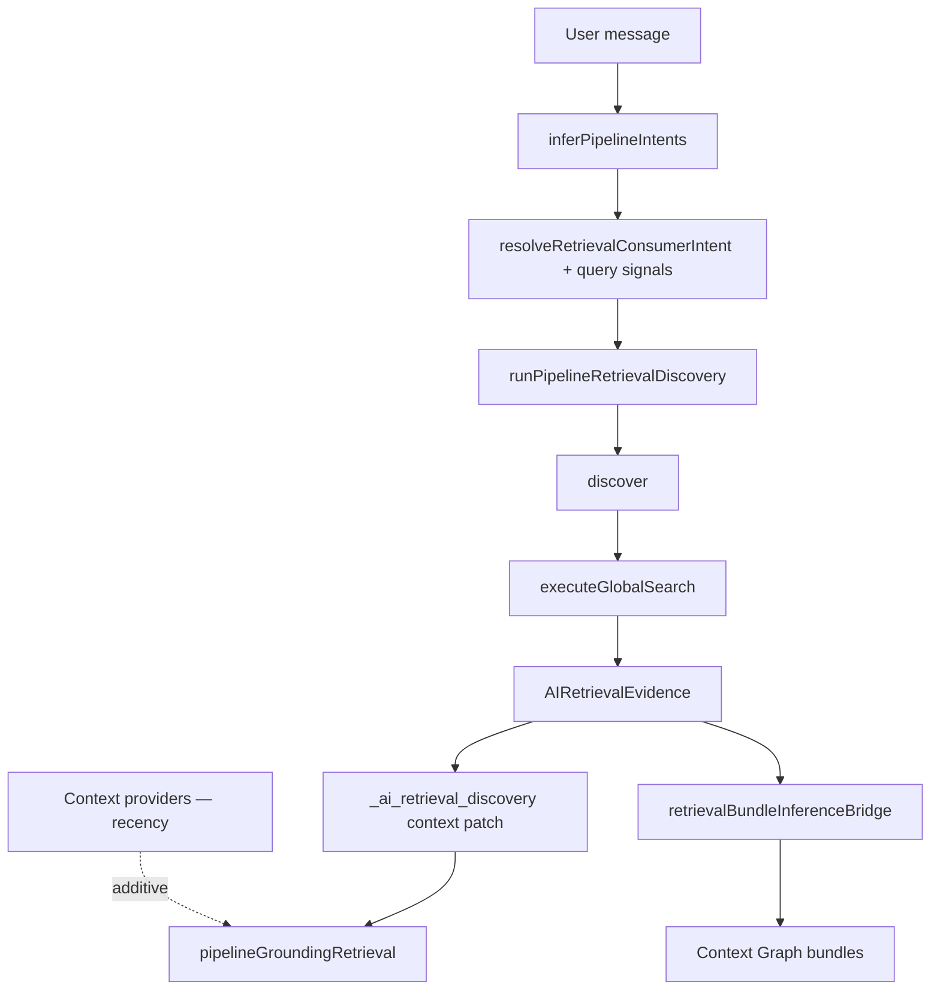

# Query-Native AI Discovery

**Program:** Platform Capability Adoption — Wave 3  
**Date:** 2026-06-25  
**Status:** **Adopted**

---

## 1. Definition

**Query-native discovery** means AI evidence retrieval is driven by **user intent and query text** through the Retrieval Adapter (`discover()` → Unified Search), not primarily by recency-based context providers (recent files, upcoming events, list summaries).

**Principle:** Intent first. Evidence second. Reasoning third.

---

## 2. Architecture

Recency context remains **additive** for grounding rules; query-native evidence is the primary discovery path when consumer intents or find-query signals match.

---

## 3. Retrieval consumers (priority order)

| Priority | Consumer intent | Trigger |
|----------|-----------------|---------|
| 1 | `workflow_action` | Pipeline intent |
| 2 | `business_operations` | Pipeline intent |
| 3 | `project_assistant` | Pipeline intent |
| 4 | `local_discovery` | Pipeline intent |
| 5 | `planning` | Pipeline intent |
| 6 | `general_discovery` | `research` intent **or** query-native find signals |

**Query-native signals** (`detectQueryDiscoverySignals`): find verb + module entity (e.g. "find my budget spreadsheet", "where is my Tuesday shift").

---

## 4. Module participation

All Search-ready modules participate automatically via `executeGlobalSearch` — no module-specific retrieval adapters:

Drive, Calendar, Todo, Chat, Notebook, Notes, Place, HR, Scheduling, Workforce Comms, V_Link, Dashboard, Member, Partner delegates.

---

## 5. Feature flags (opt-out)

| Flag | Default (Wave 3) |
|------|-------------------|
| `AI_RETRIEVAL_DISCOVERY_ENABLED` | on |
| `AI_RETRIEVAL_PROJECT_ASSISTANT_ENABLED` | on (was opt-in) |
| `AI_RETRIEVAL_LOCAL_DISCOVERY_ENABLED` | on (was opt-in) |
| `AI_RETRIEVAL_GENERAL_DISCOVERY_ENABLED` | on |
| `CONTEXT_GRAPH_RETRIEVAL_BRIDGE_ENABLED` | off (enable for graph inference from search) |
| `CONTEXT_GRAPH_GROUNDING_RECONCILE_ENABLED` | off (enable for dedup across sources) |

---

## 6. Operator diagnostics

`PipelineGroundingRetrievalResult.evidenceSourceDiagnostics` separates:

- **recencyContext** — recent_files, upcoming_events, module list providers
- **searchEvidence** — unified_search / ai_retrieval_adapter + modules contributing
- **graphInference** — graph_bundle, retrieval_inference_bridge, vlink

`AIRetrievalDiagnostics.discoveryTrigger`: `named_intent` | `query_native` | `research_intent`

---

## 7. Related documents

- [AI_DISCOVERY_ADOPTION.md](./AI_DISCOVERY_ADOPTION.md)
- [RETRIEVAL_ADOPTION_MATRIX.md](./RETRIEVAL_ADOPTION_MATRIX.md)
- [PLATFORM_ADOPTION_WAVE3_CLOSEOUT.md](./PLATFORM_ADOPTION_WAVE3_CLOSEOUT.md)
- [../ai/retrieval/AI_RETRIEVAL_CONSUMER_STANDARD.md](../ai/retrieval/AI_RETRIEVAL_CONSUMER_STANDARD.md)

**Last updated:** 2026-06-25
