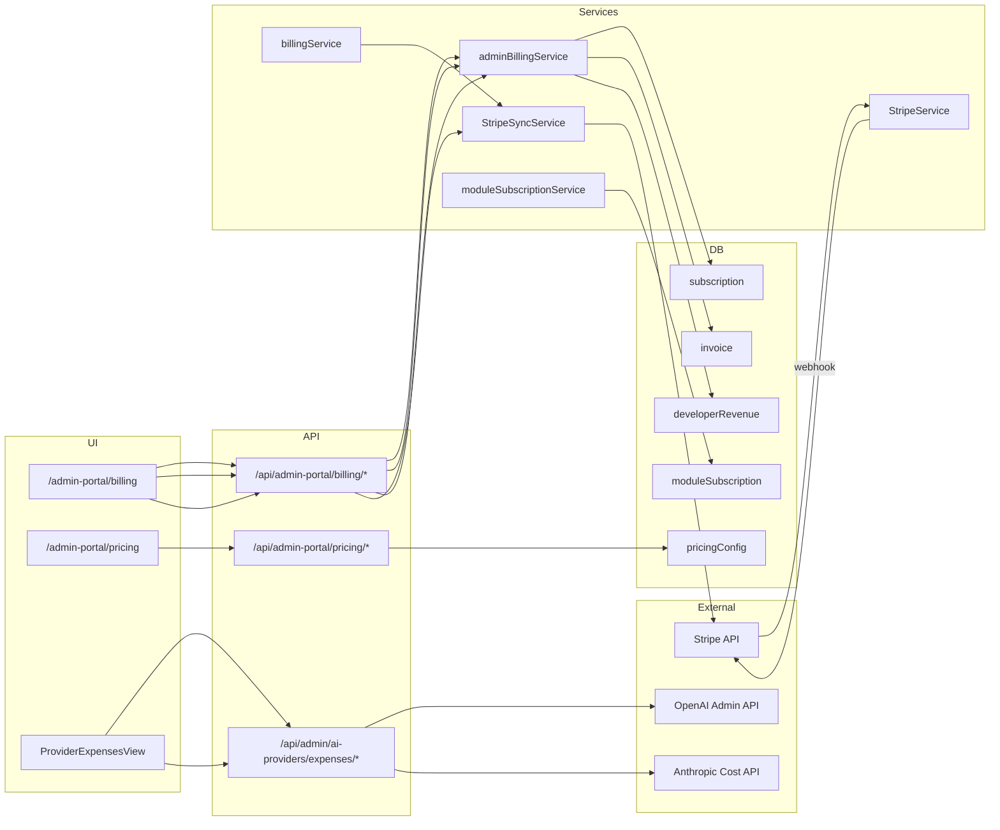

# Billing + Stripe Verification Audit

**Program:** Platform Controller Phase 1C  
**Date:** 2026-06-24  
**Scope:** Financial flows visible in Platform Controller and their Stripe backing

---

## 1. Architecture overview

---

## 2. Stripe integration components

| Component | Location | Role |
|-----------|----------|------|
| Stripe client | `server/src/config/stripe.ts` | `getStripeClient()`, `isStripeConfigured()` |
| Customer creation | `StripeService.createCustomer` | Used by checkout, query packs, module subs |
| Checkout / portal | `StripeService.createCheckoutSession`, `createCustomerPortalSession` | User-facing billing |
| Webhook entry | `POST /api/payment/webhook` (`index.ts`, raw body) | No JWT; signature verified in controller |
| Webhook handler | `StripeService.handleWebhookEvent` | Tier subs, invoices, payment intents, module subs |
| Admin sync | `StripeSyncService.syncSubscriptionFromStripe`, `syncInvoiceFromStripe`, `syncAllSubscriptions` | Operator-triggered reconciliation |
| User billing service | `server/src/services/account/billingService.ts` | `syncSubscription`, `upsertSubscriptionFromCheckout` |

---

## 3. Feature-by-feature audit

### 3.1 Stripe customer creation

| Attribute | Value |
|-----------|-------|
| **Status** | **Working** |
| **PC visibility** | Indirect — customer emails/IDs on billing tabs when present |
| **Paths** | `paymentService` ensures `user.stripeCustomerId`; `aiQueryService` creates on demand |
| **Persistence** | `User.stripeCustomerId` |
| **Tests** | `billingService.test.ts` (mocked), payment intent module sub test |
| **Risk** | Low — failures surface at checkout |
| **Action** | Needs Manual Stripe/GCP Verification: spot-check prod users have `stripeCustomerId` when subscribed |

### 3.2 Tier subscription creation

| Attribute | Value |
|-----------|-------|
| **Status** | **Working** |
| **Paths** | Checkout session completed → `upsertSubscriptionFromCheckout` |
| **Persistence** | `Subscription` with `stripeSubscriptionId`, period dates, status |
| **Tests** | `billingService.test.ts` — entitlement cache sync |
| **Risk** | Medium — metadata (`userId`, `tier`, `businessId`) must be on session |
| **Action** | Verify checkout metadata in Stripe Dashboard for sample subs |

### 3.3 Module subscription creation (personal + business)

| Attribute | Value |
|-----------|-------|
| **Status** | **Working** |
| **Paths** | Payment intent (`type: module_subscription`) or subscription webhooks → `ModuleSubscriptionService` |
| **Persistence** | `ModuleSubscription` with `stripeSubscriptionId`, `amount`, revenue split fields |
| **Business path** | `upsertPaidBusinessModuleSubscription`, `ensureFreeBusinessModuleSubscription` |
| **Tests** | `businessModuleSubscriptionService.test.ts`, `stripeWebhookBilling.test.ts`, payment intent test |
| **Risk** | Medium — business vs personal scoping via `businessId` |
| **Action** | Run business-billing-probe from module admin for paid modules |

### 3.4 Subscription status sync

| Attribute | Value |
|-----------|-------|
| **Status** | **Partially Working** |
| **Webhook sync** | **Working** — status mapped in `ModuleSubscriptionService` + tier handlers |
| **Admin manual sync** | **Working** — `POST /billing/subscriptions/:id/sync` calls Stripe API |
| **Amount sync** | **Partially Working** — Stripe item amounts written to `subscription.stripeMetadata.items`, **not** a top-level `amount` field |
| **Code evidence** | Route maps `amount: typeof sub.amount === 'number' ? sub.amount : 0` but Prisma `Subscription` has no `amount` column |
| **Summary bug** | `getSubscriptions` summary uses `additionalEmployeeCost` sum — not full MRR |
| **Risk** | **High** — operators see $0 subscription amounts in PC billing UI |
| **Action** | **P1:** Derive display amount from `stripeMetadata` or add column; fix summary aggregation |

### 3.5 Webhook handling

| Attribute | Value |
|-----------|-------|
| **Status** | **Working** (code); **Needs Manual Stripe/GCP Verification** (deployed) |
| **Endpoint** | `POST /api/payment/webhook` |
| **Auth** | Stripe signature — not JWT (correct) |
| **Handlers** | Invoice paid/failed, subscription updated/deleted, checkout completed, payment_intent.*, setup_intent.*, module subscription delegation |
| **Tests** | `stripe-webhook.integration.test.ts`, `phaseD-highRisk.integration.test.ts`, `stripeWebhookBilling.test.ts` |
| **Risk** | **High** if webhook secret misconfigured in Cloud Run |
| **Action** | Confirm Stripe webhook endpoint URL and event list in Dashboard |

### 3.6 Invoice / payment visibility

| Attribute | Value |
|-----------|-------|
| **Status** | **Partially Working** |
| **PC page** | Billing → Payments tab |
| **API** | `GET /api/admin-portal/billing/payments` → `adminBillingService.getPayments` |
| **Data** | `prisma.invoice` with joins to `subscription` / `moduleSubscription` |
| **Stripe links** | `StripeSyncService.getStripeInvoiceUrl`, charge URL, customer URL |
| **Note** | Stale comment in service says "Payment model was removed" — implementation uses `Invoice` model (correct) |
| **Risk** | **High** if webhooks do not create/update `invoice` rows — UI empty despite Stripe activity |
| **Action** | Compare invoice count in DB vs Stripe; use per-invoice sync button |

### 3.7 Developer revenue records

| Attribute | Value |
|-----------|-------|
| **Status** | **Partially Working** |
| **Creation** | `stripeService` invoice handlers, `moduleSubscriptionService`, `developerPortalService` |
| **PC display** | Billing → Payouts; Developers → financial validation |
| **Data** | `developerRevenue` with `payoutStatus`, period, split amounts |
| **Validation** | `getDeveloperStats` computes delta between `moduleSubscription` revenue fields and `developerRevenue` aggregates |
| **Risk** | **High** if deltas non-zero — double-count or missing payout pipeline |
| **Action** | Report deltas on developers page; investigate Connect payout automation |

### 3.8 Billing dashboard aggregates

| Attribute | Value |
|-----------|-------|
| **Status** | **Partially Working** |
| **Dashboard revenue** | `moduleSubscription` active sum only (`adminAnalyticsService.getDashboardStats`) |
| **Billing tab summaries** | Subscription status counts real; dollar totals unreliable (see 3.4) |
| **Expenses tab** | `ProviderExpensesView` → combined OpenAI + Anthropic costs |
| **Provider expenses** | **Needs Manual Stripe/GCP Verification** — `.catch(() => null)` returns $0 on API failure |
| **Risk** | Medium — silent $0 on provider API errors |
| **Action** | Surface provider API errors in UI; do not chart zero as "healthy" |

### 3.9 Pricing management (Stripe price IDs)

| Attribute | Value |
|-----------|-------|
| **Status** | **Working** |
| **PC page** | `/admin-portal/pricing` |
| **Data** | `pricingConfig` with `stripePriceId`, tier, cycle, employee pricing |
| **Stripe** | Seed/create flows in pricing admin (Stripe save messaging in UI) |
| **Risk** | Low — misaligned price IDs break checkout |
| **Action** | Periodic audit: `pricingConfig.stripePriceId` vs Stripe product catalog |

---

## 4. Billing feature table

| Feature | Page | API | Data Source | Status | Risk | Recommended Action |
|---------|------|-----|-------------|--------|------|-------------------|
| Subscription list | billing | `GET /billing/subscriptions` | `subscription` | Partially Working | High | Fix amount display + summary |
| Subscription detail (enhanced) | billing | `GET /billing/subscriptions/:id/enhanced` | `subscription` + `invoices` | Working | Low | Use for ops drill-down |
| Sync one subscription | billing | `POST /billing/subscriptions/:id/sync` | Stripe → DB | Working | Medium | Manual verify in test mode |
| Sync all subscriptions | billing | `POST /billing/subscriptions/sync-all` | Stripe → DB | Working | Medium | Rate-limit awareness |
| Invoice list | billing | `GET /billing/payments` | `invoice` | Partially Working | High | Webhook + reconciliation |
| Sync invoice | billing | `POST /billing/invoices/:id/sync` | Stripe → DB | Working | Medium | — |
| Developer payouts | billing | `GET /billing/payouts` | `developerRevenue` | Partially Working | High | Payout workflow audit |
| Provider expenses | billing | `GET /admin/ai-providers/expenses/providers` | Provider APIs | Needs Manual Verification | Medium | Credential + error surfacing |
| Expense history chart | billing | `GET /admin/ai-providers/history/expenses` | `HistoricalDataService` | Partially Working | Medium | Depends on stored history |
| Pricing CRUD | pricing | `/pricing/*` | `pricingConfig` | Working | Low | Stripe ID alignment check |
| Dashboard MRR chip | dashboard | `GET /dashboard/stats` | `moduleSubscription` only | Partially Working | Medium | Include tier subscription revenue |

---

## 5. Recommended implementation priorities (billing only)

| Priority | Item | Effort |
|----------|------|--------|
| **P1** | Subscription amount truth in admin UI (metadata or schema) | Small–medium |
| **P1** | Fix `getSubscriptions` summary aggregation | Small |
| **P2** | Dashboard revenue = tier + module subscriptions | Small |
| **P2** | Provider expense error surfacing (not silent $0) | Small |
| **P3** | Stripe reconciliation runbook + scheduled sync job | Medium |
| **P3** | Developer revenue delta investigation tooling | Medium |

---

**Last updated:** 2026-06-24
