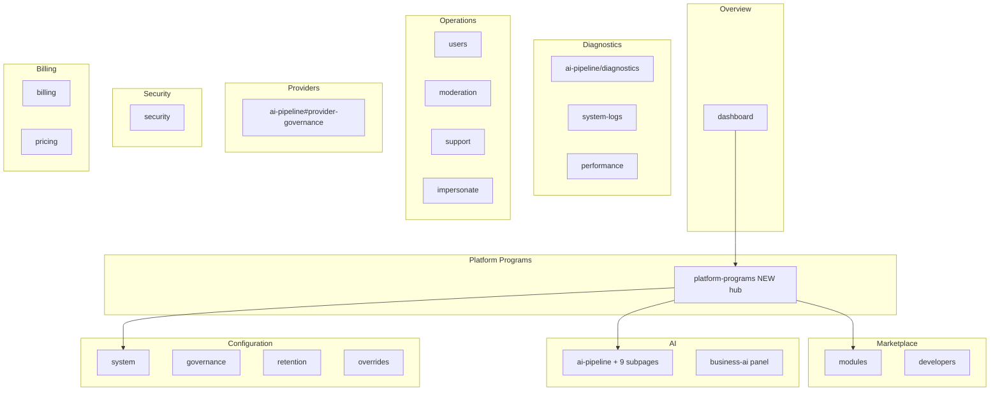

# Platform Controller — Information Architecture

**Program:** Platform Controller Program — Phase 1A  
**Date:** 2026-06-24  
**Status:** Implemented (Phase 1B — 2026-06-24)

**Inputs:** [Admin Portal Phase 0A](../admin-portal/ADMIN_PORTAL_PHASE_0A_EXECUTIVE_SUMMARY.md) · [`ADMIN_PORTAL_SATELLITE_MOUNT_MAP.md`](../architecture/audits/ADMIN_PORTAL_SATELLITE_MOUNT_MAP.md) · `web/src/app/admin-portal/layout.tsx`

**Related deliverables:** [Navigation Model](./PLATFORM_CONTROLLER_NAVIGATION_MODEL.md) · [Platform Programs Hub Design](./PLATFORM_PROGRAMS_HUB_DESIGN.md) · [Executive Summary](./PLATFORM_CONTROLLER_PHASE_1A_EXECUTIVE_SUMMARY.md)

---

## 1. Purpose

Define the **target information architecture (IA)** for the transition from **Admin Portal** to **Platform Controller** — a coherent operational control plane built by **reorganizing existing surfaces**, not by adding duplicate dashboards.

**Guiding principle:** Every existing capability gets a logical home. Consolidation is preferred over expansion.

---

## 2. Conceptual shift

| Before (Admin Portal mental model) | After (Platform Controller mental model) |
|-----------------------------------|------------------------------------------|
| "What admin page do I need?" | "What platform capability am I managing?" |
| Sidebar organized by legacy product areas | Sidebar organized by **operator domains** |
| Orphan hub pages (AI System, BI) | **Platform Programs hub** federates certified capabilities |
| Marketplace under "Developer & Modules" | **Marketplace** as first-class program domain |
| Diagnostics scattered (AI, system, logs) | **Diagnostics** domain with clear depth hierarchy |

**Route prefix:** `/admin-portal/*` remains **unchanged in Phase 1A** (implementation deferred). IA applies to labels, grouping, and navigation — not URL migration in this phase.

---

## 3. Target domain model

Ten operator domains (consolidated from current six sidebar sections + orphans):

| Domain | Purpose | Primary operator question |
|--------|---------|---------------------------|
| **Overview** | Cross-domain status at a glance | "Is the platform healthy?" |
| **Platform Programs** | Certified platform capability governance | "How is Search / Retrieval / Marketplace performing?" |
| **Marketplace** | Module lifecycle, certification, partner probes | "Can this module ship?" |
| **AI** | AI pipeline policies and program depth | "How do I configure retrieval and grounding?" |
| **Diagnostics** | Forensics, logs, performance signals | "What broke and where?" |
| **Operations** | Users, support, moderation, impersonation | "Who needs help / intervention?" |
| **Providers** | LLM provider usage and governance | "What are providers costing and how healthy are they?" |
| **Security** | Events, audit, compliance | "What security incidents need action?" |
| **Billing** | Commercial ops and pricing | "What is revenue and subscription state?" |
| **Configuration** | System, retention, governance policy, overrides | "What platform settings apply?" |

**Settings** is not a standalone domain — it merges into **Configuration** (system, retention, governance, pricing-adjacent toggles).

---

## 4. Domain → surface mapping (target)

---

## 5. Complete page disposition (41 surfaces)

Classification key: **Keep** · **Merge** · **Move** · **Rename** · **Hide** · **Remove**

| # | Current path | Disposition | Target domain | Rationale |
|---|--------------|-------------|---------------|-----------|
| 1 | `/admin-portal` | **Keep** | Overview | Entry redirect; relabel "Platform Controller" in shell header only (conceptual) |
| 2 | `/admin-portal/dashboard` | **Rename** | Overview | Label → **Platform Overview**; same page, clearer role vs program dashboards |
| 3 | `/admin-portal/users` | **Keep** | Operations | Canonical user admin |
| 4 | `/admin-portal/moderation` | **Keep** | Operations | Canonical content moderation |
| 5 | `/admin-portal/support` | **Keep** | Operations | Canonical support queue |
| 6 | `/admin-portal/impersonate` | **Keep** | Operations | Canonical impersonation lab |
| 7 | `/admin-portal/billing` | **Keep** | Billing | Canonical financial management |
| 8 | `/admin-portal/pricing` | **Move** | Billing | Same page; nav group under Billing (not separate Commercial section) |
| 9 | `/admin-portal/platform-programs` | **Merge** | Platform Programs | **New hub route (Phase 1B)** — federates links/cards only; no duplicate metrics |
| 10 | `/admin-portal/modules` | **Move** | Marketplace | Elevate to Marketplace home; same implementation |
| 11 | `/admin-portal/developers` | **Move** | Marketplace | Child of Marketplace domain; same page |
| 12 | `/admin-portal/ai-pipeline` | **Move** | Platform Programs → AI | Program home for **AI Retrieval**; keep as deep ops console |
| 13 | `.../ai-pipeline/intents` | **Keep** | AI | Policy registry depth |
| 14 | `.../ai-pipeline/grounding` | **Keep** | AI | Policy registry depth |
| 15 | `.../ai-pipeline/sources` | **Keep** | AI / Platform Programs | **Context Graph** operator depth (link from Programs hub) |
| 16 | `.../ai-pipeline/tools` | **Keep** | AI | Policy registry depth |
| 17 | `.../ai-pipeline/diagnostics` | **Keep** | Diagnostics | Canonical AI trace forensics |
| 18 | `.../ai-pipeline/test-lab` | **Keep** | Diagnostics | AI evaluation / dry-run |
| 19 | `.../ai-pipeline/quality` | **Keep** | AI | Enforcement stats |
| 20 | `.../ai-pipeline/audit` | **Keep** | Security / AI | Policy audit — cross-link from Security |
| 21 | `.../ai-pipeline/compliance` | **Keep** | Configuration / AI | Retention/export — cross-link from Configuration |
| 22 | `/admin-portal/ai-system` | **Merge** | Platform Programs | **Retire as standalone nav item**; cards absorbed into Programs hub + AI Pipeline |
| 23 | `/admin-portal/business-ai` | **Move** | Platform Programs | Becomes **Business AI** program panel/tab linked from Programs hub (same page) |
| 24 | `/admin-portal/analytics` | **Keep** | Overview / Diagnostics | Canonical platform metrics (already consolidated BI) |
| 25 | `/admin-portal/performance` | **Move** | Diagnostics | Infrastructure metrics — grouped with logs and traces |
| 26 | `/admin-portal/security` | **Keep** | Security | Canonical security & compliance |
| 27 | `/admin-portal/governance` | **Merge** | Configuration | Tab or section under **Configuration** hub (same component) |
| 28 | `/admin-portal/retention` | **Merge** | Configuration | Tab or section under **Configuration** hub (same component) |
| 29 | `/admin-portal/system-logs` | **Move** | Diagnostics | Operational logs alongside performance |
| 30 | `/admin-portal/system` | **Move** | Configuration | System admin, migrations, health config |
| 31 | `/admin-portal/overrides` | **Hide** | Configuration → Labs | Keep capability; move to **Operator Labs** subsection |
| 32 | `/admin-portal/testing` | **Hide** | Labs | Env-gated; unchanged |
| 33 | `/admin-portal/seed-modules` | **Hide** | Labs | Ops tool; link from Labs only |
| 34 | `/admin-portal/ai-learning` | **Remove** | — | Already redirects to ai-pipeline; drop from IA inventory |
| 35 | `/admin-portal/ai-context` | **Remove** | — | Already redirects to ai-pipeline/diagnostics; drop from IA |
| 36 | `/admin-portal/business-intelligence` | **Remove** | — | Already redirects to analytics?tab=insights; drop from IA |
| 37 | `/admin-portal/debug-auth` | **Hide** | Labs | Debug only |
| 38 | `/admin-portal/debug-session` | **Hide** | Labs | Debug only |
| 39 | `/admin-portal/test-api` | **Hide** | Labs | Debug only |
| 40 | `/admin-portal/test-auth` | **Hide** | Labs | Debug only |
| 41 | `/admin-portal/test-impersonation` | **Remove** | — | Duplicate of impersonate lab; redirect to impersonate |
| 42 | `/admin-portal/impersonation-test` | **Remove** | — | Duplicate of impersonate lab; redirect to impersonate |

**Effective surface count after IA (excluding redirects/removals):** **36 operational pages** + **1 new hub shell** (links only) = **37 navigable destinations**, down from **41 files** through merge/hide/remove of **5 redundant routes**.

---

## 6. Hierarchy depth rules

| Rule | Target |
|------|--------|
| Sidebar max depth | **1 level** — domain entry only |
| Program hub depth | **2 levels** — hub → existing program page |
| AI Pipeline depth | **3 levels** — Programs → Pipeline → sub-page (preserve existing sub-shell) |
| Module certification depth | **3 levels** — Marketplace → submission list → modal (preserve) |
| Debug/Labs | **Not in default sidebar** — env-gated footer or collapsed Labs section |

---

## 7. Dashboard taxonomy

| Current page | Target role | Notes |
|--------------|-------------|-------|
| `dashboard` | **Platform Overview** | Cross-domain summary; links into Programs hub |
| `platform-programs` (new) | **Program federation hub** | Cards + status; not a metrics duplicate |
| `ai-pipeline` | **AI Retrieval program dashboard** | Existing ops hub — reference pattern |
| `modules` | **Marketplace program dashboard** | Submissions + certification |
| `analytics` | **Platform metrics dashboard** | Technical + insights tab |
| `security` | **Security operator dashboard** | Incidents + audit |
| `billing` | **Commercial dashboard** | Subscriptions + revenue |

**Do not create** separate dashboards for Search, Context Graph, or Kernel — federate via Programs hub links into **existing** pages.

---

## 8. Cross-domain integration points

| Integration | Mechanism | Duplicate? |
|-------------|-----------|------------|
| Marketplace probes | `MarketplaceReadinessCard` on modules submission modal | No — single probe UI |
| Context Graph ops | Link from Programs hub → `ai-pipeline/sources` + modules AI Context tab | No — two views of same capability (program vs module) |
| Unified Search ops | Link from Programs hub → modules with readiness filter + probe docs | No new search dashboard |
| Provider governance | Nav item → `ai-pipeline#provider-governance` (existing panel) | No duplicate provider page |
| BI insights | `analytics?tab=insights` only | BI route already retired |

---

## 9. Out-of-scope surfaces (unchanged)

| Surface | Disposition |
|---------|-------------|
| `/admin/*` legacy | **Remove** from IA — already redirects to admin-portal |
| `/modules/admin` | **Remove** — redirects to modules |
| `/business/[id]/admin/*` | **Out of scope** — tenant HR/scheduling, not Platform Controller |

---

## 10. Phase 1B implementation sequence (planning)

1. Update sidebar domain model (`layout.tsx` sections only)
2. Add `platform-programs/page.tsx` as **link hub** (reuse `AdminPortalPageShell` + cards)
3. Merge Configuration tabs (governance + retention) — optional single route with tabs
4. Remove duplicate test-impersonation routes (redirects)
5. Relabel shell header Admin Portal → Platform Controller (copy only)
6. **Defer** URL prefix migration `/admin-portal` → `/platform-controller`

---

## 11. Success criteria mapping

| Criterion | Met by |
|-----------|--------|
| Every capability has a logical home | §5 disposition table |
| Duplicates identified | §5 + [Redundancy in Navigation Model](./PLATFORM_CONTROLLER_NAVIGATION_MODEL.md) |
| Platform Programs first-class | §4, [Hub Design](./PLATFORM_PROGRAMS_HUB_DESIGN.md) |
| Navigation simplified | 22 sidebar items → **14** (see Navigation Model) |
| No functionality duplicated | Hub is links-only; no new metric pipelines |
| No runtime changes in 1A | This document |

---

**Last updated:** 2026-06-24 (Phase 1B implemented)
