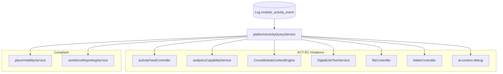

# Activity Consumer Audit

**Program:** Platform Kernel Modernization — Wave 2 Package 1  
**Date:** 2026-06-22  
**Status:** Consumer audit — **no implementation**

---

## 1. Audit method

Static analysis of `server/src` for:

- `prisma.activity` reads/writes
- `operation: 'module_activity_event'` reads
- SoR tables used as activity surrogates in feed paths
- Frontend API consumers

Test-only and commented code excluded from production counts unless routed.

---

## 2. Consumer classification matrix

| ID | Consumer | Class | Compliant? | ACT-R1? | Highest concern |
|----|----------|-------|------------|---------|-----------------|
| C-01 | `activityFeedController` | Platform | No | **Yes** | SoR surrogate + legacy |
| C-02 | `analyticsCapabilityService` (personal) | Analytics | No | **Yes** | AN-M2 certificate major |
| C-03 | `analyticsCapabilityService` (module) | Analytics | No | **Yes** | AN-M2 |
| C-04 | `CrossModuleContextEngine` | AI | No | **Yes** | Grounding trust |
| C-05 | `DigitalLifeTwinService` | AI | No | **Yes** | UX Ref #4 coupling |
| C-06 | `fileController.getItemActivity` | Module | Partial | **Yes** | Dual response |
| C-07 | `folderController.getRecentActivity` | Module | Partial | **Yes** | Legacy merge |
| C-08 | `ai-context-debug` route | AI | No | **Yes** | Prod debug path |
| C-09 | `placeVisibilityService` feed | Module | **Yes** | No | Reference pattern |
| C-10 | `workforceReportingService` | Analytics | **Yes** | No | Count-only |
| C-11 | `placeVisibilityService` export | Module | **Yes** | No | Aggregate count |
| C-12 | `driveDeleteService` | Module | N/A | Coupling | Legacy delete |

---

## 3. Cross-cutting ownership implications

### 3.1 Analytics (C-02, C-03)

| Topic | Implication |
|-------|-------------|
| **Ownership** | Analytics Capability **must not** own activity persistence |
| **Today** | `getPersonalAnalyticsCapability` treats `Activity` as usage SoR |
| **Target** | Call `platformActivityQueryService`; keep file/message **counts** as separate SoR metrics |
| **AN-M2** | Closed when personal path uses normalized query only |
| **Certificate** | Analytics L2 CwF G2 uplift — not new cert program |

**Semantic note:** `totalSessions` may decrease vs legacy (only normalized events count) — document as **honesty correction**, not regression.

### 3.2 AI (C-04, C-05, C-08)

| Topic | Implication |
|-------|-------------|
| **Ownership** | AI Platform consumes read API; does not query kernel stores |
| **CrossModuleContextEngine** | `getActivityContext` → `queryRecentForContext` |
| **DigitalLifeTwinService** | `getRecentActivity` → same |
| **Separate debt** | Intelligence engines using `aIConversationHistory` as `recentActivity` — rename track (not ACT-R1) |
| **UX Ref #4** | AI Experience certification benefits from honest grounding |

### 3.3 Search (no consumer today)

| Topic | Implication |
|-------|-------------|
| **Today** | Search does not read platform activity |
| **Future** | `search_index_stub` on domain events — Search program |
| **ACT-R1** | Query layer **enables** optional activity metadata in index without SoR reads |
| **Ownership** | Search Capability owns index; reads envelopes via platform API only |

### 3.4 Dashboard (F-01, F-03)

| Topic | Implication |
|-------|-------------|
| **Ownership** | Dashboard widget is **consumer only** |
| **Dependency** | C-01 migration unblocks Dashboard G2 feed honesty |
| **No schema change** | Widget config unchanged |

### 3.5 Notifications

| Topic | Implication |
|-------|-------------|
| **Decision** | **Do not** consume activity for notification fan-out |
| **Contract** | Domain events remain notification SoT |
| **Future digest** | May **read** activity via query service for batched digests |

### 3.6 Business Operations / HR

| Topic | Implication |
|-------|-------------|
| **Writers** | `hrActivityService` emits normalized events |
| **Readers** | Global feed omission today — fixed by C-01 federation |
| **Workforce** | C-10 already uses Log counts — extract to `countByModule` |

---

## 4. Highest-risk consumer

**C-01 — `activityFeedController`**

| Factor | Score |
|--------|-------|
| User impact | Daily dashboard landing |
| Constitutional drift | SoR surrogate pattern |
| Blast radius | All modules appear incomplete |
| Visibility | High — user-facing |

---

## 5. Compliant consumers (patterns to preserve)

### C-09 — Place feed

```text
Policy gate → prisma.log (module_activity_event, module=place) → envelope parse → DTO map
```

**Migrate to:** policy gate → `queryModuleFeed` → DTO map (same ownership split).

### C-10 — Workforce reporting

```text
prisma.log.count({ operation: module_activity_event, module, businessId, message pattern })
```

**Migrate to:** `countByModule` with action filter parameter.

---

## 6. Legacy `Activity` table status

| Aspect | Finding |
|--------|---------|
| **Writes** | No `prisma.activity.create` in production `server/src` (grep clean) |
| **Reads** | 8 production violation sites |
| **Deletes** | `driveDeleteService` on file purge |
| **Charter** | Table is **read-only legacy** — retirement after read migration |

---

## 7. Consumer dependency graph



---

## 8. Test coverage gap

| Area | Today | Required |
|------|-------|----------|
| Feed integration | `activity-feed-dashboard.integration.test.ts` — tests current multi-source | Rewrite for normalized-only |
| Place feed | `placeVisibilityService.test.ts` — asserts Log query | Update for query service mock |
| Analytics | Mocks `prisma.activity` | Mock query service |
| Query service | **None** | Contract tests per operation |

---

## Related

- [ACT_R1_MIGRATION_MATRIX.md](./ACT_R1_MIGRATION_MATRIX.md)
- [ACTIVITY_FEED_SOURCE_OF_TRUTH_REVIEW.md](./ACTIVITY_FEED_SOURCE_OF_TRUTH_REVIEW.md)

**Last updated:** 2026-06-22
