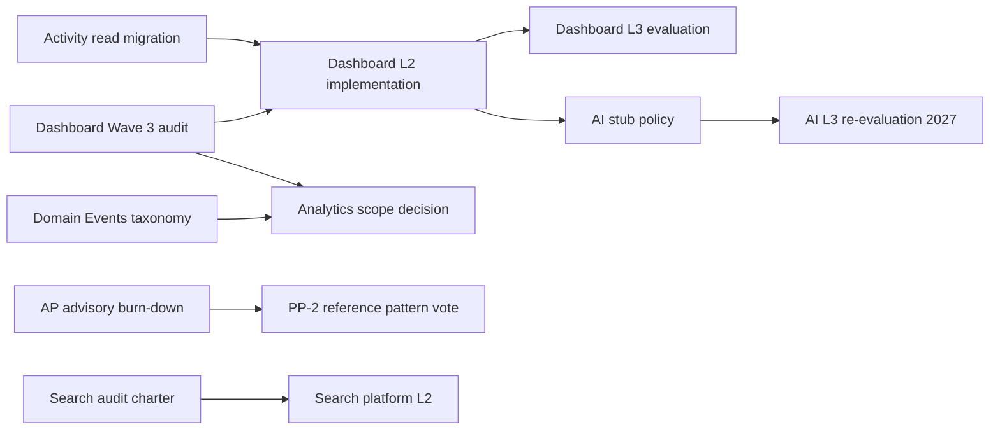

# Platform Modernization Priority 2026

**Program:** Platform Portfolio Refresh 2026  
**Date:** 2026-06-21  
**Status:** Recommendation only — **no implementation packages authorized**  
**Supersedes:** [`PLATFORM_PORTFOLIO_MODERNIZATION_PRIORITY.md`](./PLATFORM_PORTFOLIO_MODERNIZATION_PRIORITY.md) (2026-06-19)

---

## Priority framework

| Signal | Weight |
|--------|--------|
| Architectural risk (Critical/High) | 35% |
| Business value (daily use + revenue) | 30% |
| Certification unlock (enables L3 path) | 20% |
| Dependency order (unblocks other work) | 15% |

**Excluded from prioritization:** All archived certification programs (Admin Portal, BA, Context Graph, BO, Reference Workspace, Account Platform, **Dashboard Wave 3**); Calendar/Place/Notebook hygiene-only work; AI Platform L3 full program (deferred per ROI).

---

## Top 10 modernization priorities (re-ranked)

| Rank | Initiative | Type | Rationale | Est. effort |
|------|------------|------|-----------|-------------|
| **1** | **Analytics Wave 3 — scope audit + product vs platform decision** | Module | Last uncertified product module; scope ambiguity (R-05) | 2–3 weeks discovery |
| **2** | **Platform Activity read migration + Domain Events taxonomy** | Platform | R-03/R-06; unblocks honest L3 claims | 3–5 weeks |
| **3** | **AI Platform stub executor policy (narrow L3 prep)** | Platform | R-01 Critical; deny/stub policy — not full L3 wave | 2–3 weeks |
| **4** | **Account Platform advisory burn-down (certificate majors)** | Hygiene | MFA, modal billing UX, business settings dedup — post-cert not new program | 4–8 weeks (phased) |
| **5** | **Search / Relationship Search Phase 2B planning + platform audit charter** | Platform | Unaudited; cross-module findability after L3 density | 1–2 weeks planning + audit |
| **6** | **Policy Engine read-path parity charter** | Platform | R-07; completes authorization story for certified modules | 2–4 weeks |
| **7** | **Platform Scheduler §22 registry + Manifest reconcile** | Platform | L1 systems; job honesty; capability truth | 2–3 weeks |
| **8** | **Realtime platform audit charter** | Platform | No ledger row; module-declared pattern needs platform matrix | 2 weeks discovery |
| **9** | **Dashboard Package 4 finding remediation (optional)** | Hygiene | M1-R, M4, M5, M7 on certificate — separate ACT | 4–6 weeks |
| **10** | **UX Reference #6 Place expansion registration prep** | UX | Eligible With Findings; completes UX baseline expansion | 2–3 weeks governance |

---

## What should be modernized next

**Recommended sequence (next 2 quarters):**

1. **Analytics Wave 3 entry** — scope audit → product vs platform decision → implementation charter
2. **Platform kernel increment** — Activity read migration + Domain Events taxonomy (parallel, incremental)
3. **AI stub policy** — product decision on household/business/dashboard executors
4. **AP advisory burn-down** — phased engineering against certificate majors (not a new cert program)

---

## What should NOT be modernized next

| Item | Reason |
|------|--------|
| Admin Portal, Business Administration, Context Graph, Business Operations | Programs **archived** — advisories are module backlog |
| Reference Workspace WS-L3 program | **Complete** — WS-L3 CwF archived; plain WS-L3 is separate council path |
| Account Platform certification trilogy | **Complete** — PP-1/2/3 + umbrella archived 2026-06-20 |
| Identity / Settings / Billing **discovery audits** | **Obsolete** — superseded by Account Platform execution |
| Calendar architecture L3 | **Complete** — hygiene P3 only |
| Place L3 / Reference #5 | **Complete** — PL-H* optional |
| File Hub L4 changes | Reference Implementation — change control only |
| AI Platform full L3 wave | **Deferred** ROI rank 5/5 (52/100) — stub policy only until Dashboard stable |
| Standalone Notes L3 | **Stopped** — Notebook owns notes sub-domain |
| BO analytics module | **Explicitly deferred** Stage 4 per BO program archive |
| Notebook post-cert NB-H* | Optional hygiene — not portfolio priority |
| Chat / Calendar Level 4 pursuit | Out of scope without council charter |
| New Business Operations certification wave | Program archived — plain L3 is separate council vote |
| ENG-1 Place segment fix | **Closed** at WS-L3 award |

---

## Business value ranking

| Rank | Area | Value driver |
|------|------|--------------|
| 1 | **Dashboard** | Default personal landing; widget ecosystem |
| 2 | **Account Platform advisory closure** | MFA, billing UX, settings coherence — daily trust |
| 3 | **Platform kernel (Activity, Events)** | Honest audit trail for all modules |
| 4 | **Billing entitlements UX** | Revenue, module gating (post-cert majors) |
| 5 | **Analytics** | Business intelligence promise (scope TBD) |
| 6 | **Search / discovery** | Cross-module findability |
| 7 | **AI Platform L3** | Strategic but deferred |
| 8 | **Workspace advisory burn-down** | Shell polish — WS-L3 achieved |
| 9 | **Platform Scheduler** | Background jobs reliability |
| 10 | **Marketplace pipeline** | Partner revenue (longer horizon) |

---

## Top 5 certification candidates (next programs)

| Rank | Candidate | Current level | Path | Preconditions |
|------|-----------|---------------|------|---------------|
| **1** | **Dashboard** | L1 | L2 → L3 module cert | Wave 3 audit + service extraction |
| **2** | **Analytics** | L1 | Scope decision → L2/L3 OR platform-only | Product vs subscriber charter |
| **3** | **Search (platform capability)** | Unaudited | Audit → L2 platform row | Phase 2B architecture |
| **4** | **Policy Engine (platform)** | L2 | Platform L3 charter | Read-path parity |
| **5** | **AI Platform** | L2 | L3 re-evaluation | Readiness >75/100; stub policy closed |

**Not next:** Plain L3 promotion for BO, AP, or WS (separate council votes when advisories reduce).

---

## 12-month roadmap (recommended)

| Quarter | Focus | Target outcome |
|---------|-------|----------------|
| **Q3 2026** | Dashboard Wave 3 audit + service extraction start; Activity/Events increment; AI stub policy | Dashboard L2 candidacy; platform kernel progress |
| **Q4 2026** | Dashboard compliance wave; Analytics scope locked; Search audit charter | Dashboard L3 evaluation candidate |
| **Q1 2027** | Dashboard L3 certification evaluation; Analytics implementation OR platform subscriber cert | Second product module L3 (Dashboard) |
| **Q2 2027** | AI Platform L3 readiness re-score; PE platform L3 charter; AP reference pattern votes (PP-2, #AP-BILL-1) | AI L3 decision gate; reference promotions |

**Not in 12-month roadmap:** Level 4 for any module except File Hub maintenance; BO plain L3; full marketplace certification; WS plain L3 (no findings suffix).

---

## Single highest-priority initiative

### **Dashboard Wave 3 — constitutional audit + service extraction charter**

| Field | Detail |
|-------|--------|
| **Why first** | Last major **uncertified product module** on the personal critical path; Reference Workspace explicitly **out of scope** for `dashboard` module id; dual widget registry and weak activity block platform completeness narrative |
| **Scope** | Governance audit + engineering charter — constitutional audit, operation matrix, service extraction plan, widget registry unification strategy |
| **Unlocks** | Analytics scope decision (shared hub patterns); AI dashboard executor policy; honest personal landing certification |
| **Not in scope** | Visual redesign (separate UX program); ledger updates; certification execution in this discovery wave |

---

## Initiative dependency graph

---

## Modernization value ranking

| Rank | Initiative | Modernization value |
|------|------------|---------------------|
| 1 | Activity reads + Domain Events | Raises entire platform audit honesty |
| 2 | Dashboard Wave 3 | Closes last product-module L1 gap |
| 3 | Analytics scope lock | Prevents expensive wrong-path build |
| 4 | AI stub policy | Closes critical constitutional gap cheaply |
| 5 | PE read-path parity | Completes authorization model |

---

## Related

- [PLATFORM_EXECUTIVE_SUMMARY_2026.md](./PLATFORM_EXECUTIVE_SUMMARY_2026.md)
- [PLATFORM_RISK_MATRIX_2026.md](./PLATFORM_RISK_MATRIX_2026.md)
- [PLATFORM_MODULE_MODERNIZATION_ROADMAP.md](../plans/PLATFORM_MODULE_MODERNIZATION_ROADMAP.md)

**Last updated:** 2026-06-21
