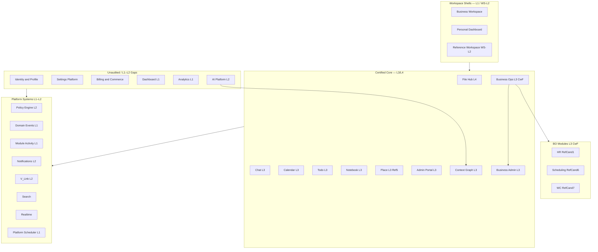

# Platform Portfolio — Domain Map

**Program:** Vssyl Platform Portfolio Reality Assessment  
**Date:** 2026-06-19  
**Status:** Discovery only

---

## Portfolio topology

---

## Domain inventory

### Tier 0 — Platform kernel & federation

| Domain | Type | Module id / key | Owner | SoR | Maturity | Cert status |
|--------|------|-----------------|-------|-----|----------|-------------|
| Runtime Kernel | Platform | — | Platform Engineering | Constitution | L2+ | Implicit in all certs |
| Context Graph | Platform capability | `context-graph` | Architecture / AI | Federation orchestrator | **L3** | **Certified** |
| Policy Engine | Platform capability | — | Platform Engineering | `policyEngine.ts` | L2 | Uncertified platform row |
| Domain Events | Platform capability | — | Platform Engineering | Event registry | L1 | Uncertified |
| Module Activity | Platform capability | — | Platform Engineering | Activity service | L1 | Uncertified |
| Global Trash | Platform capability | — | Platform Engineering | Trash API | L2 | Uncertified platform row |
| V_Link | Platform capability | — | Platform Engineering | `vlinkService` | L2 | Uncertified platform row |
| Notifications | Platform capability | — | Platform Engineering | `notificationService` | L2 | Service L2; UX Ref #2 |
| Search | Platform capability | — | Platform Engineering | `searchController` | L1 | **Unaudited** |
| Realtime | Platform capability | — | Chat socket hub | `chatSocketService` | L2 | No platform row |
| Platform Scheduler | Platform capability | — | Platform Engineering | Job registry | L1 | Uncertified |
| Manifest governance | Platform capability | — | Platform Engineering | `builtInModuleManifests` | L1 | Uncertified |

---

### Tier 1 — Control plane & administration

| Domain | Type | Key surfaces | Owner | Maturity | Cert status |
|--------|------|--------------|-------|----------|-------------|
| Admin Portal / Control Plane | Platform system | `/admin-portal`, `/api/admin-portal` | Platform Ops | **L3** | **Certified** — Control Plane Ref With Findings |
| Business Administration | Platform subdomain | Org chart, permissions, approvals, business profile | BA program | **L3** | **Certified** — #OC-1/#OC-2/#OC-3 |
| Billing & Commerce | Platform capability | `/api/billing`, Stripe, entitlements | Platform / Finance | L2 backend | **Unaudited** — no cert row |
| Identity & Profile | Platform capability | `/api/profile`, photos, member | Auth / Platform | L1 | **Unaudited** |
| Settings Platform | Platform capability | 6+ settings hubs | Fragmented | L1 | **Unaudited** |

---

### Tier 2 — Product modules (user-facing)

| Domain | Module id | Maturity | Cert status | Reference |
|--------|-----------|----------|-------------|-----------|
| File Hub | `drive` | L4 | **Reference Implementation** | Arch #1 / UX #1 |
| Chat | `chat` | L3 | **Certified** | Arch #2 |
| Calendar | `calendar` | L3 | **Certified** | Arch #3 / UX #5 |
| Todo | `todo` | L3 | **Certified** | Arch #4 / UX #3 |
| Notebook | `notebook` | L3 | **Certified** (composition) | Not Ref #5 |
| Notes | `notes` | L2 | Sub-domain of Notebook | — |
| Place | `place` | L3 | **Certified** | Arch #5 |
| HR | `hr` | L3 CwF | **Certified WITH FINDINGS** | BO Ref #1 |
| Scheduling | `scheduling` | L3 CwF | **Certified WITH FINDINGS** | BO Ref #6 CwF |
| Workforce Communications | `workforce_comms` | L3 CwF | **Certified WITH FINDINGS** | BO Ref #7 |
| Dashboard | `dashboard` | L1 | **Uncertified** | Wave 3 not started |
| Analytics | `analytics` | L1 | **Uncertified** | Pseudo-module |
| AI Platform | `ai` (platform) | L2 | **L2 only** — L3 deferred | UX Ref #4 |

---

### Tier 3 — Workspace shells (orchestration, not product modules)

| Domain | Type | Maturity | Cert status | Notes |
|--------|------|----------|-------------|-------|
| Business Workspace | Platform shell | L1 | WS-L2 CwF (combined program) | Hub for business modules |
| Personal Dashboard | Platform shell | L1 | WS-L2 CwF | Widget registry dual-path |
| Reference Workspace | Program | WS-L2 ~89% | **Registered Approved w/ Findings** | 12 open findings; not WS-L3 |

---

### Tier 4 — Cross-domain relationships

| Relationship | Pattern | Status |
|--------------|---------|--------|
| Business Operations ↔ BA | Org chart, permissions, HR identity | Certified both sides |
| HR ↔ WC bridge | `hrWorkforceBridgeIntegrationService` | BO-1A closed |
| Scheduling ↔ Calendar | `hrScheduleService`, PTO sync | Shared integration |
| Context Graph ↔ modules | 9 adapters | CG L3 certified |
| Place ↔ Calendar | Meeting delegation | Documented boundary |
| Notebook ↔ Drive/Todo/Calendar | NotebookLink + V_Link | Notebook L3 |
| Billing ↔ modules | Feature gating middleware | L2; no cert |
| Settings ↔ all modules | Fragmented per-surface APIs | L1 debt |

---

## Unaudited domain register

Domains with **no constitutional audit + operation matrix** at platform capability or module level:

| # | Domain | Priority for audit charter |
|---|--------|---------------------------|
| 1 | Identity & Profile | High — daily user trust |
| 2 | Settings Platform | High — fragmentation risk |
| 3 | Billing & Commerce | High — revenue / entitlements |
| 4 | Dashboard | High — Wave 3 roadmap entry |
| 5 | Analytics | Medium — pseudo-module scope |
| 6 | Search / Discovery | Medium — Phase 2B planning |
| 7 | Workspace Runtime (WS-L3) | High — registration blocker |
| 8 | Marketplace / partner pipeline | Medium — third-party rulebook exists |

---

## Certification program completion map

| Program | Final certification | Archive |
|---------|---------------------|---------|
| Admin Portal | L3 CERTIFIED | Archived |
| Business Administration | L3 CERTIFIED | Archived |
| Context Graph | L3 CERTIFIED | Archived |
| Business Operations | L3 WITH FINDINGS | Archived |
| File Hub | L4 Reference | Ongoing reference |
| Chat / Calendar / Todo / Notebook / Place | L3 | Hygiene backlog only |
| Reference Workspace | WS-L2 CwF | **Active** — not archived |
| AI Platform | L2 | L3 deferred |
| UX Reference Program | #1–#5 registered | Closeout doc exists |

---

## Related

- [PLATFORM_PORTFOLIO_REALITY_ASSESSMENT.md](./PLATFORM_PORTFOLIO_REALITY_ASSESSMENT.md)
- [PLATFORM_PORTFOLIO_CERTIFICATION_STATUS.md](./PLATFORM_PORTFOLIO_CERTIFICATION_STATUS.md)
- [CERTIFICATION_LEDGER.md](../architecture/CERTIFICATION_LEDGER.md)

**Last updated:** 2026-06-19
