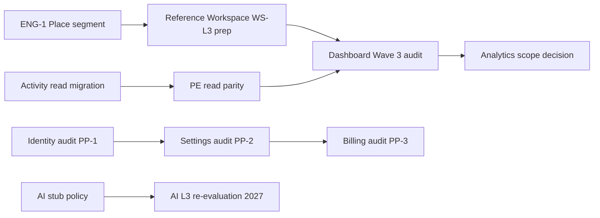

# Platform Portfolio — Modernization Priority

**Program:** Vssyl Platform Portfolio Reality Assessment  
**Date:** 2026-06-19  
**Status:** Recommendation only — **no implementation packages authorized**

---

## Priority framework

| Signal | Weight |
|--------|--------|
| Architectural risk (Critical/High) | 35% |
| Business value (daily use + revenue) | 30% |
| Certification unlock (enables L3 path) | 20% |
| Dependency order (unblocks other work) | 15% |

**Excluded from prioritization:** Completed archived programs (Admin Portal, BA, Context Graph, BO); Calendar/Place L3 hygiene-only work; AI Platform L3 full program (deferred per ROI).

---

## Top 10 modernization priorities

| Rank | Initiative | Type | Rationale | Est. effort |
|------|------------|------|-----------|-------------|
| **1** | **Reference Workspace closure — ENG-1 + WS-L3 prep** | Workspace | P0 Place segment 404; 12 findings block registration narrative; unlocks shell certification | 2–4 weeks |
| **2** | **Dashboard Wave 3 — constitutional audit + service extraction charter** | Module | L1 on primary personal surface; dual widget registry; Wave 3 roadmap entry | 4–6 weeks |
| **3** | **Identity & Profile platform audit (PP-1)** | Platform capability | Critical risk R-02; no audit; foundation for settings consolidation | 2–3 weeks discovery |
| **4** | **Settings Platform audit + IA consolidation charter (PP-2)** | Platform capability | Critical risk R-01; 6+ hubs; API drift; precedes implementation | 2–3 weeks discovery |
| **5** | **Analytics Wave 3 — scope audit + pseudo-module decision** | Module | L1 stub; BO analytics deferred to Stage 4; clarify product vs platform | 2–3 weeks discovery |
| **6** | **Billing platform capability audit (PP-3)** | Platform capability | Revenue path; retire `/payment` overlap; operation matrix | 2–3 weeks discovery |
| **7** | **Platform systems L2 promotion — Activity reads + Domain Events** | Platform | R-07/R-08; unblocks honest L3 claims for new modules | 3–5 weeks |
| **8** | **Business Workspace shell L1→L2 hardening** | Workspace | Hub for all business modules; pairs with Reference Workspace | 3–4 weeks |
| **9** | **AI Platform L3 prep — stub executor policy only** | Platform | R-05 critical; narrow scope — deny/stub policy, not full L3 | 2–3 weeks |
| **10** | **Relationship Search Architecture Phase 2B planning** | Platform | Search unaudited; tag/discovery guidelines exist; no implementation yet | 1–2 weeks planning |

---

## What should be modernized next

**Recommended sequence (next 2 quarters):**

1. **Workspace track** — Close ENG-1; advance Reference Workspace toward WS-L3 readiness (findings burn-down, operation matrix P-rows)
2. **Wave 3 entry** — Dashboard audit → Analytics scope decision (parallel discovery)
3. **Platform adjacency trilogy** — Identity → Settings → Billing audits (discovery only, then council charter for implementation)
4. **Platform systems** — Activity read migration + Domain Events taxonomy (incremental, no big-bang)

---

## What should NOT be modernized next

| Item | Reason |
|------|--------|
| Admin Portal, Business Administration, Context Graph, Business Operations | Programs **archived** — advisories are module backlog only |
| Calendar architecture L3 | **Complete** — hygiene P3 only |
| Place L3 / Reference #5 | **Complete** — PL-H* optional |
| File Hub L4 → changes | Reference Implementation — change control only |
| AI Platform full L3 wave | **Deferred** ROI rank 5/5 — prep stubs only until workspace/dashboard stable |
| Standalone Notes L3 | **Stopped** — Notebook owns notes sub-domain |
| BO analytics module | **Explicitly deferred** Stage 4 per BO program archive |
| Notebook post-cert NB-H* | Optional hygiene — not portfolio priority |
| Chat Level 4 pursuit | Out of scope without council charter |
| New Business Operations certification wave | Program archived — plain L3 is separate council vote |

---

## Business value ranking

| Rank | Area | Value driver |
|------|------|--------------|
| 1 | Workspace shells (Business + Personal) | Every business and personal session |
| 2 | Dashboard | Default personal landing |
| 3 | Billing & entitlements | Revenue, module gating, AI query packs |
| 4 | Settings coherence | Support burden, user trust, AI preference safety |
| 5 | Identity & Profile | Avatar, contacts, personalization |
| 6 | Analytics | Business intelligence promise (scope unclear) |
| 7 | AI Platform L3 | Strategic but deferred |
| 8 | Search / discovery | Cross-module findability |
| 9 | Platform Scheduler | Background jobs reliability |
| 10 | Marketplace pipeline | Partner revenue (longer horizon) |

---

## 12-month certification roadmap (recommended)

| Quarter | Focus | Target outcome |
|---------|-------|----------------|
| **Q3 2026** | Reference Workspace findings burn-down; ENG-1; Dashboard Wave 3 audit | WS-L3 readiness review eligible |
| **Q4 2026** | Dashboard L2→L3 implementation charter; Identity/Settings/Billing **discovery audits** | Dashboard certification evaluation candidate |
| **Q1 2027** | Settings + Identity implementation package (post-audit); Billing platform capability L2→L3 eval | Platform capability rows drafted for ledger |
| **Q2 2027** | Analytics scope implementation OR explicit "platform analytics subscriber" cert; AI stub policy closure | Analytics decision locked; AI L3 readiness re-score |

**Not in 12-month roadmap:** AI Platform full L3 (unless Q2 2027 readiness exceeds 75/100); Level 4 for any module; BO plain L3 (separate council when advisories close).

---

## Single highest-priority initiative

### **Reference Workspace closure — ENG-1 + findings burn-down toward WS-L3**

| Field | Detail |
|-------|--------|
| **Why first** | Blocks registration narrative for the **official Reference Workspace** program; affects every business module mount including Place, HR, Scheduling, WC; P0 QA failure (RWS-16) |
| **Scope** | Governance + targeted engineering charter (Place segment page, RWS-F1, runtime scope contract) — **not** full WS-L3 certification yet |
| **Unlocks** | Dashboard Wave 3 (shared shell patterns); honest workspace certification path; reduced settings/business duplication confusion |
| **Not in scope** | Module L3 re-certification; ledger updates; new platform domain certification |

---

## Initiative dependency graph

---

## Related

- [PLATFORM_PORTFOLIO_EXECUTIVE_SUMMARY.md](./PLATFORM_PORTFOLIO_EXECUTIVE_SUMMARY.md)
- [PLATFORM_MODULE_MODERNIZATION_ROADMAP.md](../plans/PLATFORM_MODULE_MODERNIZATION_ROADMAP.md)
- [PLATFORM_PORTFOLIO_ARCHITECTURAL_RISK_MATRIX.md](./PLATFORM_PORTFOLIO_ARCHITECTURAL_RISK_MATRIX.md)

**Last updated:** 2026-06-19
