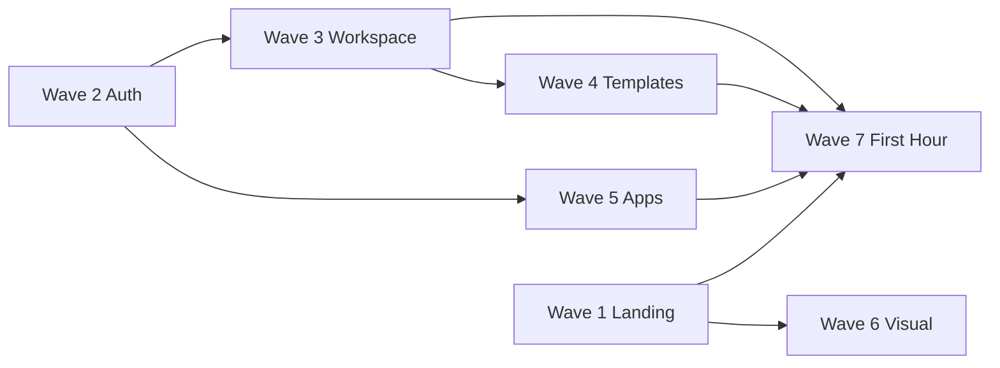

# Implementation Roadmap

**Program:** Vssyl Product Readiness Program  
**Date:** 2026-06-30 (updated post Sprint 1)  
**Purpose:** Implementation waves — Sprint 1 completed items marked ✅

**Sprint 1 closeout:** [COMMERCIAL_READINESS_SPRINT_1.md](./COMMERCIAL_READINESS_SPRINT_1.md)

**Principle:** Extend existing implementations. No architecture redesign.

---

## Roadmap overview

| Wave | Focus | Effort | Dependencies |
|------|-------|--------|--------------|
| **1** | Landing website trust & honesty | 2–3 weeks | — | ✅ **Sprint 1** |
| **2** | Authentication & signup | 2–3 weeks | — | ✅ **Sprint 1** (core items) |
| **3** | Workspace creation | 2–3 weeks | Wave 2 (invite page) |
| **4** | Dashboard templates & first-run | 1–2 weeks | Wave 3 |
| **5** | Application discovery | 2–4 weeks | Wave 2 |
| **6** | Visual polish | 2–3 weeks | Wave 1 |
| **7** | First hour experience | 2–3 weeks | Waves 3–5 |

**Total estimated effort:** 13–21 engineering weeks (sequential); **8–12 weeks** with parallel tracks.

**Recommended order:** 1 → 2 → 3 → 5 (partial) → 4 → 7 → 6 (can parallel with 7)

---

## Wave 1 — Landing Website

**Goal:** Public site is honest, trustworthy, and does not promise what product cannot deliver.

### Scope

| # | Task | Preserves | Effort |
|---|------|-----------|--------|
| 1.1 | Align trial CTAs — "Get Started Free" / "Get Pro" until Stripe trials | `landingContent.ts` structure | S |
| 1.2 | Soften or footnote HIPAA/uptime/analytics claims | Landing feature cards | S |
| 1.3 | Footer honesty — label stubs "Coming soon" or remove from nav | Footer in `landing/page.tsx` | S |
| 1.4 | Wire contact form to email API or support intake | `contact/page.tsx` | M |
| 1.5 | Add `/status` placeholder or external Statuspage link | New page or redirect | S |
| 1.6 | Add `/security` public overview (abridged from internal docs) | New page | M |
| 1.7 | Add `/support` to landing footer | Footer only | S |
| 1.8 | Optional: extract `PublicLayout` (header/footer) | Reduce duplication across public pages | M |

### Dependencies

- None for copy/footer changes
- SMTP for contact form (1.4)

### Exit criteria

- No misleading paid-tier trial CTAs
- Footer links honest or functional
- Contact form submits successfully

---

## Wave 2 — Authentication & Signup

**Goal:** All auth entry paths work including business invitations.

### Scope

| # | Task | Preserves | Effort |
|---|------|-----------|--------|
| 2.1 | Implement `/auth/accept-invitation` — login/signup + token accept | Existing accept API | M |
| 2.2 | Signup-from-invitation for users without accounts | Extend 2.1 | M |
| 2.3 | Fix resend verification to pass email in body | `verify-email` UI | S |
| 2.4 | Align register to Next.js API proxy (like login) | `register/page.tsx` | S |
| 2.5 | Optional: enforce email verification when SMTP configured | `authService` + login | M |
| 2.6 | Add `/billing` route shell → renders `BillingModal` or billing hub | `BillingModal.tsx` | M |
| 2.7 | Fix all `/billing?*` deep links (HR, modules, enterprise prompt) | Link audit | S |
| 2.8 | Fix support ticket customer endpoint path or add public route | `support/page.tsx` + server routes | M |

### Dependencies

- SMTP for invitation emails (operator)
- 2.6 unblocks commercial flows across product

### Exit criteria

- Invite email → active business member without manual token paste
- `/billing` and `/billing?module=*` resolve
- Support ticket submission succeeds for authenticated users

---

## Wave 3 — Workspace Creation

**Goal:** Users reach the correct workspace type quickly after signup.

### Scope

| # | Task | Preserves | Effort |
|---|------|-----------|--------|
| 3.1 | Call `ensureDefaultPersonalDashboard` during `registerWithSession` | `authService.ts` | S |
| 3.2 | Extend `DashboardBuildOutModal` with persona branches | Existing modal | M |
| 3.3 | "Create business" branch → `/business/create` | Business create flow | S |
| 3.4 | "I have an invite" branch → `/auth/accept-invitation` | Wave 2.1 | S |
| 3.5 | Optional: registration `?intent=business|personal` query param | Register page | S |
| 3.6 | Surface business setup checklist link prominently post-create | `getBusinessSetupStatus` | S |
| 3.7 | Review EIN requirement — document or relax for pilot | `business/create` | M |

### Dependencies

- Wave 2.1 for invite branch

### Exit criteria

- No empty-dashboard flash on first login
- Business admin can reach business create within first-run modal
- Employee path documented and functional

---

## Wave 4 — Dashboard Templates

**Goal:** First dashboard feels intentional, not empty.

### Scope

| # | Task | Preserves | Effort |
|---|------|-----------|--------|
| 4.1 | Surface `DashboardTemplates` in build-out modal — "Start from template" | `DashboardTemplates.tsx` | M |
| 4.2 | Wire `handleApplyTemplate` for `selectedModuleIds` + widgets | `DashboardClient.tsx` | M |
| 4.3 | Recommend template by persona (personal/business/household) | Template `recommended` flags | S |
| 4.4 | Welcome empty state on dashboard when user skips build-out | `EmptyState` pattern | S |
| 4.5 | First-task hints on core module hubs (optional) | Module landing components | M |

### Dependencies

- Wave 3 build-out modal branches

### Exit criteria

- >80% of new users get non-empty dashboard in first session
- Templates apply correctly per `DASHBOARD_TEMPLATES` definitions

---

## Wave 5 — Application Discovery

**Goal:** Users and admins can discover, install, and use applications correctly.

### Scope

| # | Task | Preserves | Effort |
|---|------|-----------|--------|
| 5.1 | Hide business-scope install/uninstall for non-admin members on `/modules` | API policy already correct | S |
| 5.2 | Add `canManage` to `/business/[id]/modules` UI gate | Match `policyEngine.ts` | S |
| 5.3 | Employee read-only "installed modules" view for business | New UI + optional API read | M |
| 5.4 | Public read-only marketplace catalog (unauthenticated browse) | `getMarketplaceModules` filter | L |
| 5.5 | Business paid module checkout E2E | `businessModuleSubscriptionService` | L |
| 5.6 | Fix module version update without PENDING delist | `moduleArtifactController.ts` | M |
| 5.7 | Link developer path from landing footer → public docs + `/modules/submit` | IA only | S |

### Dependencies

- Wave 2.6 for paid module purchase links
- GCS + Stripe for 5.5

### Exit criteria

- Zero employee-facing install buttons that 403
- Business admin can complete paid partner module purchase
- Prospects can browse module catalog without account (5.4)

---

## Wave 6 — Visual Polish

**Goal:** Vssyl looks like a commercial product, not an internal project.

### Scope

| # | Task | Preserves | Effort |
|---|------|-----------|--------|
| 6.1 | Add Vssyl logo SVG to `web/public/` — use in public header | Text wordmark fallback | S |
| 6.2 | Product screenshot section on landing (reference workspace captures) | Landing layout | M |
| 6.3 | Social proof section with placeholders or pilot quotes | Landing section | S |
| 6.4 | Light CSS motion on landing hero/features (no framer-motion required) | Existing transitions | S |
| 6.5 | Shared `PublicHeader` / `PublicFooter` with tokens | `tokens.css` | M |
| 6.6 | Audit public pages for `v.*` token adoption | UX constitution | M |
| 6.7 | Optional: illustration or icon grid refresh on feature cards | Lucide icons today | S |

### Dependencies

- Wave 1 copy alignment before screenshots (accurate UI)

### Exit criteria

- Landing includes real product imagery
- Consistent header/footer across all public routes
- Logo present in browser tab and header

---

## Wave 7 — First Hour Experience

**Goal:** Median time to first successful action < 15 minutes without support.

### Scope

| # | Task | Preserves | Effort |
|---|------|-----------|--------|
| 7.1 | Publish public Getting Started doc at `/docs` | `docs/guides/` curated | M |
| 7.2 | Publish Help FAQ at `/help` | Content strategy FAQ | M |
| 7.3 | Publish Business Admin + Join Your Team docs | Internal guides abridged | M |
| 7.4 | In-app link to docs from dashboard build-out modal | Modal footer link | S |
| 7.5 | Optional: link to AI onboarding from build-out | `AIOnboardingFlow` | S |
| 7.6 | Implement Stripe trial OR finalize copy alignment | Wave 1 + billing | M |
| 7.7 | Instrument signup → first-action analytics (minimal) | Admin analytics or event | M |
| 7.8 | Bridge HR onboarding journey trigger on invite accept (optional) | `hrOnboardingService` | L |

### Dependencies

- Waves 2–5 for accurate doc content
- Wave 1 for trial/copy consistency

### Exit criteria

- `/help` and `/docs` have substantive content
- First-hour success criteria from [FIRST_HOUR_EXPERIENCE.md](./FIRST_HOUR_EXPERIENCE.md) met for personal + business admin personas

---

## Dependency graph

---

## Operator prerequisites (all waves)

| Item | Doc |
|------|-----|
| Stripe keys + webhook verified | `docs/platform-controller/STRIPE_OPERATIONAL_VALIDATION.md` |
| SMTP configured | `docs/setup/SMTP_SETUP.md` |
| GCS bucket for modules | `docs/platform-controller/GCP_RUNTIME_VALIDATION.md` |
| Secrets in Secret Manager | `docs/setup/UPDATE_SECRETS_GUIDE.md` |

---

## Success metrics (program exit)

| Metric | Target |
|--------|--------|
| Overall product readiness score | ≥ 75% |
| Public experience score | ≥ 80% |
| Onboarding score | ≥ 70% |
| Commercial readiness score | ≥ 70% |
| Invite accept completion | > 95% without manual intervention |
| Billing deep link success | 100% — no 404 |
| Support ticket submission | 100% success |

---

## What not to do in this roadmap

1. Redesign platform/workspace/dashboard architecture
2. Rebuild PP-3 billing or marketplace certification pipeline
3. Replace `DashboardBuildOutModal` with greenfield wizard
4. Launch broad paid acquisition before Wave 2 complete
5. Add framer-motion or heavy animation framework without need

---

## Evidence index

| Artifact | Path |
|----------|------|
| GTM strategic waves | `docs/go-to-market/GO_TO_MARKET_STRATEGIC_POSITIONING.md` |
| Gap report | [PRODUCT_READINESS_GAP_REPORT.md](./PRODUCT_READINESS_GAP_REPORT.md) |
| First hour spec | [FIRST_HOUR_EXPERIENCE.md](./FIRST_HOUR_EXPERIENCE.md) |

---

*Roadmap planning only — no implementation authorized.*
