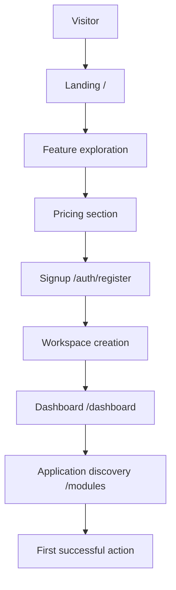

# Public User Journey

**Program:** Vssyl Product Readiness Program  
**Date:** 2026-06-30  
**Scope:** Visitor → first successful action — current state with friction at every stage

---

## Journey overview

---

## Stage 1: Visitor

| Aspect | Current state | Friction |
|--------|---------------|----------|
| Discovery | Direct URL, word of mouth — no SEO program evidenced | Low organic discovery |
| First paint | Professional landing, ~30s category clarity | None significant |
| Audience fit | Personal/business toggle on landing | Toggle easy to miss; no employee/developer path |
| Trust scan | Legal pages exist; stubs in footer | Clicking Help/Docs → "Coming Soon" |

**Status:** ⚠️ Partial

---

## Stage 2: Landing

| Step | Location | Status | Friction |
|------|----------|--------|----------|
| Hero read | `landing/page.tsx` | ✅ | Dense enterprise claims may oversell |
| Audience toggle | `landingContent.ts` | ✅ | Not repeated in header nav |
| Feature scan | 6 feature cards | ✅ | Analytics/security claims vs reality |
| Module preview | Core modules section | ✅ | Built-ins only — marketplace not shown |
| CTA click | "Start Free Trial" | ⚠️ | Trial not implemented in Stripe |

**Status:** ⚠️ Partial — strong visual, commercial honesty gaps

---

## Stage 3: Feature exploration

| Path | Status | Friction |
|------|--------|----------|
| In-page anchors (#features) | ✅ | — |
| Footer → Modules | ⚠️ | Auth required — not public catalog |
| Footer → Integrations | ❌ | Stub page |
| Footer → Documentation | ❌ | Stub |
| Product screenshots | ❌ | Cannot see product before signup |

**Status:** ⚠️ Partial

---

## Stage 4: Pricing

| Step | Status | Friction |
|------|--------|----------|
| View tiers on landing | ✅ Live from API | — |
| Monthly/yearly toggle | ✅ | — |
| Compare features | ✅ In tier cards | — |
| Enterprise CTA | ⚠️ | May link to `/billing?upgrade=enterprise` → **404** |
| Understand trial | ❌ | "Free trial" on paid tiers — misleading |

**Status:** ⚠️ Partial

---

## Stage 5: Signup

| Step | Location | Status | Friction |
|------|----------|--------|----------|
| Register form | `/auth/register` | ✅ | No persona/intent question |
| Account created | `authService.registerWithSession` | ✅ | — |
| Auto-login | NextAuth credentials | ✅ | — |
| Email verification | Backend + `/auth/verify-email` | ⚠️ | Not enforced; resend UI bug |
| Vssyl ID display | `UserNumberDisplay` | ✅ | Unusual — may confuse |
| Redirect | `/dashboard` | ✅ | No plan pre-selection |

**Alternate entry — invitation (employee):**

| Step | Status | Friction |
|------|--------|----------|
| Email link | ❌ | `/auth/accept-invitation` **missing** — **P0 blocker** |

**Status:** ✅ Personal signup works · ❌ Employee invite broken

---

## Stage 6: Workspace creation

### Personal path (default)

| Step | Location | Status | Friction |
|------|----------|--------|----------|
| Land on dashboard | `/dashboard` | ✅ | Brief empty flash possible |
| Ensure default tab | `ensureDefaultPersonalDashboard` | ⚠️ | Lazy — not at register |
| Build-out modal | `DashboardBuildOutModal` | ✅ | De facto onboarding — undirected |
| Template selection | `DashboardTemplates` | ✅ | Not prominently surfaced in first-run |
| Create business (if intended) | `/business/create` | ⚠️ | Undiscoverable without exploration |

### Business admin path

| Step | Status | Friction |
|------|--------|----------|
| Find business create | ⚠️ | No post-signup prompt |
| EIN requirement | ⚠️ | May block legitimate prospects |
| Bootstrap modules | ✅ | drive, chat, calendar auto-installed |
| Setup checklist | ⚠️ | Passive on business hub |
| Plan selection | ❌ | Not tied to business create |

**Status:** ⚠️ Partial

---

## Stage 7: Dashboard

| Step | Status | Friction |
|------|--------|----------|
| Widget layout | ✅ | Empty state intimidating without build-out |
| Module hubs | ✅ | Drive, Chat, Calendar, AI accessible |
| Billing access | ⚠️ | `BillingModal` via settings — `/billing` 404 |
| Help | ❌ | No in-app link to public docs |

**Status:** ⚠️ Partial

---

## Stage 8: Application discovery

| Step | Location | Status | Friction |
|------|----------|--------|----------|
| Browse marketplace | `/modules` | ⚠️ | Login wall for prospects |
| Personal install | API + UI | ✅ | — |
| Business install | `/business/[id]/modules` | ✅ Admin | Employees see install on `/modules` → 403 |
| Paid module purchase | `PaymentModal` / subscribe | ⚠️ | `/billing?module=` dead ends |
| Developer submit | `/modules/submit` | ✅ | Not linked from first-run |

**Status:** ⚠️ Partial

---

## Stage 9: First successful action

**Definition:** User completes one meaningful task proving value (e.g., send chat message, upload file, create calendar event, ask AI a question, install a module).

| Persona | Typical first action | Status | Time to value |
|---------|---------------------|--------|---------------|
| Personal | Add widget / open Drive | ✅ Possible | 5–15 min if undirected |
| Business admin | Create business + invite | ❌ Invite broken | Blocked at invite |
| Employee | Accept invite + open workspace | ❌ | Blocked |
| Developer | Submit module metadata | ⚠️ | 20+ min — must discover path |

**Status:** ⚠️ Personal marginal · ❌ Business/employee blocked

---

## Friction summary by severity

### P0 — Blocks journey completion

| Friction | Stage affected |
|----------|----------------|
| Missing `/auth/accept-invitation` | Signup (employee), workspace |
| `/billing` deep links 404 | Pricing, dashboard, modules |
| Support ticket API mismatch | Post-signup help |

### P1 — High friction

| Friction | Stage affected |
|----------|----------------|
| No signup intent capture | Signup → workspace |
| Trial CTA mismatch | Landing → pricing → signup |
| Public docs stubs | Feature exploration, dashboard |
| Employee marketplace install UI | Application discovery |
| Business create undiscoverable | Workspace creation |

### P2 — Polish friction

| Friction | Stage affected |
|----------|----------------|
| Lazy default dashboard | Workspace creation |
| Contact form stub | Landing trust |
| No product screenshots | Landing |
| Register bypasses API proxy | Signup (env-dependent) |

---

## Journey readiness by persona

| Persona | Completes journey without dev help? | Weakest stage |
|---------|-------------------------------------|---------------|
| Personal user | ⚠️ Marginal | Workspace creation (empty dashboard) |
| Business administrator | ❌ No | Signup → invite |
| Employee | ❌ No | Signup (invite accept) |
| Developer | ⚠️ Marginal | Application discovery |
| Prospect (no account) | ⚠️ Partial | Application discovery (login wall) |

---

## Evidence index

| Artifact | Path |
|----------|------|
| User journey audit (0A) | `docs/go-to-market/USER_JOURNEY_AUDIT.md` |
| Onboarding review | `docs/go-to-market/ONBOARDING_EXPERIENCE_REVIEW.md` |
| Register | `web/src/app/auth/register/page.tsx` |
| Dashboard client | `web/src/app/dashboard/DashboardClient.tsx` |

---

*Assessment only — no implementation authorized.*
