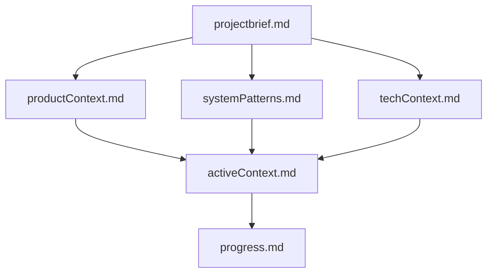

# Memory Bank - Block on Block Project

## Overview
This memory bank contains comprehensive documentation for the Block on Block project, organized using a modular context pattern. Each file serves a specific purpose and builds upon others in a clear hierarchy.

## File Structure & Hierarchy

### Core Files (Required)
1. **`projectbrief.md`** - Foundation document defining core requirements and goals
2. **`productContext.md`** - Why this project exists, problems it solves, user experience goals
3. **`activeContext.md`** - Current work focus, recent changes, next steps
4. **`systemPatterns.md`** - System architecture, key technical decisions, design patterns
5. **`techContext.md`** - Technologies used, development setup, technical constraints
6. **`progress.md`** - What works, what's left to build, current status

### Module-Specific Context Files
- **`businessProfileManagement.md`** - Business profile management system requirements and implementation
- **`chatProductContext.md`** - Chat module product context and requirements
- **`driveProductContext.md`** - Drive module product context and requirements
- **`dashboardProductContext.md`** - Dashboard module product context and requirements
- **`marketplaceProductContext.md`** - Marketplace module product context and requirements
- **`adminProductContext.md`** - Admin module product context and requirements
- **`analyticsProductContext.md`** - Analytics module product context and requirements
- **`developerProductContext.md`** - Developer tools and SDK requirements
- **`globalSearchProductContext.md`** - Global search functionality requirements
- **`notificationsProductContext.md`** - Notification system requirements
- **`presenceProductContext.md`** - User presence and real-time features
- **`settingsProductContext.md`** - Settings and configuration management
- **`testingProductContext.md`** - Testing strategy and requirements
- **`threadActivityProductContext.md`** - Thread activity and engagement features

### Additional Context Files
- **`apiDocumentation.md`** - API documentation and specifications
- **`businessProfileManagement.md`** - Business profile management system
- **`compliance.md`** - Compliance and regulatory requirements
- **`contributorGuide.md`** - Contributor guidelines and development workflow
- **`databaseContext.md`** - Database schema and data models
- **`deployment.md`** - Deployment procedures and infrastructure
- **`designPatterns.md`** - UI/UX and code design patterns
- **`futureIdeas.md`** - Future feature ideas and roadmap
- **`lintingAndCodeQuality.md`** - Code quality standards and linting rules
- **`moduleSpecs.md`** - Module specifications and requirements
- **`permissionsModel.md`** - Permission system and access control
- **`roadmap.md`** - Project roadmap and milestones
- **`testingStrategy.md`** - Testing strategy and quality assurance

## Current Status (2024-12-28)

### ✅ Recently Completed
- **API Issues Resolution** - Fixed 404 errors for audit and privacy endpoints, implemented consistent API proxy patterns
- **Data Classification System** - Complete visual classification system with badges, rules, and templates
- **Audit & Privacy Management** - Comprehensive audit trail with data masking and privacy controls
- **Business Settings Page Enhancement** - Professional UX with logo upload, admin access control, and enhanced form validation
- **Avatar Component Consolidation** - Eliminated duplicate components and standardized imports
- **Business Profile Navigation Fix** - Fixed breadcrumb navigation for business contexts
- **Multi-Context Dashboard System** - Complete support for personal, business, and educational contexts

### 🔄 Current Focus
- **Phase 3.4.3.4: Chat & Dashboard Integration** - Add classification support to Chat and Dashboard modules
- **Phase 3.4.4: Data Governance Policies** - Implement automated governance enforcement
- **Phase 3.4.5: Compliance Reporting** - Generate compliance reports and audits

### 📋 Next Priorities
1. **Chat Module Classification** - Add classification badges and management to chat messages
2. **Dashboard Module Classification** - Add classification support to dashboard widgets
3. **Data Governance Automation** - Implement automated policy enforcement
4. **Compliance Reporting** - Generate comprehensive compliance reports

## Update Rules

### When to Update Memory Bank
1. **Major Feature Completion** - Document completed features in progress.md
2. **Architecture Changes** - Update systemPatterns.md and techContext.md
3. **New Requirements** - Update relevant product context files
4. **Technical Decisions** - Document in systemPatterns.md
5. **User Request** - When user requests "update memory bank"

### Update Process
1. **Review ALL Files** - When updating, review all memory bank files
2. **Cross-Reference** - Use cross-references instead of duplication
3. **Date Changes** - Always date major updates or new sections
4. **Archive Outdated** - Move deprecated content to archive sections
5. **Maintain Hierarchy** - Ensure files build upon each other correctly

### File-Specific Rules
- **projectbrief.md** - Only major scope/vision changes
- **activeContext.md** - Current work focus and next steps
- **progress.md** - Implementation progress and completed features
- **systemPatterns.md** - New architectural patterns and technical decisions
- **techContext.md** - Technology stack changes and technical constraints
- **productContext.md** - Product vision and user experience goals

## Key Achievements

### Business Tier Foundation ✅ COMPLETE
- Multi-context dashboard system (personal, business, educational)
- Role-based access control across all contexts
- Business and educational institution creation and management
- Member invitation and acceptance system
- Dashboard-aware navigation across all modules

### Professional UX Implementation ✅ COMPLETE
- Enhanced business settings page with logo upload
- Admin access control with permission-based editing
- Live branding preview with color picker and font selection
- Comprehensive form validation and error handling
- Responsive design with mobile support

### Technical Infrastructure ✅ COMPLETE
- Next.js 14.1.0 with App Router
- Express.js backend with Prisma ORM
- PostgreSQL database with proper relationships
- JWT authentication with NextAuth.js
- Real-time updates with Socket.IO
- TypeScript monorepo with shared components

## Getting Started

### For New Contributors
1. Read `projectbrief.md` for project vision
2. Review `activeContext.md` for current focus
3. Check `progress.md` for implementation status
4. Understand `systemPatterns.md` for architecture
5. Review `techContext.md` for technical setup

### For Development
1. Follow the modular context pattern
2. Update memory bank when making significant changes
3. Use cross-references to avoid duplication
4. Date all major updates
5. Archive deprecated content

### For Product Decisions
1. Reference relevant product context files
2. Update requirements in appropriate files
3. Document decisions in systemPatterns.md
4. Track progress in progress.md
5. Update activeContext.md for current focus

## Contact & Maintenance
- **Last Updated**: 2024-12-27
- **Current Focus**: Business Tier Foundation - Phase 4.2 Member Management
- **Next Milestone**: Complete member management interface
- **Status**: Active development with comprehensive documentation
