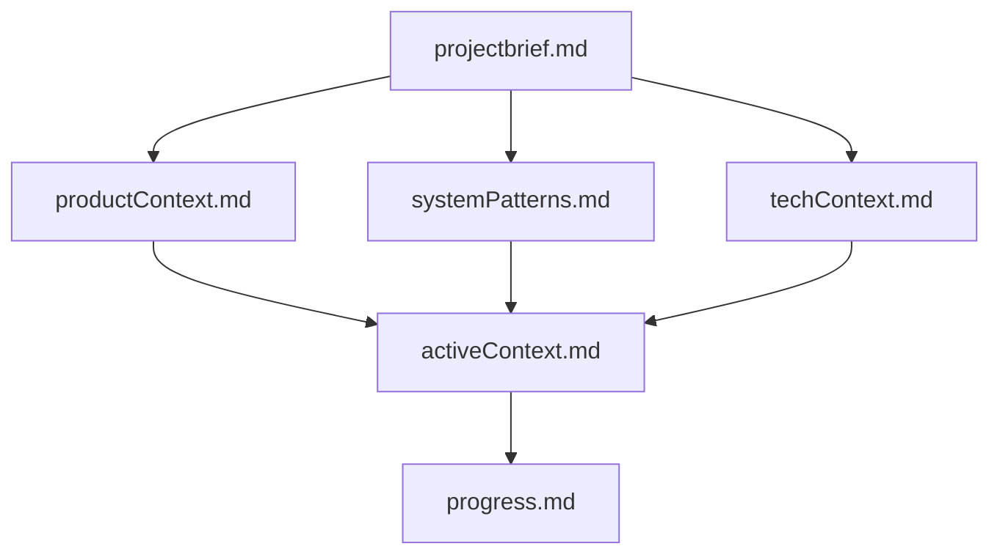

# Memory Bank — Vssyl

Structured context for humans and AI: **product intent and bounded current working context**.

Memory Bank is **not** architecture authority and **not** implementation truth.

| Owner | Role |
|-------|------|
| Code, config, tests, migrations | Implementation truth |
| `docs/architecture/` | Architectural truth |
| `memory-bank/` | Product intent and carefully maintained current context (may lag) |

Memory Bank must not override code or architecture. Historical, phase, session, and archived material here or under `docs/archive/` is evidence only — never treat it as current authority without verifying status.

**Secrets:** Never store literal production credentials in Memory Bank or archives. Redact them; use placeholders in docs; keep runtime secrets in Secret Manager (see `docs/setup/UPDATE_SECRETS_GUIDE.md`).

## Agent discovery (selective)

Default sequence (see root [`AGENTS.md`](../AGENTS.md) and [`docs/VSSYL_SOURCE_OF_TRUTH.md`](../docs/VSSYL_SOURCE_OF_TRUTH.md)):

1. `AGENTS.md` — agent orientation (not architecture law)
2. `docs/VSSYL_SOURCE_OF_TRUTH.md`
3. Inspect actual task-relevant code
4. `docs/architecture/VSSYL_ARCHITECTURE_INDEX.md` → canonical architecture for the domain
5. Task-relevant Memory Bank product context (`*ProductContext.md`, etc.) when product intent matters
6. `activeContext.md` / `progress.md` **only when** current status, recent work, sequencing, or unfinished work is materially relevant

Do **not** start every session by reading `activeContext.md` and `progress.md`.

## Hierarchy

```mermaid
flowchart TD
  PB[projectbrief.md] --> PC[productContext.md]
  PB --> SP[systemPatterns.md]
  PB --> TC[techContext.md]
  PC --> AC[activeContext.md]
  SP --> AC
  TC --> AC
  AC --> P[progress.md]
```

## Core files

| File | Role |
|------|------|
| `projectbrief.md` | Scope and requirements |
| `productContext.md` | Product vision |
| `activeContext.md` | **Active workstreams only** (selective agent read) — history: `docs/archive/session-summaries/active-context-archive-2026-09-pretrim.md` |
| `progress.md` | Compact status ledger (selective agent read) — history: `docs/archive/session-summaries/progress-archive-2026-09-pretrim.md` |
| `systemPatterns.md` | Compact pattern index (pointers only; architecture SoT is `docs/architecture/`) — history: `docs/archive/session-summaries/system-patterns-archive-2026-09-pretrim.md` |
| `techContext.md` | Current stack card (code/config win) — history: `docs/archive/session-summaries/tech-context-archive-2026-09-pretrim.md` |
| `databaseContext.md` | Concise Prisma/data orientation (not schema dump) |
| `contributorGuide.md` | Short contributor/agent navigation (aligns with root `AGENTS.md`; selective discovery) |
| `troubleshooting.md` | **Index only** → links to `docs/guides/TROUBLESHOOTING.md` + incident archive |

## Module and domain contexts

`*ProductContext.md` files (drive, chat, hr, scheduling, admin, developer, notifications, etc.), plus **`applicationMermaidDiagrams.md`** (platform + interoperability + module-surface maps), `aiContextSystem.md`, `deployment.md`, and remaining plan files (verify currency). Redirect stubs from ownership reconciliation include `permissionsModel.md`, `onboardingProductContext.md`, `businessProfileManagement.md`, `threadActivityProductContext.md`, and `designPatterns.md` (Batch 1C-4B-1). Historical roadmaps/plans archived in Batch 1C-4A (`roadmap.md` and related paths are redirect stubs).

Completed AI phase plans, session summaries, and superseded workspace/search architecture notes live under **`docs/archive/`** (Batch 1A / 1C-4A). Verify currency via architecture docs (for AI: `docs/architecture/AI_DOCUMENT_STATUS_MATRIX.md`) before treating any plan as current authority. Redirect stubs include `AI_CODING_STANDARDS.md`, `globalSearchProductContext.md`, `moduleManagerContext.md`, `roadmap.md`, `moduleBrainstorming.md`, `org-chart-permission-system.md`, and other 1C-4A historical plans.

**Workspace runtime (May 2026):** Frontend module/widget contracts — `docs/architecture/WORKSPACE_RUNTIME_AND_MODULE_CONTRACTS.md`; code under `web/src/runtime/`; status in `activeContext.md` / `progress.md` / `dashboardProductContext.md` §10a when status context is needed.

## Documentation cleanup (April 2026)

- **Active context**: long tail moved to `docs/archive/session-summaries/active-context-archive-2026-04-pretrim.md`.
- **Troubleshooting**: long incident log moved to `docs/archive/troubleshooting-historical-incidents.md`; fixes stay in `docs/guides/TROUBLESHOOTING.md`.
- **AI long guides**: `docs/archive/guides-merged-2026/` (see that folder’s README).
- **Stripe duplicates**: `docs/archive/stripe-merged-2026/`.
- **HR framework duplicates**: `docs/archive/hr-merged-2026/`.
- **`docs/` root**: only `docs/README.md` remains at top level; other markdown lives under `plans/`, `guides/`, `setup/`, `deployment/`, `ai/`, or `archive/` (see `docs/plans/README.md`, `docs/guides/README.md`, `docs/archive/README.md`, `docs/ai/README.md`).

Canonical doc map for AI modules: end of `aiContextSystem.md` (verify against current architecture AI chain before relying on older narratives).

## Where operational runbooks live

Setup, deployment, and CI: **`docs/`** (`docs/README.md` index). The memory bank holds **why** and **how the product fits together**; `docs/architecture/` holds **architecture law**; `docs/` also holds **steps to execute**.
