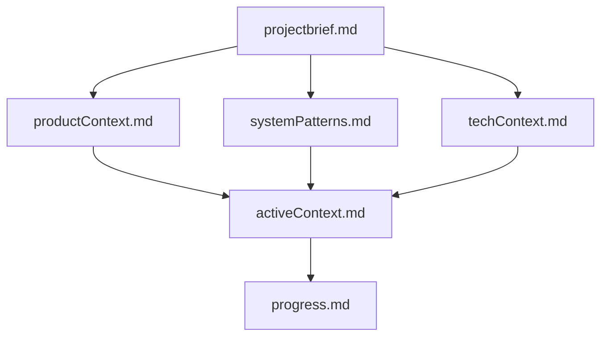

# Memory Bank — Vssyl

Structured context for humans and AI. **Start every session with** `activeContext.md` and `progress.md`, then open the module or domain file you are changing.

## Hierarchy

```mermaid
flowchart TD
  PB[projectbrief.md] --> PC[productContext.md]
  PB --> SP[systemPatterns.md]
  PB --> TC[techContext.md]
  PC --> AC[activeContext.md]
  SP --> AC
  TC --> AC
  AC --> P[progress.md]
```

## Core files

| File | Role |
|------|------|
| `projectbrief.md` | Scope and requirements |
| `productContext.md` | Product vision |
| `activeContext.md` | **Rolling** recent work (older narratives archived April 2026) |
| `progress.md` | Status and what shipped |
| `systemPatterns.md` | Architecture patterns |
| `techContext.md` | Stack and tooling |
| `databaseContext.md` | Data model notes |
| `troubleshooting.md` | **Index only** → links to `docs/guides/TROUBLESHOOTING.md` + incident archive |

## Module and domain contexts

`*ProductContext.md` files (drive, chat, hr, scheduling, admin, etc.), plus `businessWorkspaceArchitecture.md`, `permissionsModel.md`, `aiContextSystem.md`, `deployment.md`, `roadmap.md`, and phased plans (`AI_PLATFORM_PHASED_PLAN.md`, `BILLING_*`, org chart summaries, …).

## Documentation cleanup (April 2026)

- **Active context**: long tail moved to `docs/archive/session-summaries/active-context-archive-2026-04-pretrim.md`.
- **Troubleshooting**: long incident log moved to `docs/archive/troubleshooting-historical-incidents.md`; fixes stay in `docs/guides/TROUBLESHOOTING.md`.
- **AI long guides**: `docs/archive/guides-merged-2026/` (see that folder’s README).
- **Stripe duplicates**: `docs/archive/stripe-merged-2026/`.
- **HR framework duplicates**: `docs/archive/hr-merged-2026/`.
- **`docs/` root**: only `docs/README.md` remains at top level; other markdown lives under `plans/`, `guides/`, `setup/`, `deployment/`, `ai/`, or `archive/` (see `docs/plans/README.md`, `docs/guides/README.md`, `docs/archive/README.md`, `docs/ai/README.md`).

Canonical doc map for AI modules: end of `aiContextSystem.md`.

## Where operational runbooks live

Setup, deployment, and CI: **`docs/`** (`docs/README.md` index). The memory bank holds **why** and **how the system fits together**; `docs/` holds **steps to execute**.
