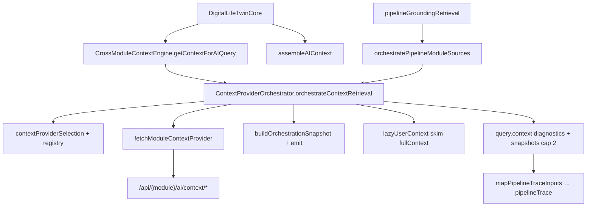
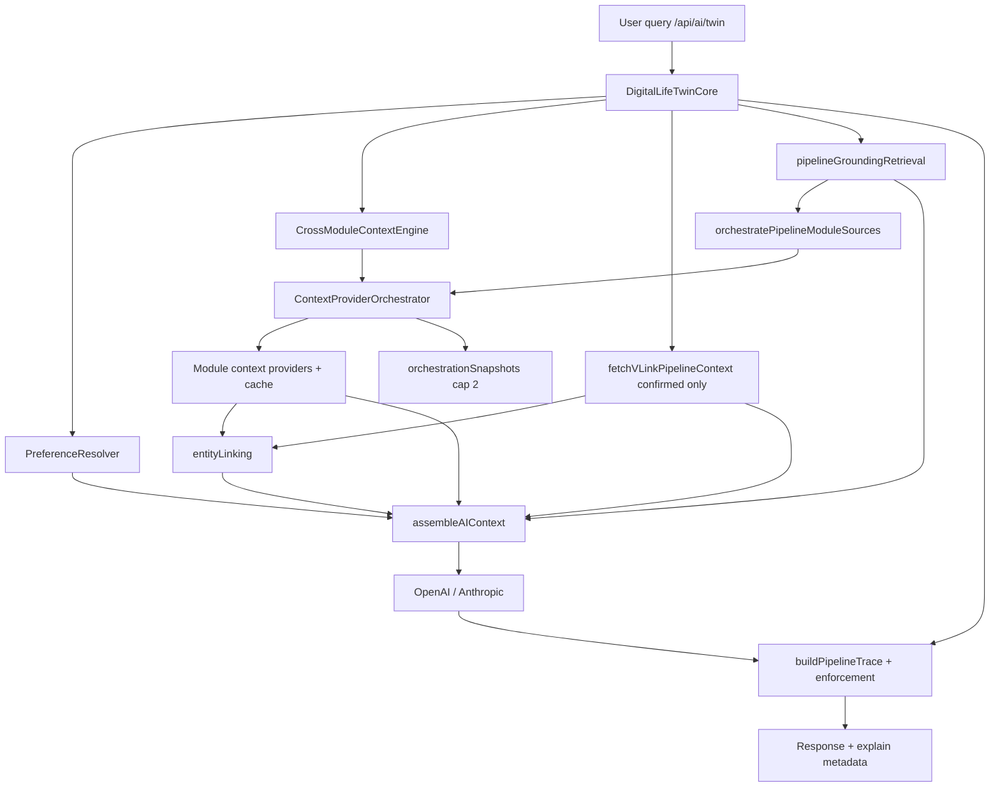

# AI Context System - Vssyl Platform

## Overview

The AI Context System is a **mandatory component** of every module in the Vssyl platform. It enables the AI assistant to understand and answer natural language questions about module-specific data, creating an intelligent, conversational interface for users.

**Critical Rule**: Every module MUST implement AI context providers. This is not optional - it's a core platform requirement that enables the AI to be truly useful.

**Canonical provider API contract (auth, response shape, cache, certification):** [`docs/guides/AI_CONTEXT_PROVIDER_API.md`](../docs/guides/AI_CONTEXT_PROVIDER_API.md)

**Internal AI system textbook (architecture narrative):** [`docs/architecture/AI_SYSTEM_TEXTBOOK.md`](../docs/architecture/AI_SYSTEM_TEXTBOOK.md)

**Partner SDK boundaries (marketplace can/cannot):** [`docs/guides/MODULE_AI_SDK_BOUNDARIES.md`](../docs/guides/MODULE_AI_SDK_BOUNDARIES.md)

> 📖 **Architecture deep-dive (archived copy, April 2026):** [`docs/archive/guides-merged-2026/AI_CONTEXT_SYSTEM_ARCHITECTURE.md`](../../docs/archive/guides-merged-2026/AI_CONTEXT_SYSTEM_ARCHITECTURE.md)

## Quick Reference: Common Questions

### Q: How do context files work for the AI system?
**A**: Each module registers its AI context in the `ModuleAIContextRegistry` database table (not separate files). This includes:
- **Keywords**: Terms the AI uses to match queries ("file", "upload", "document")
- **Patterns**: Query patterns ("show my files", "upload * to drive")
- **Context Providers**: API endpoints that return live data (`/api/drive/ai/context/recent`)

### Q: How do we create a knowledge base for the AI system?
**A**: The knowledge base is the **central PostgreSQL database**:
- All module data (files, employees, schedules) stored in database tables
- `ModuleAIContextRegistry` stores module AI definitions
- `UserAIContextCache` caches context for performance (15-minute TTL)
- `AILearningEvent` tracks user-specific learning
- `GlobalLearningEvent` tracks cross-user patterns

### Q: Does each user have a central database?
**A**: Yes! All users share the **same PostgreSQL database**, but data is isolated by:
- `userId` in all queries (multi-tenant scoping)
- `businessId` for business-scoped data
- `dashboardId` for dashboard-scoped data
- Each user has their own `UserAIContextCache` entry

### Q: Does each module have memory?
**A**: No - there's a **centralized learning system**:
- All learning stored in `AILearningEvent` table
- Each event tagged with `sourceModule` (which module it came from)
- Cross-user patterns in `GlobalLearningEvent`
- No separate per-module memory stores

### Q: How does AI know about new files in Drive?
**A**: AI queries the database **directly in real-time**:
1. File uploaded → stored in `File` table
2. User asks "show my files"
3. AI calls `/api/drive/ai/context/recent`
4. Controller queries: `prisma.file.findMany({ where: { userId } })`
5. Database returns ALL files (including new ones)
6. AI responds with current data

**No notification system needed** - AI always queries fresh data!

### Q: Can @mentions help the AI work less hard?
**A**: Yes! Users can add `@mentions` to directly target modules:
- `@drive show my files` → Skips keyword matching, directly queries Drive
- `@hr how many employees?` → Directly targets HR module
- `@calendar what's today?` → Directly targets Calendar module

**Performance Benefits**:
- ⚡ **45ms faster** (skips keyword matching)
- 🎯 **100% confidence** (explicit module targeting)
- ✅ **More accurate** (no ambiguity)

**Supported @mentions**: `@drive`, `@files`, `@chat`, `@messages`, `@calendar`, `@events`, `@hr`, `@employees`, `@scheduling`, `@shifts`

### Q: How does the AI use attached files in chat?
**A**: When users attach Drive files to an AI message:
1. File IDs are passed in `context.fileIds` to the Digital Life Twin (`/api/ai/twin`)
2. `fileAnalysisService` extracts text from supported types: .txt, .md, .json, .csv, .html, PDF (pdf-parse + unpdf), Office (.docx, .xlsx, .pptx, etc.), images (tesseract OCR)
3. Summaries (up to 4000 chars per file, 5 files max, 2MB per file / 5MB for images) are injected into the ATTACHED FILES CONTEXT section of the prompt
4. The AI can reference and reason about file content in its response
5. Attachments persist with the user message in `AIMessage.attachments`
6. "Ask AI about this file" from Drive opens AI chat with the file pre-attached
7. **Production (Cloud Run)**: Uses unpdf (serverless-optimized) as primary for PDFs; GCS path resolution handles storage.cloud.google.com and storage.googleapis.com
8. **Vision (images)**: `getVisionImageParts` fetches image buffers; `resizeImageForVision` downscales to 1600px max, JPEG 85% before sending to model
9. **CSV files**: Parsed via `parseCsvToMarkdownTable` and sent as structured markdown tables
10. **"Image used in this reply"**: When vision parts are sent, `usedVisionParts` is set and the UI shows a badge

### Streaming chat UX (May 2026)

When `/api/ai/twin` is called with `stream: true`, the backend may return **SSE** (`text/event-stream`) while the model still emits **structured v2 JSON** token-by-token. Only the **full-page** client (`web/src/app/ai-chat/page.tsx`) uses streaming today; dropdown and embed module use a single JSON response.

**Client contract (`web/src/lib/aiStreamHandler.ts`):**
- **`TwinStreamState`** — accumulates raw chunks in memory only (not in React conversation state).
- **`processTwinStreamChunk`** — on `{`, `[`, or markdown fence, sets `bufferingStructured` and returns `displayText: null` so the UI never shows `{ "mode": "conversation", ... }`.
- **`consumeTwinSseLine`** — parses `data: {"text":...}` / `{"done":true,"data":...}` lines.
- **`finalizeTwinStream`** — on end, prefers `done.data` from server; else parses accumulated JSON via `aiResponseHandler` (`tryParseStructuredAIJSON`, `normalizeTwinResponseData`).
- **UX:** While loading, `isAILoading` shows **`AIThinkingIndicator`** (animated dots) — no `ai_stream_*` placeholder message (avoids flicker/replace). One assistant message is appended after finalize.
- **Safety net:** `AIAssistantMessageBody` uses `shouldHideStreamingContent` if partial JSON ever reaches render.

**Non-stream paths:** `AIChatDropdown`, `AIChatModule`, and non-stream twin responses use `buildAIConversationItemFromTwinData` / `normalizeStoredAIMessage` in `web/src/lib/aiResponseHandler.ts`.

**Commits:** `1deb6d48` (buffer + thinking UX), `976a2658` (structured prose render), `19c2cc56` (first streaming guard).

Plan: `docs/plans/AI_CONVERSATIONAL_CONTINUITY_AND_RENDERING_SOURCE_OF_TRUTH.md`.

### Assembled context tiering and continuity (May 2026)

`AIContextAssembler` attaches **tier** metadata to blocks (recent conversation and continuity state favored; broad cross-module context trimmed more aggressively). `DigitalLifeTwinCore` passes **conversation continuity** and **active topic** derived each turn into assembly and prompts. Details: `memory-bank/activeContext.md` and the plan doc above.

### Digital Life Twin — personal preferences & Control Center (May 2026)

**Rule:** Settings users configure in the **personal AI Control Center** (`/ai`) must reach the live twin via one canonical path — not a duplicate monolithic prompt.

**Pipeline (`POST /api/ai/twin`):**
1. `DigitalLifeTwinService` — same-thread history; **`getRecentConversationMemory`** (other threads); **`recallRelevantMessages`** when `hasExplicitRecallIntent`; **`getRelevantUserMemoryFacts`** (recall-biased on intent). See `memory-bank/AI_CONTEXT_MEMORY_ARCHITECTURE.md`.
2. `DigitalLifeTwinCore` — **`PreferenceResolver.resolve`** (personality, autonomy, active `UserAIContext`, provider keys).
3. `assembleAIContext` — module blocks + recalled messages + thread summaries/topics + memory facts + **“User communication and AI preference settings”** + optional **business policy** when `context.businessId` is set.
4. Providers — `personalityForProvider`, `autonomyBoundariesForProvider`, `buildProviderUserPrompt` (`assembledContext` JSON is private; `userQuery` = user message).

**Inferred context consent:** Chat extraction creates `UserAIContext` with `learningStatus: pending` until the user promotes via Memories or review APIs. Only `learningStatus: active` rows are prompt-eligible (`userAIContextLearningService.promptEligibleContextWhere`).

**Preview:** `GET /api/ai/effective-preferences` — personal scope; optional `?businessId=` adds a note that business policies apply separately.

**Learning events (personal):** `AILearningEvent` review on `/ai` → **Learning** tab (`AILearningHub` + `PersonalLearningEventsReview`; `personalAILearningEventsService`). Optional analytics: **More → Insights**. Business workspace events use Workspace AI admin APIs — not mixed with personal rows.

**Canonical docs:** `docs/architecture/AI_PLATFORM_OVERVIEW.md`, `AI_TWIN_PROMPT_PIPELINE.md`, `AI_CONTEXT_ASSEMBLY.md`, `AI_BUSINESS_PERSONAL_TWIN_BOUNDARIES.md`, `AI_INTELLIGENCE_HUB.md`. **Status:** `memory-bank/activeContext.md`, `memory-bank/progress.md` (AI Control Center audit, commit `789c5f05`).

### Context Provider Contract — Phase A / B / B.5 (May 2026) ✅

**Status:** Shipped. Orchestrator **on by default**; legacy path via `AI_CONTEXT_ORCHESTRATOR_ENABLED=false`.

**Problem solved:** `CrossModuleContextEngine` was a bottleneck — ad-hoc module fetches, weak intent/provider selection, no unified grounding→provider mapping, limited replay diagnostics.

**Solution:** Thin orchestration layer between query analysis and HTTP provider fetches; pipeline grounding reuses same orchestrator for module-backed catalog sources.

#### Architecture (orchestration path)



#### Phase A — Core orchestrator

| Piece | Location | Notes |
|-------|----------|-------|
| Contract types | `shared/src/types/ai-context-provider-contract.ts` | `ProviderSelectionDiagnostic`, `ContextOrchestrationMeta`, `ContextGenerationRecord` |
| Orchestrator | `server/src/ai/context/ContextProviderOrchestrator.ts` | `orchestrateContextRetrieval`, `orchestratePipelineModuleSources` |
| Registry | `contextProviderRegistry.ts` | `normalizeRegistryProvider`, `loadInstalledRegistryProviders` |
| Selection | `contextProviderSelection.ts` | Intent + grounding source plan; budget (`maxLatencyMs`, `maxOptionalProviders`) |
| Fetch adapter | `fetchModuleContextProvider.ts` | JWT internal fetch; audit rows |
| Legacy compat | `legacyProviderCanHandle.ts` | Sub-intent provider pick (e.g. drive quota → `storage_overview`) |
| Lazy user context | `lazyUserContext.ts` | `fullContext` not loaded unless needed |
| Engine delegate | `CrossModuleContextEngine.ts` | Returns orchestration fields on smart context object |
| Twin | `DigitalLifeTwinCore.ts` | Merges diagnostics; `appendContextGenerationRecord` (cap 2) |

**`contextGenerationId`:** new UUID **per orchestration pass** (typically 1× module context fetch + 0–1× grounding module-source pass). **Not** one id for the entire twin HTTP request.

**`contextGenerations[]`:** lightweight records on `query.context` (cap 2) for trace/debug correlation.

#### Phase B — Metadata, grounding, diagnostics

| Piece | Notes |
|-------|--------|
| **Wave-1 metadata** | `registerBuiltInModules.ts`: `drive`, `calendar`, `chat`, `place`, `hr`, `scheduling` — optional `supportedIntents`, `retrievalCost`, `priority`, `pipelineSourceIds`, `volatility`, `freshnessPolicy`, `freshnessWindowMs`, `invalidatedByEvents` (declarative only) |
| **Certification** | `moduleContextProviderCertification.parseContextProviders` round-trips optional fields |
| **Source map** | `pipelineSourceProviderMap.ts` — `vssyl_place`→place, `drive_files`→drive, `calendar`→calendar (+ fallback provider names) |
| **Grounding bridge** | `pipelineGroundingRetrieval.ts` calls orchestrator for module-backed sources only; skips fetch when `existingModuleContexts` already has module payload |
| **Platform adapters** | `location` (IP geolocation), `vlink` (`vlinkPipelineContextService`), `web_search`, `business_context` — unchanged |
| **Freshness diagnostics** | `contextProviderFreshness.ts` — `fresh` \| `stale` \| `unknown` from cache age vs `maxAgeMs`; `staleContextWarnings[]` — **no** invalidation or SWR in B |
| **Required grounding** | Hybrid: `requiredSourceFailures` always on snapshot/trace; twin blocks only when pipeline enforcement is `block` or `regenerate` |
| **Diagnostics surfaces** | `contextDensityReport.buildOrchestrationDiagnosticsFromQueryContext`; `mapPipelineTraceInputs`; `POST /api/ai-context-debug/assemble` |

#### Phase B.5 — Orchestration snapshots (observability only)

Metadata-only **`AIOrchestrationSnapshot`** per pass — no provider payloads, no prompt text.

| Field | Purpose |
|-------|---------|
| `snapshotId` | Unique row id for logs/replay |
| `schemaVersion` | `1` — snapshot JSON shape |
| `orchestratorVersion` | `phase-b5-v1` (central constant in `orchestrationSnapshot.ts`; bump when orchestration semantics change) |
| `traceTags` | Deterministic filter labels (see table below) |
| `queryPreview` | Redacted/truncated query (≤120 chars) |
| `passKind` | `module_context` \| `grounding_module_sources` |
| `selectedProviders` / `skippedProviders` | Selection outcome metadata |
| `groundingSources` | required/optional catalog ids + `mappedProviders` |
| `timing.totalLatencyMs` | Pass wall time |
| `outcome` | Counts, `groundingFailure`, enforcement mode |

**`traceTags` (initial rules):**

| Tag | Condition |
|-----|-----------|
| `grounding_failure` | `outcome.groundingFailure === true` |
| `required_source_failure` | `requiredSourceFailures.length > 0` |
| `stale_context` | `staleContextWarnings.length > 0` |
| `admin_debug` | `snapshotForce === true` |
| `grounding_boost` | `passKind === 'grounding_module_sources'` |
| `fallback_provider` | Selected provider is known pipeline fallback (`storage_overview`, `upcoming_events`) |
| `high_latency` | `totalLatencyMs >= 1800` |
| `sampled_snapshot` | Emitted in production sample (not dev, not admin force) |

**Storage:** structured logs (`operation: ai_orchestration_snapshot`) + `query.context.orchestrationSnapshots[]` (cap 2) + optional embed in persisted pipeline `traceJson` when `AIPipelineDiagnostic` persist runs — **no** dedicated Prisma table in B.5.

#### Environment variables

| Variable | Default | Effect |
|----------|---------|--------|
| `AI_CONTEXT_ORCHESTRATOR_ENABLED` | on (not `false`) | Orchestrator path vs legacy engine |
| `AI_ORCHESTRATION_SNAPSHOT_ENABLED` | off in prod | Master snapshot switch |
| `AI_ORCHESTRATION_SNAPSHOT_SAMPLE_RATE` | `0.02` | Prod sampling when enabled |
| `AI_ORCHESTRATION_SNAPSHOT_LOG_LEVEL` | `info` | Log level for snapshot emit |

#### Build order

Server `tsc` requires compiled shared types. Root `pnpm type-check` runs `build:shared` first; `pnpm verify:ci` adds `build:web` (`next build`) after type-check for web compile safety (QA-ENV-04). `vssyl-server` `pretest` / `pretype-check` build `vssyl-shared`.

#### Tests (representative)

`contextProviderSelection.test.ts`, `contextProviderOrchestrator.test.ts`, `lazyUserContext.test.ts`, `contextProviderFreshness.test.ts`, `contextProviderRegistryMetadata.test.ts`, `pipelineGroundingRetrieval.orchestrator.test.ts`, `pipelineGroundingRetrieval.vlink.test.ts`, `orchestrationSnapshot.test.ts`, `mapPipelineTraceInputs.test.ts`, `contextDensityReport.test.ts`

#### Deferred (Phase C+)

- Runtime cache invalidation from `invalidatedByEvents` / domain events
- WebSocket-driven context refresh
- Stale-while-revalidate fetch queues
- Health-based adaptive provider ranking (`AI_CONTEXT_FRESHNESS_RANKING_ENABLED`)
- Active Context Graph materialization
- Dedicated `AIOrchestrationSnapshot` DB + admin replay API
- Test Lab snapshot timeline UI
- Vector DB / embedding routing in orchestrator
- Tags: `vision_request`, `optional_provider_skipped`, per-provider telemetry tags

**Canonical docs:** [`docs/guides/AI_CONTEXT_PROVIDER_API.md`](../docs/guides/AI_CONTEXT_PROVIDER_API.md), [`docs/architecture/AI_CONTEXT_ASSEMBLY.md`](../docs/architecture/AI_CONTEXT_ASSEMBLY.md), [`docs/architecture/AI_PLATFORM_OVERVIEW.md`](../docs/architecture/AI_PLATFORM_OVERVIEW.md)

**Status pointers:** [`memory-bank/activeContext.md`](activeContext.md), [`memory-bank/progress.md`](progress.md)

---

## Why AI Context is Mandatory

### The Problem Without AI Context
Without AI context, the AI assistant:
- ❌ Cannot answer questions about module data ("How many employees do we have?")
- ❌ Cannot provide insights or summaries
- ❌ Cannot help users discover features or understand their data
- ❌ Becomes just a generic chatbot instead of an intelligent business assistant

### The Solution With AI Context
With AI context, the AI assistant:
- ✅ Answers natural language questions about real business data
- ✅ Provides actionable insights and summaries
- ✅ Helps users understand patterns and trends
- ✅ Creates a cohesive, intelligent experience across all modules

### Business Value
- **Accessibility**: Non-technical users can ask questions in plain English
- **Discovery**: Users learn what's possible by asking questions
- **Efficiency**: Instant answers without navigating complex UIs
- **Intelligence**: The platform feels smart and integrated
- **Competitive Advantage**: Most SaaS platforms don't have this level of AI integration

---

## Architecture

### How It Works

**Canonical diagrams (May 2026):** [`docs/architecture/AI_PLATFORM_OVERVIEW.md`](../docs/architecture/AI_PLATFORM_OVERVIEW.md) · [AI_CONTEXT_ASSEMBLY.md](../docs/architecture/AI_CONTEXT_ASSEMBLY.md) · [AI_TWIN_PROMPT_PIPELINE.md](../docs/architecture/AI_TWIN_PROMPT_PIPELINE.md)



Legacy note: the old “AI Router → Context Engine” diagram described pre-2026 architecture. Module HTTP providers unchanged; **selection and fetch** go through **`ContextProviderOrchestrator`** (May 2026) unless `AI_CONTEXT_ORCHESTRATOR_ENABLED=false`.

### Three-Layer System

1. **Registration Layer** (`registerBuiltInModules.ts`)
   - Declares what context a module provides
   - Defines keywords, patterns, and entities
   - Maps context providers to endpoints

2. **Controller Layer** (`*AIContextController.ts`)
   - Implements context provider endpoints
   - Queries database for relevant data
   - Returns structured, AI-consumable responses

3. **Consumption Layer** (AI Engine)
   - Analyzes user questions
   - Determines which context providers to call
   - Synthesizes responses from multiple modules

---

## Implementation Pattern

### 1. Module Registration

Every module must register its AI context in `server/src/startup/registerBuiltInModules.ts`:

```typescript
{
  moduleId: 'hr',
  moduleName: 'HR Management',
  aiContext: {
    keywords: ['employee', 'staff', 'team', 'workforce', 'headcount', 'time off', 'attendance'],
    patterns: [
      'how many employees',
      'who is off today',
      'show me the team',
      'attendance summary'
    ],
    entities: ['employee', 'department', 'position', 'time-off request'],
    actions: ['count employees', 'check availability', 'view attendance'],
    contextProviders: [
      {
        name: 'hr_overview',
        description: 'General HR statistics and employee counts',
        endpoint: '/api/hr/ai/context/overview'
      },
      {
        name: 'employee_count',
        description: 'Detailed employee headcount by department and position',
        endpoint: '/api/hr/ai/context/headcount'
      },
      {
        name: 'time_off_summary',
        description: 'Who is off today/this week and pending time-off requests',
        endpoint: '/api/hr/ai/context/time-off'
      }
    ]
  }
}
```

### 2. Context Provider Controller

Create a dedicated `*AIContextController.ts` file:

```typescript
/**
 * [Module] AI Context Provider Controller
 * 
 * Provides context data about [Module] to the AI system.
 * These endpoints are called by the ContextProviderOrchestrator (via CrossModuleContextEngine) when processing AI queries.
 */

import { Request, Response } from 'express';
import { prisma } from '../lib/prisma';

/**
 * GET /api/[module]/ai/context/[provider-name]
 * 
 * Returns [specific context] for AI understanding
 * Used by AI to answer "[example questions]"
 */
export async function getSpecificContext(req: Request, res: Response) {
  try {
    const userId = (req as any).user?.id || (req as any).user?.sub;
    const { businessId } = req.query;
    
    // 1. Validate authentication
    if (!userId) {
      return res.status(401).json({ 
        success: false, 
        message: 'Authentication required' 
      });
    }

    // 2. Validate required parameters
    if (!businessId || typeof businessId !== 'string') {
      return res.status(400).json({ 
        success: false, 
        message: 'businessId is required' 
      });
    }

    // 3. Verify access to business
    const member = await prisma.businessMember.findUnique({
      where: {
        businessId_userId: { businessId, userId },
      },
    });

    if (!member || !member.isActive) {
      return res.status(403).json({ 
        success: false, 
        message: 'Access denied' 
      });
    }

    // 4. Query relevant data
    const data = await prisma.model.findMany({
      where: { businessId },
      // ... include relevant relations
    });

    // 5. Format for AI consumption
    const context = {
      // Structured data that AI can understand
      summary: {
        // High-level metrics
      },
      details: {
        // Specific data points
      }
    };
    
    // 6. Return standardized response
    res.json({
      success: true,
      context,
      metadata: {
        provider: '[module]',
        endpoint: '[provider-name]',
        businessId,
        timestamp: new Date().toISOString()
      }
    });
    
  } catch (error) {
    console.error('Error in getSpecificContext:', error);
    res.status(500).json({ 
      success: false, 
      message: 'Failed to fetch context',
      error: error instanceof Error ? error.message : 'Unknown error'
    });
  }
}
```

### 3. Route Registration

Add AI context routes in the module's route file:

```typescript
// AI CONTEXT PROVIDERS (Required for AI integration)
// Route: /api/[module]/ai/*
router.get('/ai/context/overview', moduleController.getOverviewContext);
router.get('/ai/context/specific', moduleController.getSpecificContext);
// ... more context providers
```

### 4. Controller Re-export (if needed)

If context providers are in a separate controller file:

```typescript
// In main module controller
export {
  getOverviewContext,
  getSpecificContext
} from './[module]AIContextController.js';
```

### 5. Admin Portal AI Endpoints

Admin-facing AI data (Business AI global/patterns, Centralized AI health/patterns/insights/privacy) is served by `/api/admin/business-ai/*` and `/api/centralized-ai/*`. **All such requests from the admin UI must use `adminApiService`** (never raw `fetch`), which attaches the NextAuth session token and parses `{ success, data }` responses.

- **Frontend**: `adminApiService.getBusinessAIGlobal()`, `getBusinessAIPatterns()`, `getCentralizedAIHealth()`, `getCentralizedAIPatterns()`, `getCentralizedAIInsights()`, `getCentralizedAIPrivacySettings()`
- **Pages**: `/admin-portal/ai-system`, `/admin-portal/ai-learning`

See **Admin Portal AI Integration** in `docs/archive/guides-merged-2026/AI_CONTEXT_SYSTEM_ARCHITECTURE.md` and `memory-bank/adminProductContext.md` (AI System Overview).

---

## Implementation Checklist

When building a new module, AI context implementation is **MANDATORY**:

### ✅ Planning Phase
- [ ] Identify 3-5 key questions users will ask about this module
- [ ] Determine what data the AI needs to answer those questions
- [ ] Design context provider endpoints (minimum 2-3 per module)

### ✅ Backend Implementation
- [ ] Create `*AIContextController.ts` with context provider functions
- [ ] Implement each context provider with proper error handling
- [ ] Add routes in module route file under `/api/[module]/ai/context/*`
- [ ] Register module in `registerBuiltInModules.ts` with full AI context
- [ ] Test each endpoint with sample businessId

### ✅ Code Quality
- [ ] All implementations follow TypeScript standards (no `any` types)
- [ ] Proper authentication and authorization checks
- [ ] Multi-tenant scoping (businessId required)
- [ ] Consistent error format with structured logging
- [ ] Type-safe query parameter validation
- [ ] Standardized response format (success, context, metadata)

### ✅ Documentation
- [ ] Update module's product context file with AI capabilities
- [ ] Document what questions the AI can answer
- [ ] Add example queries users can try

---

## Context Provider Design Principles

### 1. **Answer Specific Questions**
Each context provider should answer a specific type of question:
- ❌ Bad: Generic "getData" endpoint
- ✅ Good: "getEmployeeHeadcount" answers "How many employees do we have?"

### 2. **Return Structured Data**
AI needs structured, predictable data:
```typescript
// ✅ GOOD: Structured with summary + details
{
  summary: {
    totalCount: 45,
    status: 'good'
  },
  details: [
    { name: 'Engineering', count: 15 },
    { name: 'Sales', count: 12 }
  ]
}

// ❌ BAD: Unstructured array
[
  { dept: 'Engineering', emp: 15 },
  { department: 'Sales', employees: 12 }  // Inconsistent keys!
]
```

### 3. **Include Context & Metadata**
Always include metadata so AI understands the response:
```typescript
{
  success: true,
  context: { /* actual data */ },
  metadata: {
    provider: 'hr',
    endpoint: 'headcount',
    businessId: 'xxx',
    timestamp: '2025-11-13T...',
    dateRange: { from: '...', to: '...' }  // If time-based
  }
}
```

### 4. **Provide Summaries**
Include both raw data AND interpreted summaries:
```typescript
{
  details: {
    employeesOffToday: 5,
    employeesOffThisWeek: 12
  },
  summary: {
    status: 'low-staff',  // AI can use this
    message: '5 employees off today - reduced staffing',
    requiresAction: true
  }
}
```

### 5. **Keep Responses Focused**
Don't return everything - return what's relevant:
- ❌ Bad: Return all 10,000 employee records
- ✅ Good: Return summary stats + top 10 relevant items

### 6. **Handle Time Ranges Intelligently**
Many questions are time-based ("today", "this week"):
```typescript
const today = new Date();
today.setHours(0, 0, 0, 0);
const tomorrow = new Date(today);
tomorrow.setDate(today.getDate() + 1);

// Query for today's data
where: {
  startDate: { lte: today },
  endDate: { gte: today }
}
```

---

## Real-World Examples

### Example 1: HR Module

**User Question**: "How many employees do we have?"

**Context Provider**: `employee_count`
```typescript
export async function getEmployeeHeadcountContext(req: Request, res: Response) {
  // ... auth checks ...
  
  const employees = await prisma.employeePosition.findMany({
    where: { businessId, active: true },
    include: {
      position: {
        select: {
          title: true,
          department: { select: { name: true } }
        }
      }
    }
  });

  // Group by department
  const byDepartment = new Map<string, number>();
  employees.forEach(emp => {
    const dept = emp.position?.department?.name || 'Unassigned';
    byDepartment.set(dept, (byDepartment.get(dept) || 0) + 1);
  });

  const context = {
    headcount: {
      total: employees.length,
      byDepartment: Array.from(byDepartment.entries())
        .map(([name, count]) => ({ department: name, count }))
        .sort((a, b) => b.count - a.count)
    },
    summary: {
      totalEmployees: employees.length,
      departmentCount: byDepartment.size,
      largestDepartment: {
        name: Array.from(byDepartment.entries()).sort((a, b) => b[1] - a[1])[0]?.[0],
        count: Array.from(byDepartment.entries()).sort((a, b) => b[1] - a[1])[0]?.[1]
      }
    }
  };

  res.json({ success: true, context, metadata: { ... } });
}
```

**AI Response**: "You currently have 45 employees across 5 departments. Your largest department is Engineering with 15 employees, followed by Sales with 12."

### Example 2: Scheduling Module

**User Question**: "Who's working tomorrow?"

**Context Provider**: `coverage_status`
```typescript
export async function getCoverageStatusForAI(req: Request, res: Response) {
  // ... auth checks ...
  
  const tomorrow = new Date();
  tomorrow.setDate(tomorrow.getDate() + 1);
  tomorrow.setHours(0, 0, 0, 0);
  const dayAfter = new Date(tomorrow);
  dayAfter.setDate(dayAfter.getDate() + 1);

  const shifts = await prisma.scheduleShift.findMany({
    where: {
      businessId,
      startTime: { gte: tomorrow, lt: dayAfter }
    },
    include: {
      employeePosition: {
        include: {
          user: { select: { name: true } },
          position: { select: { title: true } }
        }
      }
    }
  });

  const context = {
    tomorrow: {
      date: tomorrow.toISOString().split('T')[0],
      totalShifts: shifts.length,
      openShifts: shifts.filter(s => s.status === 'OPEN').length,
      workingEmployees: shifts
        .filter(s => s.employeePosition)
        .map(s => ({
          name: s.employeePosition.user.name,
          position: s.employeePosition.position.title,
          startTime: s.startTime.toISOString(),
          endTime: s.endTime.toISOString()
        })),
      coverageRate: Math.round(
        (shifts.filter(s => s.status !== 'OPEN').length / shifts.length) * 100
      )
    }
  };

  res.json({ success: true, context, metadata: { ... } });
}
```

**AI Response**: "Tomorrow you have 8 employees scheduled to work: John (Manager, 9am-5pm), Sarah (Cashier, 10am-6pm), Mike (Cook, 8am-4pm)... The schedule is fully covered with all 8 shifts assigned."

---

## Current Implementation Status

### ✅ Implemented Modules

| Module | Context Providers | Example Questions |
|--------|------------------|-------------------|
| **Drive** | `recent_files`, `storage_stats`, `file_search` | "Show recent files", "How much storage am I using?" |
| **Chat** | `recent_conversations`, `unread_messages`, `conversation_history` | "Show unread messages", "Who am I chatting with?" |
| **Calendar** | `upcoming_events`, `today_schedule`, `availability` | "What's on my schedule today?", "Am I free at 3pm?" |
| **HR** | `hr_overview`, `employee_count`, `time_off_summary` | "How many employees?", "Who's off today?" |
| **Scheduling** | `scheduling_overview`, `coverage_status`, `scheduling_conflicts` | "Who's working tomorrow?", "Any open shifts?" |

### 🚧 Needs Implementation

All future modules must include AI context from day one. Examples of modules that will need AI context:

- **Inventory** → "What's low in stock?", "Show top selling items"
- **Analytics** → "What are this month's trends?", "Show revenue summary"
- **Projects** → "What's overdue?", "Show my tasks"
- **CRM** → "Who are my top customers?", "Show recent leads"

---

## Common Patterns

### Pattern 1: Today/This Week Queries
```typescript
// Today
const today = new Date();
today.setHours(0, 0, 0, 0);
const tomorrow = new Date(today);
tomorrow.setDate(today.getDate() + 1);

// This week (Sunday to Saturday)
const weekStart = new Date(today);
weekStart.setDate(today.getDate() - today.getDay());
const weekEnd = new Date(weekStart);
weekEnd.setDate(weekStart.getDate() + 7);
```

### Pattern 2: Grouping by Category
```typescript
const grouped = new Map<string, ItemType[]>();
items.forEach(item => {
  const key = item.category;
  if (!grouped.has(key)) {
    grouped.set(key, []);
  }
  grouped.get(key)!.push(item);
});

// Convert to array
const result = Array.from(grouped.entries()).map(([category, items]) => ({
  category,
  count: items.length,
  items: items.slice(0, 5)  // Limit to top 5
}));
```

### Pattern 3: Status Classification
```typescript
const status = 
  criticalCount > 0 ? 'critical' :
  warningCount > 5 ? 'needs-attention' :
  warningCount > 0 ? 'normal' :
  'all-good';

const summary = {
  status,
  requiresAction: criticalCount > 0 || warningCount > 5,
  message: status === 'critical' ? 'Immediate attention needed' : 'Everything normal'
};
```

---

## Testing AI Context

### Manual Testing
1. Start the backend server
2. Get a valid authentication token
3. Test each context provider endpoint:
```bash
curl -H "Authorization: Bearer YOUR_TOKEN" \
  "http://localhost:5000/api/hr/ai/context/overview?businessId=YOUR_BUSINESS_ID"
```

### Expected Response Format
```json
{
  "success": true,
  "context": {
    "summary": { ... },
    "details": { ... }
  },
  "metadata": {
    "provider": "hr",
    "endpoint": "overview",
    "businessId": "xxx",
    "timestamp": "2025-11-13T..."
  }
}
```

### Integration Testing
Once endpoints work, test with the AI assistant:
- Ask natural language questions
- Verify AI calls the correct context providers
- Check that responses are accurate and helpful

---

## Best Practices

### ✅ DO
- Implement AI context **from day one** of module development
- Create 2-3+ context providers per module
- Return structured, consistent data formats
- Include summaries and status indicators
- Use proper TypeScript types throughout
- Validate authentication and businessId on every request
- Handle edge cases (no data, empty results)
- Document what questions each provider answers

### ❌ DON'T
- Skip AI context implementation ("we'll add it later")
- Return raw database records without formatting
- Use inconsistent response formats between providers
- Forget multi-tenant scoping (always require businessId)
- Return sensitive data without proper authorization
- Use `any` types or skip error handling
- Create generic "getAll" endpoints that return everything

---

## Future Enhancements

### Planned Features
- **Cross-Module Queries**: "Show employees who are working tomorrow" (combines HR + Scheduling)
- **Temporal Queries**: "What changed since yesterday?" (requires change tracking)
- **Predictive Context**: "Will we be understaffed next week?" (requires forecasting)
- **Action Suggestions**: AI suggests actions based on context ("You should hire more for Q4")

### Extensibility
The AI context system is designed to grow:
- New modules automatically integrate when they register context providers
- Context providers can be versioned (v1, v2) for breaking changes
- Modules can subscribe to other modules' context (event-driven)

---

## Assembled context pipeline (Digital Twin, May 2026)

Server-side **`AIContextAssembler`** (`server/src/ai/context/AIContextAssembler.ts`) turns raw module/context payloads into **`AIAssembledContext`** for `DigitalLifeTwinCore` / provider prompts:

1. **Compression** — deterministic shrinking of block content (logged `[AI_CONTEXT_COMPRESSION]`).
2. **Relevance ranking** — keyword scoring vs user query + current module; capped ordered list (logged `[AI_CONTEXT_RELEVANCE]`).
3. **Token budgeting** — conservative estimated-token cap (**default ~6000**, ~4 chars per token). **High** priority blocks are always kept; **medium/low** blocks fill remaining budget by relevance order; a **diversity** step tries not to drop every block from a given **`sourceType`** when budget allows. Very large **high** blocks stay rather than being dropped. Kept blocks may include **`budgetTokensEstimate`**; **`[AI_CONTEXT_BUDGET]`** structured debug log.

No embeddings or AI summarization in this path—purely deterministic heuristics.

### Admin pipeline evidence (May 2026)

**`buildPipelineEvidenceBundle`** compares what was **assembled** for the twin prompt vs **structured** module retrieval vs **tools** vs **grounding prepass** (location, Place). Admins inspect traces in **Admin Portal → AI Pipeline** (`docs/architecture/AI_PIPELINE_ADMIN_TOOLS.md`). Enforcement can block or disclose when grounding rules require retrieval that did not run.

**Dynamic orchestration registry (May 2026):** Intents, context sources, tool policies, and grounding rules are stored in DB with `isSystem` / `archived` / `capabilities` / `runtimeKind` / per-source `mappedTools[]`. Admin CRUD is validated (`pipelineRegistryValidator`) and archive-only. Custom registry entries are **policy metadata** until catalog-driven intent inference (v2). See `memory-bank/activeContext.md` (Dynamic AI orchestration registry).

---

## Conclusion

**AI Context is Non-Negotiable**: Every module must implement AI context providers. This is what makes Vssyl intelligent and differentiated from competitors.

---

## 🤖 Automatic Fact Extraction (January 2025)

### Overview

The AI system automatically extracts important facts from conversations and saves them to `UserAIContext`. This is similar to ChatGPT's custom instructions, but the facts are automatically learned from conversations rather than manually entered.

### How It Works

1. **User chats with AI** - Normal conversation flow
2. **AI responds** - External provider (OpenAI/Anthropic) generates response
3. **Learning engine processes** - `AdvancedLearningEngine.processLearningEvent()` called
4. **Fact extraction** - `FactExtractionService` analyzes conversation
5. **Extract facts** - Uses OpenAI to extract structured facts (job, workplace, preferences, etc.)
6. **Check duplicates** - Compares against existing `UserAIContext` entries
7. **Save facts** - New facts saved to `UserAIContext` with proper scoping

### What Gets Extracted

- **Job Information**: Title, workplace, role
- **Personal Information**: Location, family, interests
- **Preferences**: How they like things done, communication style
- **Relationships**: Important people in their life
- **Workflows**: Processes they use
- **Instructions**: How they want to be helped

### Integration

- **Service**: `server/src/services/factExtractionService.ts`
- **Integration Point**: `server/src/ai/learning/AdvancedLearningEngine.ts`
- **Storage**: `UserAIContext` table (same as manual context entries)
- **Scoping**: Facts can be `personal` or `business` scope
- **Loading**: Facts are automatically loaded in every AI query (same as manual context)

### How Facts Are Used in Future Conversations

**Loading Process** (in `DigitalLifeTwinCore.processAsDigitalTwin()`):
1. **Query Top 20 Facts**: Loads highest-priority facts from `UserAIContext` table
2. **Relevance Filtering**: Filters facts by:
   - Module match (if fact is module-specific)
   - Content similarity (if query relates to fact content)
3. **Top 5 Selection**: Most relevant facts (up to 5) included in AI prompt
4. **Prompt Integration**: Facts added to "USER-DEFINED CONTEXT" section with instruction: "CRITICALLY: Follow any user-defined context instructions above"

### User Visibility: Memories View & Source (February 2025)

- **Memories tab** (`/ai?tab=memories`): Single read-only view "What the AI knows" in AI Control Center. Shows UserAIContext grouped by type (facts, preferences, instructions, workflows), personality summary, and learned patterns. Edit via Custom Context and Personality tabs.
- **UserAIContext.source**: Optional field `'user' | 'conversation'`. Entries created in Custom Context have `source: 'user'`; entries saved by fact extraction from chat have `source: 'conversation'`. Memories view shows badges "You added" / "Saved from a conversation".
- **Learned patterns**: `GET /api/ai/learning/my-patterns` returns user-friendly pattern summaries (from AILearningEvent where eventType is pattern); Memories view shows a "Learned patterns" section.

**Example Flow**:
```
Day 1: User says "I'm a project manager at Acme Corp"
       → Fact extracted and saved

Day 5: User asks "What should I focus on today?"
       → System loads fact: "Project manager at Acme Corp"
       → Fact included in prompt: "USER-DEFINED CONTEXT: [personal] My Job Title: Project manager at Acme Corp"
       → AI responds: "As a project manager at Acme Corp, you should..."
```

### Benefits

- **Automatic Learning**: No manual entry required
- **Contextual**: Facts extracted from actual conversations
- **Scoped**: Properly separated by personal/business context
- **Integrated**: Works seamlessly with existing context system
- **Non-Blocking**: Extraction happens in background, doesn't delay responses
- **Progressive Intelligence**: System gets smarter about each user over time
- **Personalized Responses**: AI uses stored facts to give context-aware answers

### Technical Details

- Uses OpenAI GPT-4o for structured fact extraction
- Checks for duplicates before saving (70% word overlap threshold)
- Only extracts high-confidence facts
- Respects existing context to avoid duplication
- Runs asynchronously after AI response (non-blocking)
- Facts loaded from database before each query (top 20 by priority)
- Top 5 most relevant facts included in AI prompt
- 15-minute cache for performance optimization

### Conversation History

**AIConversationHistory** table stores:
- Full conversation logs (user queries + AI responses)
- Session grouping (related conversations)
- Metadata (provider, model, tokens, cost, processing time)
- User feedback (ratings, corrections)

**Used For**:
- Pattern recognition and learning
- Predictive intelligence (anticipating user needs)
- Recommendations (suggesting actions based on history)
- Behavior analysis (understanding user workflows)

**See**: 
- `docs/archive/session-summaries/AI_SYSTEM_ENHANCEMENTS_JANUARY_2025.md` for full implementation details
- `docs/archive/guides-merged-2026/AI_CONTEXT_SYSTEM_ARCHITECTURE.md` for complete conversation memory flow diagram

When you build a new module, plan AI context **first**, not last. Ask yourself:
1. What questions will users ask about this module?
2. What data does the AI need to answer those questions?
3. How can I structure that data for easy AI consumption?

The AI context system is the bridge between raw data and intelligent assistance. Build it well, and users will feel like they have a smart assistant. Skip it, and your module is just another CRUD interface.

---

**Last Updated**: May 2026

**Recent Updates**:
- ✅ Assembled context pipeline: compression → relevance rank → estimated-token budget in `AIContextAssembler` (May 2026)
- ✅ Module AI Context Dashboard added to Admin Portal (January 2025)
- ✅ Registration logic fixed to register missing modules incrementally
- ✅ View Details and Test Providers functionality implemented
- ✅ Query optimizations to prevent timeouts
- ✅ Large standalone AI guides consolidated under `docs/archive/guides-merged-2026/` (April 2026); this file remains the product/architecture source of truth.

**Status**: ✅ Production Pattern (5 modules implemented)  
**Owner**: Platform Architecture Team

### Documentation map (April 2026)

| Topic | Location |
|-------|----------|
| Product rules & response shape (this file) | `memory-bank/aiContextSystem.md` |
| Architecture diagrams / long narrative | `docs/archive/guides-merged-2026/AI_CONTEXT_SYSTEM_ARCHITECTURE.md` |
| Module developer checklist (historical) | `docs/archive/guides-merged-2026/MODULE_AI_CONTEXT_GUIDE.md` |
| Centralized learning / testing notes | `docs/archive/guides-merged-2026/CENTRALIZED_AI_LEARNING.md`, `CENTRALIZED_AI_TESTING.md` |
| Vision / multimodal runbooks | `docs/ai/RUNBOOK.md`, `docs/ai/GOLDEN_RULES.md` |

