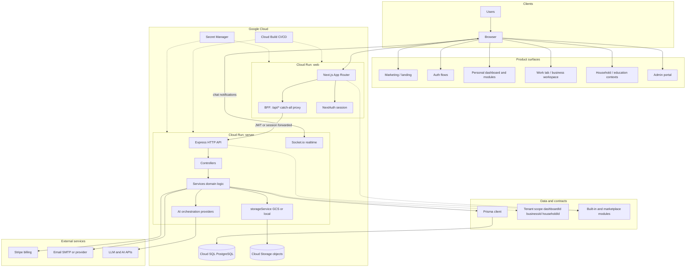
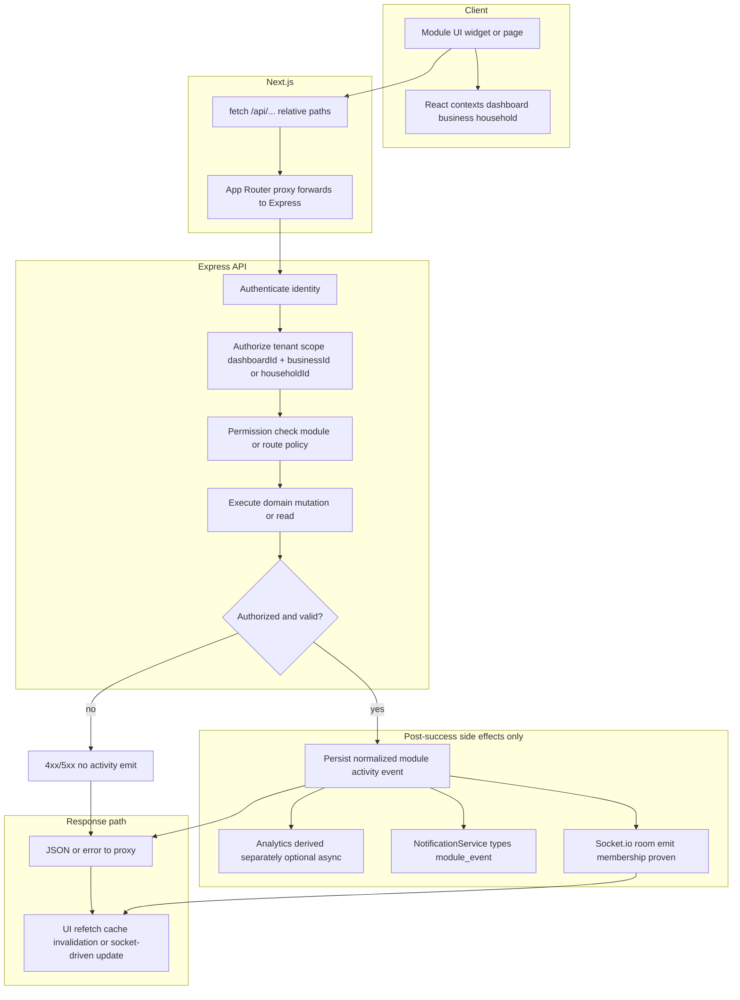
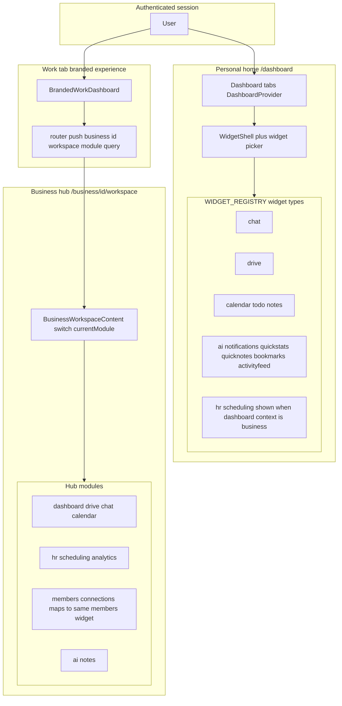

# Application architecture — Mermaid diagrams

Canonical **visual maps** of Vssyl for onboarding and AI context. These complement prose in `systemPatterns.md` and `techContext.md`.

**Last updated:** 2026-05-15

## Diagram 1 — Platform and deployment (whole application)

High-level clients, Next.js + Express, data stores, realtime, and major externals. Aligns with deployment notes in `systemPatterns.md` (Cloud Run, proxy, Prisma, GCS).

---

## Diagram 2 — Module interoperability lifecycle

Mutating actions follow **authorize → execute → side effects**; activity, notifications, and sockets run **only after** successful execution. Matches `.cursor/rules/module-interoperability.mdc` and `moduleSpecs.md`.

**Implementation note:** Domain events (`server/src/events/emitDomainEvent.ts`, subscribers under `server/src/events/subscribers/`) can fan out activity, analytics, and socket updates; controllers should still respect **no emit on failed/unauthorized** actions.

---

## Diagram 3 — Module surfaces (personal widgets vs business hub)

Where module IDs appear in the UI: **dashboard widgets** vs **business workspace** routing.

| Area | Source in repo |
|------|----------------|
| Personal widget types | `web/src/components/dashboard/widgetRegistry.ts` (`WIDGET_REGISTRY`) |
| Business hub mounts | `web/src/components/business/BusinessWorkspaceContent.tsx` (`switch (currentModule)`) |
| Work navigation | `web/src/components/BrandedWorkDashboard.tsx` (`?module=` query) |

**Nuances**

- Personal widgets are not always full-page module routes; some entries are summary tiles (`quickstats`, `activityfeed`, etc.).
- `connections` in the business hub renders the same surface as `members` (see comment in `BusinessWorkspaceContent.tsx`).
- Work rail availability can still be filtered by business configuration (`getModulesForUser` in `BrandedWorkDashboard.tsx`); the hub switch above is what mounts once a module id is selected.
